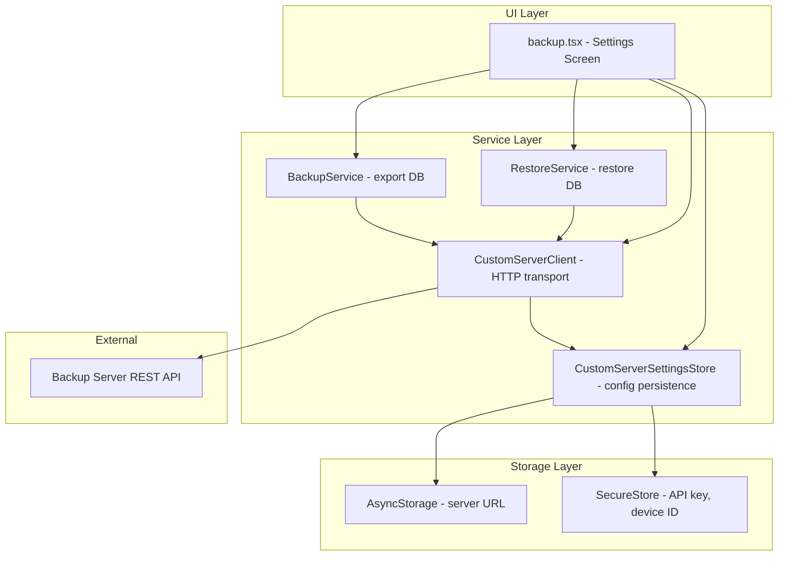
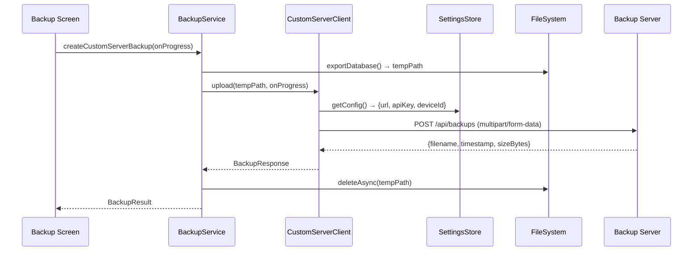
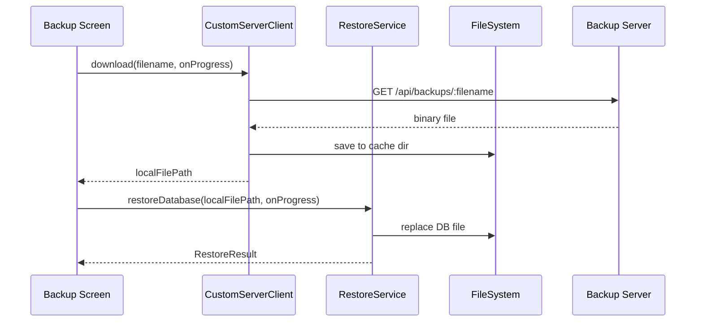

# Design Document: App Backup Integration

## Overview

This design integrates the GG Economy mobile app (React Native/Expo) with a self-hosted backup server via its REST API. The backend is already implemented and provides endpoints for uploading, listing, downloading, and deleting `.db` backup files, authenticated via `x-api-key` and identified by `x-device-id` headers.

The integration adds a new `CustomServerClient` service module that mirrors the existing `GoogleDriveClient` pattern, a settings storage layer for server configuration (URL + API key + device ID), and UI additions to the existing backup settings screen. The existing `BackupService` export logic and `RestoreService` restore logic are reused — only the transport layer changes.

### Key Design Decisions

1. **New `CustomServerClient` module** — follows the same singleton pattern as `GoogleDriveClient`, exposing `upload`, `list`, `download`, `delete`, and `testConnection` methods.
2. **Settings split** — server URL in AsyncStorage (non-sensitive), API key and device ID in expo-secure-store (sensitive).
3. **Device ID generation** — 16 random bytes via `expo-crypto` → 32 hex chars, generated once and persisted.
4. **Fetch API** — no axios; uses native `fetch` with `AbortController` for timeouts.
5. **Typed error codes** — a `CustomServerError` class with codes matching Requirement 8.
6. **Progress callbacks** — same `BackupProgress` / `RestoreProgress` pattern used by the Google Drive flow.
7. **UI** — new collapsible section in the existing `backup.tsx` screen for custom server configuration and operations.

## Architecture



### Data Flow: Upload Backup



### Data Flow: Download & Restore



## Components and Interfaces

### 1. CustomServerClient (`src/services/backup/CustomServerClient.ts`)

The HTTP transport layer for communicating with the backup server.

```typescript
// Error codes matching Requirement 8
export type CustomServerErrorCode =
  | 'AUTH_FAILED'
  | 'FILE_TOO_LARGE'
  | 'NETWORK_ERROR'
  | 'BAD_REQUEST'
  | 'SERVER_ERROR'
  | 'NOT_CONFIGURED'
  | 'NOT_FOUND'
  | 'UNKNOWN_ERROR'
  | 'DATABASE_NOT_FOUND'
  | 'EXPORT_FAILED'
  | 'UPLOAD_FAILED'
  | 'DOWNLOAD_FAILED';

export class CustomServerError extends Error {
  constructor(
    message: string,
    public readonly code: CustomServerErrorCode,
    public readonly httpStatus?: number,
    public readonly originalError?: unknown
  ) {
    super(message);
    this.name = 'CustomServerError';
  }
}

export interface CustomServerConfig {
  serverUrl: string;
  apiKey: string;
  deviceId: string;
}

export interface ServerBackupMetadata {
  filename: string;
  createdAt: string; // ISO 8601
  sizeBytes: number;
}

export interface ServerBackupResponse {
  filename: string;
  timestamp: string; // ISO 8601
  sizeBytes: number;
}

export interface UploadProgressCallback {
  (progress: { stage: 'exporting' | 'uploading'; progress: number; message: string }): void;
}

export interface DownloadProgressCallback {
  (progress: { stage: 'downloading'; progress: number; message: string }): void;
}

export class CustomServerClient {
  /**
   * Test connection to the server health endpoint.
   * Timeout: 10 seconds.
   */
  async testConnection(serverUrl: string, apiKey: string): Promise<void>;

  /**
   * Upload a .db file to the server.
   * Timeout: 60 seconds.
   */
  async upload(
    localFilePath: string,
    config: CustomServerConfig,
    onProgress?: UploadProgressCallback
  ): Promise<ServerBackupResponse>;

  /**
   * List all backups for this device, sorted by createdAt descending.
   * Timeout: 30 seconds.
   */
  async listBackups(config: CustomServerConfig): Promise<ServerBackupMetadata[]>;

  /**
   * Download a backup file to the cache directory.
   * Timeout: 120 seconds.
   */
  async download(
    filename: string,
    config: CustomServerConfig,
    onProgress?: DownloadProgressCallback
  ): Promise<string>;

  /**
   * Delete a backup from the server.
   * Timeout: 30 seconds.
   */
  async deleteBackup(
    filename: string,
    config: CustomServerConfig
  ): Promise<{ message: string }>;
}

export const customServerClient: CustomServerClient;
```

### 2. CustomServerSettingsStore (`src/services/backup/CustomServerSettingsStore.ts`)

Manages persistence of server configuration.

```typescript
export interface ServerSettings {
  serverUrl: string | null;
  apiKey: string | null;
  deviceId: string | null;
}

export interface CustomServerSettingsStore {
  /** Get all settings. Returns null fields if not configured. */
  getSettings(): Promise<ServerSettings>;

  /** Save server URL (AsyncStorage) and API key (SecureStore). Validates inputs. */
  saveSettings(serverUrl: string, apiKey: string): Promise<void>;

  /** Get or generate device ID. Uses SecureStore. */
  getOrCreateDeviceId(): Promise<string>;

  /** Clear all settings from both stores. */
  clearSettings(): Promise<void>;

  /** Validate server URL format (http/https, has host, ≤2048 chars). */
  validateServerUrl(url: string): { valid: boolean; error?: string };

  /** Validate API key (trimmed length 1-256). */
  validateApiKey(apiKey: string): { valid: boolean; error?: string };

  /** Check if fully configured (URL + API key + device ID all present). */
  isConfigured(): Promise<boolean>;
}

export const customServerSettingsStore: CustomServerSettingsStore;
```

### 3. Integration with BackupService

The existing `BackupService.exportDatabase()` method is reused to produce the temp `.db` file. A new method is added:

```typescript
// Added to BackupService or as a standalone function
export async function createCustomServerBackup(
  onProgress?: BackupProgressCallback
): Promise<BackupResult>;
```

This orchestrates: export → upload via `CustomServerClient` → cleanup temp file.

### 4. Integration with RestoreService

The existing `RestoreService.restoreDatabase(localPath)` method is reused. The flow is:

1. `CustomServerClient.download(filename)` → local temp path
2. `RestoreService.validateBackup(tempPath)`
3. `RestoreService.restoreDatabase(tempPath)`

### 5. UI Additions to `backup.tsx`

A new section "Custom Server" is added below the existing Google Drive sections:

- **Server URL** text input (max 2048 chars)
- **API Key** text input (max 256 chars, secure entry)
- **Save / Test Connection** button
- **Connection status** indicator (success/error)
- **Backup list** (FlatList, up to 50 items, sorted newest first)
- **Backup Now** button
- **Restore** action per backup item (with confirmation alert)
- **Delete** action per backup item (with confirmation alert)

## Data Models

### Storage Keys

| Key | Store | Value |
|-----|-------|-------|
| `@gg-economy/custom-server-url` | AsyncStorage | Server URL string |
| `custom-server-api-key` | SecureStore | API key string |
| `custom-server-device-id` | SecureStore | 32-char hex device ID |

### Server API Response Types (as received)

```typescript
// POST /api/backups response
interface ServerUploadResponse {
  filename: string;       // e.g. "gg-economy-backup-20250115-143022.db"
  timestamp: string;      // ISO 8601
  sizeBytes: number;
}

// GET /api/backups response
type ServerListResponse = Array<{
  filename: string;
  createdAt: string;      // ISO 8601
  sizeBytes: number;
}>;

// GET /api/health response
interface ServerHealthResponse {
  status: "ok";
  timestamp: string;
}

// DELETE /api/backups/:filename response
interface ServerDeleteResponse {
  message: string;
}

// Error response (any non-2xx)
interface ServerErrorResponse {
  error: string;
}
```

### Mapping: Server → App BackupMetadata

```typescript
function mapServerToAppMetadata(server: ServerBackupMetadata): BackupMetadata {
  return {
    id: server.filename,           // filename as unique ID
    fileName: server.filename,
    createdAt: new Date(server.createdAt),
    sizeBytes: server.sizeBytes,
    schemaVersion: 0,              // unknown for server backups
  };
}
```

### Error Code Mapping

| HTTP Status | Error Code | Message |
|-------------|-----------|---------|
| 401 | `AUTH_FAILED` | Invalid API key |
| 413 | `FILE_TOO_LARGE` | File exceeds 50 MB limit |
| 400 | `BAD_REQUEST` | Server error message from response body |
| 404 | `NOT_FOUND` | Backup not found |
| 500 | `SERVER_ERROR` | Server-side error |
| Timeout | `NETWORK_ERROR` | Request timed out |
| No connection | `NETWORK_ERROR` | Server unreachable |
| DNS failure | `NETWORK_ERROR` | DNS resolution failed |
| Other non-2xx | `UNKNOWN_ERROR` | Unexpected status: {code} |
| No config | `NOT_CONFIGURED` | Server not configured |


## Correctness Properties

*A property is a characteristic or behavior that should hold true across all valid executions of a system — essentially, a formal statement about what the system should do. Properties serve as the bridge between human-readable specifications and machine-verifiable correctness guarantees.*

### Property 1: Required Headers Invariant

*For any* valid `CustomServerConfig` and *for any* operation (upload, list, download, delete, testConnection), the outgoing HTTP request SHALL include both the `x-api-key` header set to the configured API key and the `x-device-id` header set to the configured device ID.

**Validates: Requirements 1.2, 1.3, 3.3**

### Property 2: Server Response Mapping

*For any* valid server backup metadata object containing a `filename` (non-empty string), a `createdAt` (valid ISO 8601 string), and a `sizeBytes` (non-negative integer), the mapping function SHALL produce a `BackupMetadata` object where `id` equals `filename`, `fileName` equals `filename`, `createdAt` is a Date object representing the same instant, `sizeBytes` is preserved as-is, and `schemaVersion` equals 0.

**Validates: Requirements 1.6, 4.3, 5.2**

### Property 3: HTTP Error Code Mapping

*For any* HTTP response with a non-2xx status code, the client SHALL produce a `CustomServerError` with the correct `code` field: `AUTH_FAILED` for 401, `FILE_TOO_LARGE` for 413, `BAD_REQUEST` for 400, `NOT_FOUND` for 404, `SERVER_ERROR` for 500, and `UNKNOWN_ERROR` for any other non-2xx status. Every error SHALL contain both a `code` (string) and `message` (string) field.

**Validates: Requirements 1.9, 8.1, 8.2, 8.3, 8.4, 8.5, 8.7, 8.8**

### Property 4: URL Validation

*For any* string input, the URL validator SHALL accept it if and only if it starts with `http://` or `https://`, contains a host component after the scheme, and has a total length not exceeding 2048 characters. Invalid URLs SHALL produce a rejection with an error indication.

**Validates: Requirements 2.4, 2.5**

### Property 5: API Key Validation

*For any* string input, the API key validator SHALL accept it if and only if the string, after trimming leading and trailing whitespace, has a length between 1 and 256 characters inclusive. Invalid API keys SHALL produce a rejection with an error indication.

**Validates: Requirements 2.6, 2.7**

### Property 6: Device ID Format

*For any* invocation of device ID generation, the resulting string SHALL be exactly 32 characters long and every character SHALL be a valid lowercase hexadecimal digit (0-9, a-f).

**Validates: Requirements 3.1**

### Property 7: Backup List Sorting

*For any* non-empty array of server backup metadata objects with distinct `createdAt` timestamps, the list returned by `listBackups` SHALL be sorted in descending order by `createdAt` (newest first), such that for every consecutive pair of items, the earlier item's `createdAt` is greater than or equal to the later item's `createdAt`.

**Validates: Requirements 5.1**

## Error Handling

### Error Propagation Strategy

All errors from `CustomServerClient` are wrapped in `CustomServerError` with typed codes. The UI layer catches these and displays localized messages via i18n.

```typescript
try {
  const result = await customServerClient.upload(tempPath, config, onProgress);
  // success
} catch (error) {
  if (error instanceof CustomServerError) {
    switch (error.code) {
      case 'AUTH_FAILED':
        showAlert(t('backup.errors.authFailed'));
        break;
      case 'FILE_TOO_LARGE':
        showAlert(t('backup.errors.fileTooLarge'));
        break;
      case 'NETWORK_ERROR':
        showAlert(t('backup.errors.networkError'));
        break;
      case 'NOT_CONFIGURED':
        showAlert(t('backup.errors.notConfigured'));
        break;
      // ... other codes
    }
  }
}
```

### Timeout Strategy

| Operation | Timeout | Rationale |
|-----------|---------|-----------|
| Health check | 10s | Quick connectivity test |
| Upload | 60s | Large files up to 50 MB |
| Download | 120s | Large files + slow networks |
| List / Delete | 30s | Small payloads |

### Timeout Implementation

```typescript
function fetchWithTimeout(url: string, options: RequestInit, timeoutMs: number): Promise<Response> {
  const controller = new AbortController();
  const timeoutId = setTimeout(() => controller.abort(), timeoutMs);

  return fetch(url, { ...options, signal: controller.signal })
    .catch((error) => {
      if (error.name === 'AbortError') {
        throw new CustomServerError(
          'Request timed out',
          'NETWORK_ERROR'
        );
      }
      throw new CustomServerError(
        `Network error: ${error.message}`,
        'NETWORK_ERROR',
        undefined,
        error
      );
    })
    .finally(() => clearTimeout(timeoutId));
}
```

### Cleanup on Failure

- **Upload failure**: Temp export file is always deleted in a `finally` block.
- **Download failure**: Partial temp file is deleted before throwing.
- **Restore failure**: `RestoreService` already handles rollback to safety backup.

### Configuration Guard

Before any network request, the client checks `isConfigured()`. If any of `serverUrl`, `apiKey`, or `deviceId` is missing, it throws `NOT_CONFIGURED` immediately without making a network call.

## Testing Strategy

### Property-Based Tests (fast-check)

Property-based testing is appropriate for this feature because it contains pure logic functions (validation, mapping, error classification) with clear input/output behavior and large input spaces.

**Library**: `fast-check` (already installed as devDependency)
**Location**: `__tests__/property/services/backup/`
**Minimum iterations**: 100 per property

Each property test is tagged with:
```
Feature: app-backup-integration, Property {N}: {property_text}
```

| Property | Test File | Iterations |
|----------|-----------|------------|
| 1: Required Headers | `customServerClient.property.test.ts` | 100 |
| 2: Server Response Mapping | `customServerClient.property.test.ts` | 100 |
| 3: HTTP Error Code Mapping | `customServerClient.property.test.ts` | 100 |
| 4: URL Validation | `customServerSettings.property.test.ts` | 100 |
| 5: API Key Validation | `customServerSettings.property.test.ts` | 100 |
| 6: Device ID Format | `customServerSettings.property.test.ts` | 100 |
| 7: Backup List Sorting | `customServerClient.property.test.ts` | 100 |

### Unit Tests (Jest)

**Location**: `__tests__/unit/services/backup/`

Focus on:
- Specific examples for each API operation (upload, download, delete)
- Timeout behavior (mocked timers)
- Configuration guard (NOT_CONFIGURED error)
- Progress callback invocation
- Temp file cleanup in success and failure paths
- SecureStore/AsyncStorage integration (mocked)

### Integration Tests

**Location**: `__tests__/integration/`

Focus on:
- Full backup flow: export → upload → verify response
- Full restore flow: download → validate → restore
- Settings persistence across mock restarts
- Connection test with mocked server responses

### Component Tests

**Location**: `__tests__/component/`

Focus on:
- Custom server section renders correctly
- Input validation feedback in UI
- Connection test button behavior
- Backup list rendering
- Confirmation dialogs for restore/delete
- Loading states during operations
- Error message display

### Test Doubles Strategy

- **fetch**: Global mock via `jest.fn()` returning controlled responses
- **expo-secure-store**: In-memory Map mock
- **AsyncStorage**: Already mocked in jest setup
- **expo-file-system**: Existing mock at `__mocks__/expo-file-system.js`
- **expo-crypto**: Mock returning deterministic hex strings for reproducibility
