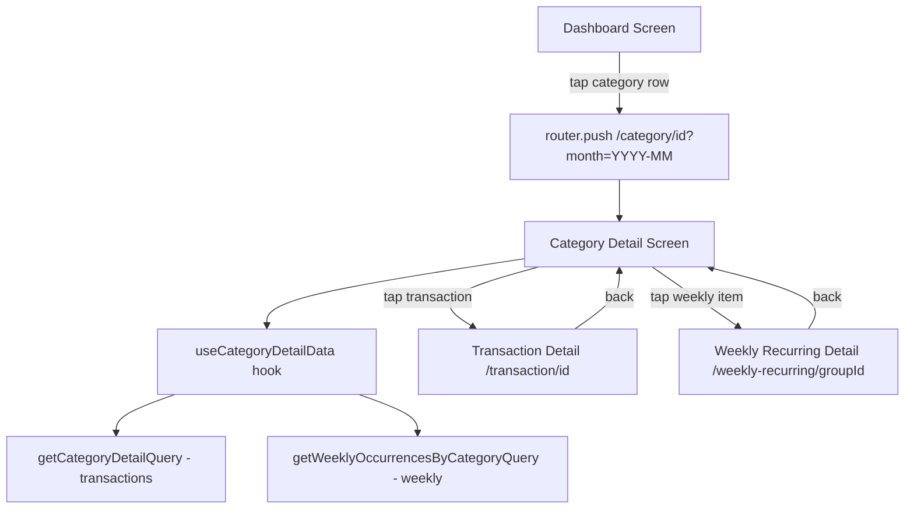

# Design Document: Category Detail Screen

## Overview

The Category Detail Screen provides a drill-down view from the Dashboard's collapsible category sections. When the user taps a category row (within Fixo or Variável sections), the app navigates to a new screen displaying all transactions and weekly occurrences contributing to that category's total for the selected month.

The screen follows existing patterns established by `app/transaction/[id].tsx` and `app/weekly-recurring/[id].tsx`:

- Expo Router file-based routing with dynamic `[id]` segment
- `useLocalSearchParams` for route parameters
- Theme-aware styling via `useThemeColors()` + constants
- i18n via `react-i18next`
- `SafeAreaView` + `FlatList` layout

## Architecture



### Navigation Flow

1. **CollapsibleSection** category row press → calls `router.push(`/category/${categoryId}?month=${selectedMonth}`)`
2. **Category Detail Screen** reads params via `useLocalSearchParams<{ id: string; month: string }>()`
3. Back navigation provided by Expo Router's Stack header (automatic)

### Route Registration

A new `Stack.Screen` entry in `app/_layout.tsx`:

```typescript
<Stack.Screen
  name="category/[id]"
  options={{
    presentation: 'card',
    headerShown: true,
    title: '', // Set dynamically via Stack.Screen options in the component
  }}
/>
```

## Components and Interfaces

### 1. Route File: `app/category/[id].tsx`

The screen component. Responsibilities:

- Extract `id` and `month` from route params
- Fetch category metadata + transaction data via custom hook
- Render header section (icon, name, total, month label, count, badge)
- Render FlatList of transaction items
- Handle item press navigation
- Handle loading/error/empty states

### 2. Custom Hook: `useCategoryDetailData`

**Location:** `src/hooks/useCategoryDetailData.ts`

```typescript
interface CategoryDetailItem {
  id: string;
  title: string;
  date: string; // YYYY-MM-DD
  amount: number; // in cents (raw DB value)
  type: 'transaction' | 'weekly';
  weeklyGroupId?: string; // for navigation on weekly items
}

interface CategoryInfo {
  id: string;
  name: string;
  icon: string;
  color: string;
  type: CategoryType;
  expenseGroup: string | null;
}

interface UseCategoryDetailDataReturn {
  category: CategoryInfo | null;
  items: CategoryDetailItem[];
  total: number; // sum of all displayed items (in cents)
  count: number; // items.length
  isLoading: boolean;
  error: string | null;
  refresh: () => void;
}

function useCategoryDetailData(categoryId: string, month: string): UseCategoryDetailDataReturn;
```

**Behavior:**

- Fetches category metadata from `categories` table by ID
- Fetches transactions using the same filter as the dashboard:
  - `categoryId` match
  - `referenceMonth` match
  - `isExcludedFromTotals = false`
  - `isPaid = 1 OR recurringId IS NULL`
- Fetches weekly occurrences:
  - Joins `weeklyOccurrences` → `weeklyRecurringGroups` where `categoryId` matches
  - `referenceMonth` match
  - `isPaid = true`
- Merges both lists, sorts by `date` descending
- Computes total as sum of `abs(amount)` across all items
- Re-fetches on screen focus (using `useFocusEffect` from `@react-navigation/native` or Expo Router equivalent)

### 3. Data Layer: `src/db/queries/categoryDetail.ts`

New query module with two functions:

```typescript
/**
 * Get transactions for a category in a month (with full detail).
 * Applies dashboard-consistent filters.
 */
function getCategoryDetailTransactionsQuery(
  categoryId: string,
  referenceMonth: string
): Promise<CategoryDetailTransactionResult[]>;

/**
 * Get weekly occurrences for a category in a month.
 * Only includes paid occurrences (isPaid = true).
 * Joins weeklyRecurringGroups to get the group's categoryId.
 */
function getCategoryDetailWeeklyQuery(
  categoryId: string,
  referenceMonth: string
): Promise<CategoryDetailWeeklyResult[]>;
```

**Transaction Query SQL logic:**

```sql
SELECT t.id, t.title, t.date, t.amount
FROM transactions t
WHERE t.category_id = ?
  AND t.reference_month = ?
  AND t.is_excluded_from_totals = 0
  AND (t.is_paid = 1 OR t.recurring_id IS NULL)
ORDER BY t.date DESC;
```

**Weekly Occurrences Query SQL logic:**

```sql
SELECT wo.id, wo.description, wo.date, wo.amount, wo.weekly_group_id
FROM weekly_occurrences wo
INNER JOIN weekly_recurring_groups wrg ON wo.weekly_group_id = wrg.id
WHERE wrg.category_id = ?
  AND wo.reference_month = ?
  AND wo.is_paid = 1
ORDER BY wo.date DESC;
```

### 4. CollapsibleSection Modification

**Current behavior:** `onCategoryPress(categoryId)` toggles `expandedCategoryId` state to show inline transaction list.

**New behavior:** `onCategoryPress(categoryId)` navigates to the Category Detail Screen.

Changes in `app/(tabs)/index.tsx`:

```typescript
// Replace handleCategoryPress:
const handleCategoryPress = useCallback(
  (categoryId: string) => {
    router.push(`/category/${categoryId}?month=${selectedMonth}`);
  },
  [router, selectedMonth]
);
```

The `expandedCategoryId` state and the inline `useCategoryTransactions` hook usage become unused and can be removed from the Dashboard screen. The `CollapsibleSection` component interface remains unchanged — it still receives `onCategoryPress`, but now navigation happens instead of inline expansion.

### 5. Screen Component Structure

```
CategoryDetailScreen
├── Stack.Screen (dynamic title with category name)
├── Header Section (View)
│   ├── Category Icon + Name (with color accent)
│   ├── Total Amount (formatted)
│   ├── Month Label (formatted)
│   ├── Transaction Count
│   └── Expense Group Badge (conditional)
├── FlatList
│   ├── renderItem → TransactionRow
│   │   ├── Title
│   │   ├── Date (formatted)
│   │   ├── Amount (formatted)
│   │   └── Recurring Indicator (if type === 'weekly')
│   └── ListEmptyComponent → EmptyState
├── LoadingIndicator (when isLoading)
└── EmptyState with retry (when error)
```

### 6. i18n Keys

New keys to add to `pt-BR.json` and `en.json`:

```json
{
  "categoryDetail": {
    "title": "Detalhes da Categoria" / "Category Details",
    "transactionCount": "{{count}} lançamento(s)" / "{{count}} transaction(s)",
    "emptyTitle": "Nenhum lançamento" / "No transactions",
    "emptyDescription": "Nenhum lançamento encontrado para esta categoria neste mês." / "No transactions found for this category in this month.",
    "badgeFixed": "Fixo" / "Fixed",
    "badgeVariable": "Variável" / "Variable",
    "weeklyIndicator": "Semanal" / "Weekly",
    "errorTitle": "Erro ao carregar" / "Error loading",
    "errorDescription": "Não foi possível carregar os lançamentos." / "Could not load transactions.",
    "retry": "Tentar novamente" / "Try again"
  }
}
```

## Data Models

### CategoryDetailItem (UI model)

| Field         | Type                      | Description                                 |
| ------------- | ------------------------- | ------------------------------------------- |
| id            | string                    | Transaction ID or weekly occurrence ID      |
| title         | string                    | Transaction title or occurrence description |
| date          | string                    | YYYY-MM-DD                                  |
| amount        | number                    | Raw amount from DB (negative for expenses)  |
| type          | 'transaction' \| 'weekly' | Distinguishes item source                   |
| weeklyGroupId | string \| undefined       | Group ID for weekly items (for navigation)  |

### CategoryInfo (UI model)

| Field        | Type           | Description                   |
| ------------ | -------------- | ----------------------------- |
| id           | string         | Category UUID                 |
| name         | string         | Display name                  |
| icon         | string         | Icon identifier               |
| color        | string         | Hex color code                |
| type         | CategoryType   | 'income' \| 'expense'         |
| expenseGroup | string \| null | 'fixed' \| 'variable' \| null |

### Route Parameters

| Param | Source                | Description             |
| ----- | --------------------- | ----------------------- |
| id    | path segment `[id]`   | Category ID             |
| month | query param `?month=` | Reference month YYYY-MM |

## Correctness Properties

_A property is a characteristic or behavior that should hold true across all valid executions of a system—essentially, a formal statement about what the system should do. Properties serve as the bridge between human-readable specifications and machine-verifiable correctness guarantees._

### Property 1: Data filtering correctness

_For any_ set of transactions and weekly occurrences in the database for a given category and month, the displayed list SHALL only contain items where: (a) transactions have `isExcludedFromTotals = false` AND (`isPaid = true` OR `recurringId IS NULL`), and (b) weekly occurrences have `isPaid = true`.

**Validates: Requirements 5.1, 5.2, 5.3**

### Property 2: List sort order

_For any_ non-empty result set of category detail items, the items SHALL be ordered by date descending — that is, for every consecutive pair of items (item[i], item[i+1]), item[i].date >= item[i+1].date.

**Validates: Requirements 3.1**

### Property 3: Total consistency

_For any_ set of displayed items on the Category Detail Screen, the sum of `abs(amount)` across all items SHALL equal the total displayed in the header section.

**Validates: Requirements 5.4, 2.2**

### Property 4: Weekly occurrence inclusion with indicator

_For any_ weekly occurrence that matches the category and month filters and has `isPaid = true`, it SHALL appear in the displayed list AND be marked with `type === 'weekly'` (which renders the recurring indicator).

**Validates: Requirements 3.3, 3.4**

### Property 5: Item rendering completeness

_For any_ item in the displayed list, the rendered output SHALL contain the item's title (non-empty string), a formatted date string, and a formatted currency amount.

**Validates: Requirements 3.2, 7.2, 7.3**

### Property 6: Reference month formatting round-trip

_For any_ valid YYYY-MM string, the formatted month label SHALL contain a recognizable month name (from the locale's month names) and the correct 4-digit year.

**Validates: Requirements 2.3, 7.4**

## Error Handling

| Scenario                           | Handling                                                      |
| ---------------------------------- | ------------------------------------------------------------- |
| Category ID not found in DB        | Show EmptyState with "Category not found" message             |
| Database query failure             | Show error state with retry button; retry re-invokes the hook |
| Invalid/missing `month` param      | Default to current month (same as dashboard)                  |
| Empty result set (no transactions) | Show EmptyState with descriptive message                      |
| Network timeout (N/A - local DB)   | Not applicable; all queries are local SQLite                  |

Error states use the existing `EmptyState` component with an action prop for retry, matching the pattern in `app/(tabs)/index.tsx`.

## Testing Strategy

### Unit Tests (Example-based)

- **Navigation integration**: Verify `router.push` called with correct params on category press
- **Empty state**: Render with empty data, verify EmptyState component appears
- **Loading state**: Verify LoadingIndicator shown while `isLoading = true`
- **Error state**: Mock query failure, verify error UI with retry action
- **Item press navigation**: Tap transaction → navigates to `/transaction/[id]`; tap weekly → navigates to `/weekly-recurring/[groupId]`
- **Expense group badge**: Render with fixed/variable/null, verify correct badge

### Property-Based Tests

Property-based testing is applicable for this feature because the core data logic (filtering, sorting, aggregation) has clear universal properties that hold across all valid inputs.

**Library:** fast-check (already available in project via Jest)  
**Minimum iterations:** 100 per property

Each property test SHALL:

- Generate random but valid category detail datasets
- Exercise the data transformation/filtering logic
- Assert the correctness property holds

**Tag format:** `Feature: category-detail-screen, Property {N}: {description}`

Properties to implement:

1. Filtering correctness (validates 5.1, 5.2, 5.3)
2. Sort order invariant (validates 3.1)
3. Total = sum of displayed amounts (validates 5.4)
4. Weekly inclusion with type marker (validates 3.3, 3.4)
5. Item rendering completeness (validates 3.2)
6. Month formatting correctness (validates 2.3, 7.4)

### Integration Tests

- Verify data refresh on screen focus return (Requirement 4.3)
- Verify navigation performance < 300ms (Requirement 1.4, manual/E2E)
- Verify existing `idx_transactions_category_id` index is used (Requirement 8.2)
