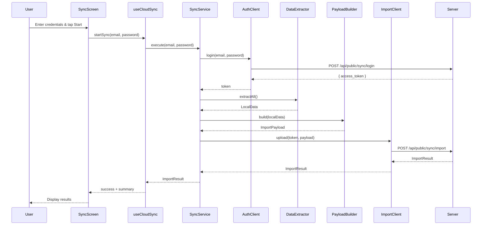
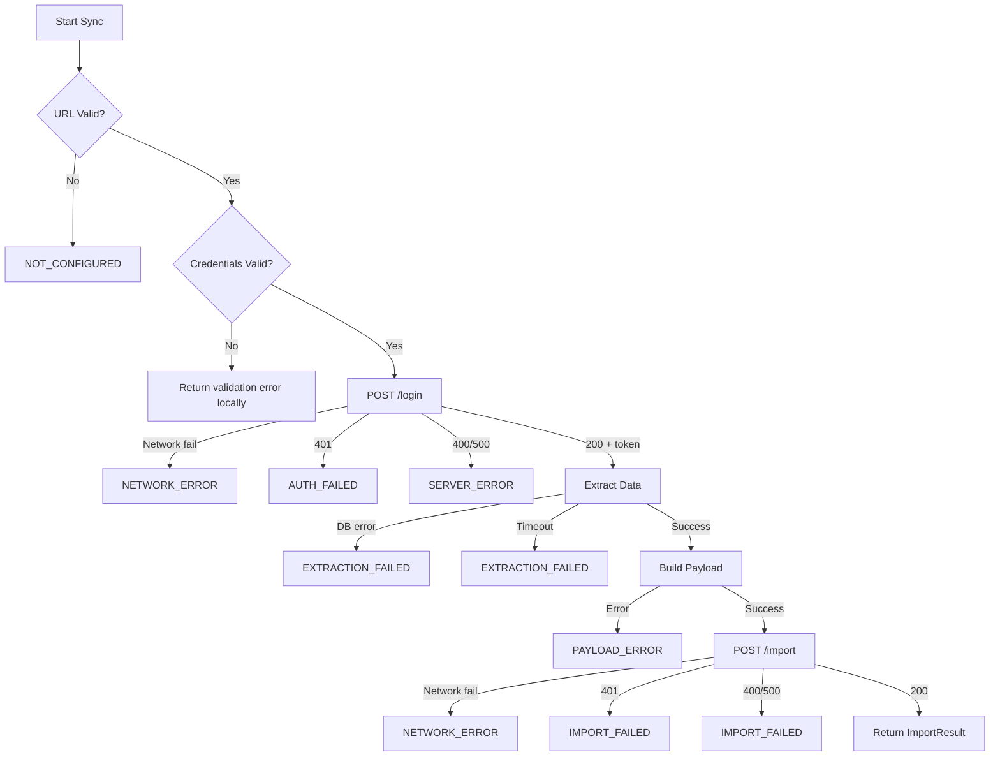

# Design Document: Cloud Sync Import

## Overview

Cloud Sync Import provides a one-way data migration from the local SQLite database to a Supabase-backed web platform. The feature implements a sequential pipeline: authenticate → extract → build payload → upload. It follows the existing project patterns (service modules, typed errors, hooks for UI state) and leverages Drizzle ORM for data extraction and `fetch` with `AbortController` for HTTP communication.

The design prioritizes:

- **Data integrity**: All records are extracted and converted without loss
- **Predictable error handling**: Typed error codes at every failure point
- **Idempotency**: The server uses record `id` fields for deduplication
- **User feedback**: Real-time step progress via a dedicated hook



## Architecture

The feature follows the project's established layered architecture:

```
┌─────────────────────────────────────────────────────┐
│  UI Layer (Screens)                                 │
│  └── CloudSyncScreen                               │
├─────────────────────────────────────────────────────┤
│  Hook Layer                                         │
│  └── useCloudSync (state management, progress)     │
├─────────────────────────────────────────────────────┤
│  Service Layer                                      │
│  ├── CloudSyncService (orchestration)              │
│  ├── SyncAuthClient (authentication)               │
│  ├── SyncDataExtractor (local DB reads)            │
│  ├── SyncPayloadBuilder (data transformation)      │
│  └── SyncImportClient (upload)                     │
├─────────────────────────────────────────────────────┤
│  Data Layer                                         │
│  └── Drizzle ORM (expo-sqlite)                     │
└─────────────────────────────────────────────────────┘
```

### Design Decisions

1. **Single service directory** (`src/services/cloud-sync/`): Groups all cloud sync modules together, consistent with existing services like `backup/` and `import/`.

2. **Functional module pattern**: Following `CustomServerClient.ts` style — exported functions rather than classes, with a namespace object for convenience. This keeps things testable and tree-shakeable.

3. **No retry logic**: The requirements specify fail-fast behavior. The user can retry manually from the UI, which preserves credential state.

4. **In-memory token only**: The access token lives in a local variable within the sync execution scope. No persistence to disk or secure store.

5. **`fetch` with AbortController**: Matches the existing `fetchWithTimeout` pattern in `CustomServerClient.ts`. No need to introduce axios.

6. **Mutex via boolean flag**: Prevents concurrent sync executions using a simple module-level `isRunning` flag, consistent with the project's straightforward concurrency model.

## Components and Interfaces

### SyncAuthClient (`src/services/cloud-sync/SyncAuthClient.ts`)

Handles authentication with the remote sync API.

```typescript
export interface LoginCredentials {
  email: string;
  password: string;
}

export interface LoginResult {
  accessToken: string;
}

/**
 * Authenticates with the sync server.
 * @throws CloudSyncError with appropriate code on failure
 */
export async function login(credentials: LoginCredentials, baseUrl: string): Promise<LoginResult>;
```

### SyncDataExtractor (`src/services/cloud-sync/SyncDataExtractor.ts`)

Reads all relevant tables from the local SQLite database.

```typescript
export interface ExtractedData {
  categories: CategoryRecord[];
  funds: FundRecord[];
  fundAllocations: FundAllocationRecord[];
  transactions: TransactionRecord[];
  recurringTransactions: RecurringTransactionRecord[];
  weeklyRecurringGroups: WeeklyRecurringGroupRecord[];
  weeklyOccurrences: WeeklyOccurrenceRecord[];
  recurringFundLinks: RecurringFundLinkRecord[];
  categoryGoals: CategoryGoalRecord[];
}

/**
 * Extracts all records from the 9 relevant tables.
 * @throws CloudSyncError with EXTRACTION_FAILED on any table read failure
 */
export async function extractAll(db: Database): Promise<ExtractedData>;
```

### SyncPayloadBuilder (`src/services/cloud-sync/SyncPayloadBuilder.ts`)

Transforms extracted local data into the server-expected payload format.

```typescript
export interface ImportPayload {
  tables: {
    categories: Record<string, unknown>[];
    funds: Record<string, unknown>[];
    installment_groups: Record<string, unknown>[];
    recurring_transactions: Record<string, unknown>[];
    weekly_recurring_groups: Record<string, unknown>[];
    fund_allocations: Record<string, unknown>[];
    transactions: Record<string, unknown>[];
    recurring_fund_links: Record<string, unknown>[];
    weekly_occurrences: Record<string, unknown>[];
    budget_goals: Record<string, unknown>[];
  };
}

/**
 * Builds the import payload from extracted data.
 * - Converts camelCase fields to snake_case
 * - Maps categoryGoals → budget_goals
 * - Derives installment_groups from transactions
 * - Preserves boolean integers (0/1)
 */
export function buildPayload(data: ExtractedData): ImportPayload;
```

### SyncImportClient (`src/services/cloud-sync/SyncImportClient.ts`)

Uploads the constructed payload to the server.

```typescript
export interface ImportResultTotals {
  ok: number;
  failed: number;
  skipped: number;
}

export interface ImportResult {
  totals: ImportResultTotals;
  tables: Record<string, { ok: number; failed: number; skipped: number }>;
}

/**
 * Sends the import payload to the server.
 * @throws CloudSyncError with appropriate code on failure
 */
export async function uploadImport(
  payload: ImportPayload,
  accessToken: string,
  baseUrl: string
): Promise<ImportResult>;
```

### CloudSyncService (`src/services/cloud-sync/CloudSyncService.ts`)

Orchestrates the full sync pipeline.

```typescript
export type SyncStep = 'authenticating' | 'extracting' | 'building' | 'uploading';

export interface SyncProgressCallback {
  (step: SyncStep): void;
}

export interface SyncExecuteParams {
  email: string;
  password: string;
  onProgress?: SyncProgressCallback;
}

/**
 * Executes the full sync pipeline.
 * @throws CloudSyncError if any step fails
 * @throws CloudSyncError with code ALREADY_RUNNING if sync is in progress
 */
export async function execute(params: SyncExecuteParams): Promise<ImportResult>;
```

### CloudSyncError (`src/services/cloud-sync/CloudSyncError.ts`)

Typed error class for the sync feature.

```typescript
export type CloudSyncErrorCode =
  | 'AUTH_FAILED'
  | 'NETWORK_ERROR'
  | 'EXTRACTION_FAILED'
  | 'PAYLOAD_ERROR'
  | 'IMPORT_FAILED'
  | 'NOT_CONFIGURED'
  | 'SERVER_ERROR'
  | 'ALREADY_RUNNING';

export class CloudSyncError extends Error {
  constructor(
    message: string,
    public readonly code: CloudSyncErrorCode,
    public readonly httpStatus?: number
  );
}
```

### useCloudSync Hook (`src/hooks/useCloudSync.ts`)

React hook for the UI to trigger and observe the sync process.

```typescript
export interface UseCloudSyncReturn {
  // State
  isRunning: boolean;
  currentStep: SyncStep | null;
  result: ImportResult | null;
  error: CloudSyncError | null;

  // Actions
  startSync: (email: string, password: string) => Promise<void>;
  clearResult: () => void;
  clearError: () => void;
}

export function useCloudSync(): UseCloudSyncReturn;
```

### Configuration (`src/services/cloud-sync/config.ts`)

```typescript
export interface CloudSyncConfig {
  baseUrl: string;
}

export function getCloudSyncConfig(): CloudSyncConfig;
export function setCloudSyncBaseUrl(url: string): Promise<void>;
```

## Data Models

### Local Database Tables (Source)

The 9 tables to extract, as defined in the Drizzle schema (`src/db/schema.ts`):

| Table                   | Key Fields                                                                                                                                                                                         | Notes                             |
| ----------------------- | -------------------------------------------------------------------------------------------------------------------------------------------------------------------------------------------------- | --------------------------------- |
| `categories`            | id, name, type, icon, color, isActive, expenseGroup, createdAt                                                                                                                                     | `isActive` stored as integer 0/1  |
| `funds`                 | id, name, icon, color, isActive, createdAt, updatedAt                                                                                                                                              |                                   |
| `fundAllocations`       | id, fundId, referenceMonth, amount, createdAt, updatedAt                                                                                                                                           |                                   |
| `transactions`          | id, title, date, amount, description, categoryId, originId, batchId, referenceMonth, needsReview, isExcludedFromTotals, isPaid, duplicateOf, createdAt, updatedAt, installmentGroupId, recurringId | Boolean fields as integers        |
| `recurringTransactions` | id, title, amount, categoryId, categoryType, startMonth, description, originId, isActive, createdAt, updatedAt                                                                                     |                                   |
| `weeklyRecurringGroups` | id, title, amount, dayOfWeek, categoryId, categoryType, description, originId, startDate, isActive, createdAt, updatedAt                                                                           |                                   |
| `weeklyOccurrences`     | id, weeklyGroupId, date, referenceMonth, amount, description, isValueEdited, isPaid, createdAt, updatedAt                                                                                          |                                   |
| `recurringFundLinks`    | id, recurringId, fundId, createdAt                                                                                                                                                                 |                                   |
| `categoryGoals`         | id, categoryId, amount, createdAt, updatedAt                                                                                                                                                       | Maps to `budget_goals` in payload |

### Import Payload Structure (Target)

```typescript
{
  tables: {
    categories: [{ id, name, type, icon, color, is_active, expense_group, created_at }],
    funds: [{ id, name, icon, color, is_active, created_at, updated_at }],
    installment_groups: [{ id }],  // derived from transactions.installmentGroupId
    recurring_transactions: [{ id, title, amount, category_id, category_type, start_month, description, origin_id, is_active, created_at, updated_at }],
    weekly_recurring_groups: [{ id, title, amount, day_of_week, category_id, category_type, description, origin_id, start_date, is_active, created_at, updated_at }],
    fund_allocations: [{ id, fund_id, reference_month, amount, created_at, updated_at }],
    transactions: [{ id, title, date, amount, description, category_id, origin_id, batch_id, reference_month, needs_review, is_excluded_from_totals, is_paid, duplicate_of, created_at, updated_at, installment_group_id, recurring_id }],
    recurring_fund_links: [{ id, recurring_id, fund_id, created_at }],
    weekly_occurrences: [{ id, weekly_group_id, date, reference_month, amount, description, is_value_edited, is_paid, created_at, updated_at }],
    budget_goals: [{ id, category_id, amount, created_at, updated_at }]
  }
}
```

### CamelCase → snake_case Mapping

The `SyncPayloadBuilder` applies a generic `camelToSnake` utility that handles the following conversions:

| Local (camelCase)    | Payload (snake_case)    |
| -------------------- | ----------------------- |
| categoryId           | category_id             |
| fundId               | fund_id                 |
| weeklyGroupId        | weekly_group_id         |
| referenceMonth       | reference_month         |
| isActive             | is_active               |
| createdAt            | created_at              |
| updatedAt            | updated_at              |
| installmentGroupId   | installment_group_id    |
| recurringId          | recurring_id            |
| needsReview          | needs_review            |
| isExcludedFromTotals | is_excluded_from_totals |
| isPaid               | is_paid                 |
| duplicateOf          | duplicate_of            |
| batchId              | batch_id                |
| originId             | origin_id               |
| categoryType         | category_type           |
| startMonth           | start_month             |
| dayOfWeek            | day_of_week             |
| startDate            | start_date              |
| isValueEdited        | is_value_edited         |
| expenseGroup         | expense_group           |

### Server Response Model

```typescript
// POST /api/public/sync/login response
{ access_token: string }

// POST /api/public/sync/import response
{
  totals: { ok: number; failed: number; skipped: number },
  tables: {
    [tableName: string]: { ok: number; failed: number; skipped: number }
  }
}
```

## Correctness Properties

_A property is a characteristic or behavior that should hold true across all valid executions of a system — essentially, a formal statement about what the system should do. Properties serve as the bridge between human-readable specifications and machine-verifiable correctness guarantees._

### Property 1: Payload structure completeness

_For any_ valid `ExtractedData` (including cases where some tables have zero records), the `buildPayload` function SHALL produce an `ImportPayload` where `tables` contains exactly 10 keys (`categories`, `funds`, `installment_groups`, `recurring_transactions`, `weekly_recurring_groups`, `fund_allocations`, `transactions`, `recurring_fund_links`, `weekly_occurrences`, `budget_goals`), and the `budget_goals` array has the same length as the input `categoryGoals` array.

**Validates: Requirements 3.1, 3.2, 3.8**

### Property 2: Installment groups derivation

_For any_ set of transaction records with varying `installmentGroupId` values (some null, some repeated, some unique), the `buildPayload` function SHALL produce an `installment_groups` array whose length equals the number of distinct non-null `installmentGroupId` values, and each entry SHALL have an `id` field matching one of those distinct values.

**Validates: Requirements 3.3**

### Property 3: CamelCase to snake_case key conversion

_For any_ record from any extracted table, every key in the corresponding payload record SHALL be in snake*case format (matching the regex `/^[a-z][a-z0-9]\*(*[a-z0-9]+)\*$/`), and no camelCase keys from the original record SHALL appear in the output.

**Validates: Requirements 3.4**

### Property 4: Value preservation through transformation

_For any_ record from any extracted table, the payload builder SHALL preserve: (a) the `id` field value unchanged, (b) all numeric values (amounts) unchanged, (c) all string values (dates, text) unchanged, and (d) all integer boolean fields (0 or 1) as their integer representation without conversion to JSON `true`/`false`.

**Validates: Requirements 3.5, 3.6, 3.7, 3.9**

### Property 5: JSON serialization round-trip

_For any_ valid `ExtractedData`, the payload produced by `buildPayload` SHALL be JSON-serializable such that `JSON.parse(JSON.stringify(payload))` yields an object with identical keys, value types, and array lengths as the original payload.

**Validates: Requirements 3.10**

### Property 6: URL path construction normalization

_For any_ valid base URL (with or without a trailing slash) and any API path, the constructed endpoint URL SHALL never contain double slashes (excluding the `://` in the protocol), and SHALL correctly join the base URL and path with exactly one slash separator.

**Validates: Requirements 7.4**

## Error Handling

### Error Codes and Scenarios

| Code                | Triggered By                                 | User Message Example                     |
| ------------------- | -------------------------------------------- | ---------------------------------------- |
| `AUTH_FAILED`       | HTTP 401 from login endpoint                 | "Invalid email or password"              |
| `NETWORK_ERROR`     | Timeout, DNS failure, no connectivity        | "Connection failed. Check your internet" |
| `EXTRACTION_FAILED` | Database read error on any table             | "Failed to read local data (table: X)"   |
| `PAYLOAD_ERROR`     | Unexpected error during payload construction | "Failed to prepare data for upload"      |
| `IMPORT_FAILED`     | HTTP 400/401/500 from import endpoint        | "Server rejected the import: {message}"  |
| `NOT_CONFIGURED`    | Empty/invalid base URL                       | "Server URL not configured"              |
| `SERVER_ERROR`      | Unexpected HTTP status or malformed response | "Unexpected server error (status: X)"    |
| `ALREADY_RUNNING`   | Sync triggered while one is in progress      | "A sync is already in progress"          |

### Error Flow



### Error Design Principles

1. **Fail fast**: The pipeline stops at the first failure. No partial uploads.
2. **No retries in service layer**: The UI handles retry via user action (preserving credentials).
3. **Typed errors only**: Every thrown error is a `CloudSyncError` with a known code. Unexpected errors are wrapped in `SERVER_ERROR`.
4. **Message length cap**: All user-facing messages are ≤200 characters.
5. **No sensitive data in errors**: Error messages never include tokens, passwords, or full URLs with credentials.

## Testing Strategy

### Property-Based Tests (fast-check)

The feature uses `fast-check` (already in devDependencies) for property-based testing of the payload builder and URL utilities — the pure transformation layer where input variation reveals edge cases.

**Configuration:**

- Minimum 100 iterations per property
- Each test tagged with: `Feature: cloud-sync-import, Property {N}: {title}`
- Generators produce random but valid `ExtractedData` structures

**Target modules:**

- `SyncPayloadBuilder` (Properties 1–5)
- URL construction utility (Property 6)

### Unit Tests (Jest)

Example-based tests for:

- `SyncAuthClient`: HTTP request format, status code → error mapping, timeout behavior
- `SyncImportClient`: Request headers, response parsing, error handling
- `CloudSyncService`: Orchestration order, fail-fast behavior, progress callbacks, mutex
- `useCloudSync` hook: State transitions, error/result management
- `CloudSyncScreen`: Rendering states, button enable/disable, credential retention

### Integration Tests

- `SyncDataExtractor`: Verify all 9 tables are read from a seeded SQLite database with correct record counts and no data loss

### Test File Structure

```
src/
├── services/cloud-sync/
│   ├── __tests__/
│   │   ├── SyncAuthClient.test.ts
│   │   ├── SyncDataExtractor.test.ts
│   │   ├── SyncImportClient.test.ts
│   │   ├── SyncPayloadBuilder.test.ts
│   │   ├── SyncPayloadBuilder.property.test.ts  ← PBT
│   │   ├── CloudSyncService.test.ts
│   │   └── config.test.ts                       ← includes URL property
│   └── ...
├── hooks/__tests__/
│   └── useCloudSync.test.ts
└── components/__tests__/
    └── CloudSyncScreen.test.tsx
```

### Test Balance

- **Property tests** cover the transformation logic exhaustively (payload structure, key conversion, value preservation, serialization round-trip)
- **Unit tests** cover specific integration points (HTTP calls, error mapping, orchestration)
- **Component tests** cover UI states and user interactions
- Property tests eliminate the need for many manual edge case tests in the payload builder — the generators will exercise empty arrays, special characters, extreme numeric values, and boundary conditions automatically
