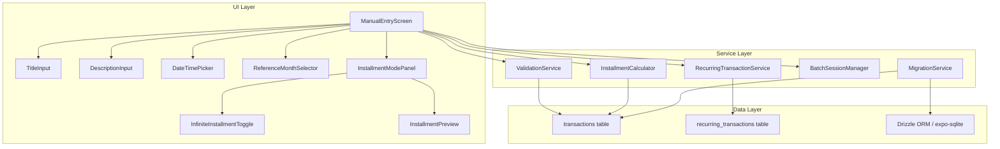

# Design Document: Entry Title and Dates

## Overview

Este design detalha a reestruturação do formulário de entrada manual do GG Economy Mobile para introduzir separação entre título e descrição, seleção de hora na data da compra, formalização dos três conceitos de data, parcela infinita (recorrência), edição individual de valores de parcelas, e migração de dados existentes.

### Decisões de Design Principais

1. **Título como campo primário**: O campo `title` substitui o papel atual de `description` como identificador principal do lançamento. A migração copia `description` → `title` para dados existentes.
2. **ISO 8601 completo para datas**: A coluna `date` passa a armazenar datetime completo (`2025-06-15T14:30:00.000Z`) em vez de apenas data (`2025-06-15`).
3. **Tabela de recorrências separada**: Parcelas infinitas são gerenciadas por uma nova tabela `recurring_transactions` que gera lançamentos individuais mensalmente.
4. **Edição de parcela individual**: Valores editados são salvos diretamente no lançamento; para recorrências, o usuário escolhe se afeta apenas aquela ocorrência ou todas as futuras.

## Architecture

### Diagrama de Componentes



### Fluxo de Dados

1. **Entrada normal**: Usuário preenche título + valor + data/hora + categoria → validação → `createTransaction()` → tabela `transactions`
2. **Modo lote**: Título + categoria fixos na sessão → cada entrada valida valor + data/hora → `createTransaction()` com título da sessão
3. **Parcelamento finito**: Título + valor total + parcelas → `calculateInstallments()` → múltiplos `createTransaction()` com `installmentGroupId`
4. **Parcela infinita**: Título + valor + categoria + mês inicial → `createRecurring()` → tabela `recurring_transactions` → geração mensal automática
5. **Migração**: Na inicialização do app, verifica versão do schema → executa migração `description` → `title`

## Components and Interfaces

### 1. Validation Service (atualizado)

```typescript
// src/validation/entryValidation.ts

interface TitleValidationInput {
  title: string;
}

interface DescriptionValidationInput {
  description: string;
}

interface StandardEntryValidationInput {
  title: string;
  description: string;
  amount: number; // cents
  date: Date;
  categoryId: string | null;
  referenceMonth: string; // YYYY-MM
}

interface InstallmentEntryValidationInput {
  title: string;
  description: string;
  totalAmount: number; // cents
  parcelCount: number; // 2-48 or Infinity
  startMonth: string; // YYYY-MM
  categoryId: string | null;
  isInfinite: boolean;
}

interface BatchEntryValidationInput {
  amount: number; // cents
  description: string; // optional per-entry description
  date: Date;
  referenceMonth: string;
}

// Constantes
const TITLE_MIN_LENGTH = 1;
const TITLE_MAX_LENGTH = 100;
const DESCRIPTION_MAX_LENGTH = 500;

function validateTitle(title: string): ValidationResult;
function validateDescription(description: string): ValidationResult;
function validateStandardEntry(input: StandardEntryValidationInput): ValidationResult;
function validateInstallmentEntry(input: InstallmentEntryValidationInput): ValidationResult;
function validateBatchEntry(input: BatchEntryValidationInput): ValidationResult;
```

### 2. Recurring Transaction Service

```typescript
// src/services/recurring/RecurringTransactionService.ts

interface CreateRecurringDTO {
  title: string;
  amount: number; // cents
  categoryId: string;
  categoryType: 'income' | 'expense';
  startMonth: string; // YYYY-MM
  description?: string;
  originId?: string;
}

interface RecurringTransaction {
  id: string;
  title: string;
  amount: number;
  categoryId: string;
  categoryType: 'income' | 'expense';
  startMonth: string;
  description: string;
  originId: string | null;
  isActive: boolean;
  createdAt: string;
  updatedAt: string;
}

function createRecurring(dto: CreateRecurringDTO): Promise<RecurringTransaction>;
function deactivateRecurring(id: string): Promise<void>;
function reactivateRecurring(id: string): Promise<void>;
function updateRecurringAmount(id: string, newAmount: number): Promise<void>;
function generateMonthlyTransactions(targetMonth: string): Promise<void>;
function getActiveRecurrings(): Promise<RecurringTransaction[]>;
```

### 3. Installment Calculator (atualizado)

```typescript
// src/services/installment/InstallmentCalculator.ts

interface InstallmentCalculatorInput {
  totalAmount: number;
  parcelCount: number; // 2-48 for finite
  startMonth: string;
  title: string; // NEW: replaces description as primary
  description?: string; // NEW: optional detail
  categoryId: string;
  originId?: string;
}

// Existing functions remain unchanged:
// distributeAmount, advanceMonth, calculateInstallments
```

### 4. Batch Session Manager (atualizado)

```typescript
// src/services/batch/BatchSessionManager.ts

interface BatchSession {
  isActive: boolean;
  categoryId: string | null;
  categoryType: 'income' | 'expense' | null;
  title: string | null; // NEW: locked title for session
  entryCount: number;
  maxEntries: number;
  totalValue: number;
}

interface BatchSessionActions {
  startSession(categoryId: string, categoryType: CategoryType, title: string): void;
  incrementCount(amount: number): void;
  endSession(): BatchSessionSummary;
  reset(): void;
}
```

### 5. Migration Service

```typescript
// src/db/migrations/addTitleField.ts

/**
 * Migration v2: Add title column, restructure description
 *
 * Steps:
 * 1. ALTER TABLE transactions ADD COLUMN title TEXT NOT NULL DEFAULT ''
 * 2. UPDATE transactions SET title = description
 * 3. UPDATE transactions SET description = ''
 * 4. Update schema_version to new version
 *
 * Rollback:
 * 1. UPDATE transactions SET description = title
 * 2. DROP COLUMN title (via table rebuild in SQLite)
 * 3. Revert schema_version
 */
async function migrateAddTitleField(): Promise<void>;
async function rollbackAddTitleField(): Promise<void>;
```

### 6. DateTimePicker Component

```typescript
// src/components/ui/DateTimePicker.tsx

interface DateTimePickerProps {
  value: Date;
  onChange: (date: Date) => void;
  locale: string;
  label?: string;
  minimumDate?: Date;
  maximumDate?: Date;
}

// Uses @react-native-community/datetimepicker under the hood
// Displays formatted date+time according to locale
// pt-BR: "dd/MM/yyyy HH:mm"
// en: "MM/dd/yyyy hh:mm a"
```

## Data Models

### Transactions Table (atualizada)

```sql
CREATE TABLE transactions (
  id TEXT PRIMARY KEY,
  title TEXT NOT NULL,                    -- NEW: 1-100 chars, required
  date TEXT NOT NULL,                     -- CHANGED: ISO 8601 full datetime
  amount REAL NOT NULL,                   -- cents
  description TEXT NOT NULL DEFAULT '',   -- CHANGED: optional, 0-500 chars
  category_id TEXT REFERENCES categories(id) ON DELETE SET NULL,
  origin_id TEXT REFERENCES origins(id) ON DELETE SET NULL,
  batch_id TEXT REFERENCES import_batches(id) ON DELETE SET NULL,
  reference_month TEXT NOT NULL,          -- YYYY-MM
  needs_review INTEGER NOT NULL DEFAULT 1,
  is_excluded_from_totals INTEGER NOT NULL DEFAULT 0,
  duplicate_of TEXT,
  created_at TEXT NOT NULL DEFAULT (datetime('now')),
  updated_at TEXT NOT NULL DEFAULT (datetime('now')),
  installment_group_id TEXT,
  recurring_id TEXT REFERENCES recurring_transactions(id) ON DELETE SET NULL  -- NEW
);
```

### Recurring Transactions Table (nova)

```sql
CREATE TABLE recurring_transactions (
  id TEXT PRIMARY KEY,
  title TEXT NOT NULL,                    -- 1-100 chars
  amount REAL NOT NULL,                   -- cents (base value)
  category_id TEXT NOT NULL REFERENCES categories(id) ON DELETE CASCADE,
  category_type TEXT NOT NULL,            -- 'income' | 'expense'
  start_month TEXT NOT NULL,             -- YYYY-MM
  description TEXT NOT NULL DEFAULT '',   -- optional detail
  origin_id TEXT REFERENCES origins(id) ON DELETE SET NULL,
  is_active INTEGER NOT NULL DEFAULT 1,
  created_at TEXT NOT NULL DEFAULT (datetime('now')),
  updated_at TEXT NOT NULL DEFAULT (datetime('now'))
);

CREATE INDEX idx_recurring_active ON recurring_transactions(is_active);
CREATE INDEX idx_recurring_start_month ON recurring_transactions(start_month);
```

### Drizzle Schema Additions

```typescript
// src/db/schema.ts additions

export const recurringTransactions = sqliteTable(
  'recurring_transactions',
  {
    id: text('id').primaryKey(),
    title: text('title').notNull(),
    amount: real('amount').notNull(),
    categoryId: text('category_id')
      .notNull()
      .references(() => categories.id, { onDelete: 'cascade' }),
    categoryType: text('category_type', { enum: ['income', 'expense'] }).notNull(),
    startMonth: text('start_month').notNull(),
    description: text('description').notNull().default(''),
    originId: text('origin_id').references(() => origins.id, { onDelete: 'set null' }),
    isActive: integer('is_active', { mode: 'boolean' }).notNull().default(true),
    createdAt: text('created_at')
      .notNull()
      .default(sql`(datetime('now'))`),
    updatedAt: text('updated_at')
      .notNull()
      .default(sql`(datetime('now'))`),
  },
  (table) => [
    index('idx_recurring_active').on(table.isActive),
    index('idx_recurring_start_month').on(table.startMonth),
  ]
);

// Updated transactions table - add title and recurring_id columns
// title: text('title').notNull(),
// recurringId: text('recurring_id').references(() => recurringTransactions.id, { onDelete: 'set null' }),
```

### Type Definitions

```typescript
// src/types/recurring.ts

export interface RecurringTransaction {
  id: string;
  title: string;
  amount: number;
  categoryId: string;
  categoryType: 'income' | 'expense';
  startMonth: string;
  description: string;
  originId: string | null;
  isActive: boolean;
  createdAt: string;
  updatedAt: string;
}

export interface CreateRecurringDTO {
  title: string;
  amount: number;
  categoryId: string;
  categoryType: 'income' | 'expense';
  startMonth: string;
  description?: string;
  originId?: string;
}

// Updated InstallmentCalculatorInput
export interface InstallmentCalculatorInput {
  totalAmount: number;
  parcelCount: number;
  startMonth: string;
  title: string;
  description?: string;
  categoryId: string;
  originId?: string;
}
```

## Correctness Properties

_A property is a characteristic or behavior that should hold true across all valid executions of a system — essentially, a formal statement about what the system should do. Properties serve as the bridge between human-readable specifications and machine-verifiable correctness guarantees._

### Property 1: Title Validation

_For any_ string, `validateTitle` SHALL accept it if and only if `string.trim().length` is between 1 and 100 (inclusive). Strings composed entirely of whitespace or exceeding 100 characters after trimming SHALL be rejected.

**Validates: Requirements 1.2, 1.3, 7.1**

### Property 2: Description Validation

_For any_ string, `validateDescription` SHALL accept it if and only if `string.length` is at most 500. An empty string SHALL also be accepted (description is optional).

**Validates: Requirements 2.3, 7.2**

### Property 3: Transaction Field Persistence Round-Trip

_For any_ valid transaction with a random title (1-100 chars), description (0-500 chars), and datetime, creating the transaction and reading it back SHALL return the exact same title, description, and full datetime (including hour and minute) in ISO 8601 format.

**Validates: Requirements 1.4, 2.4, 3.3**

### Property 4: Date Formatting Matches Locale Pattern

_For any_ valid Date object, formatting it with locale "pt-BR" SHALL produce a string matching the pattern `dd/MM/yyyy HH:mm`, and formatting with locale "en" SHALL produce a string matching `MM/dd/yyyy hh:mm a`.

**Validates: Requirements 3.4**

### Property 5: Reference Month Derivation

_For any_ valid Date, `deriveReferenceMonth(date)` SHALL return a string in YYYY-MM format where the year and month match the year and month of the input date.

**Validates: Requirements 3.5, 4.5**

### Property 6: Batch Mode Title Propagation

_For any_ batch session started with a random valid title and category, every transaction created during that session SHALL have its `title` field equal to the session title, regardless of how many entries are added or what per-entry descriptions are provided.

**Validates: Requirements 5.2, 5.5**

### Property 7: Migration Data Transformation

_For any_ set of existing transactions with random description values, after executing the migration, each transaction's `title` field SHALL equal its original `description` value, and its `description` field SHALL be an empty string.

**Validates: Requirements 6.2, 6.3**

### Property 8: Recurring Transaction Generation

_For any_ active recurring transaction with a given start month, calling `generateMonthlyTransactions(targetMonth)` for any month >= startMonth SHALL produce a transaction with the recurring's title, amount, and category. For any month < startMonth, no transaction SHALL be generated.

**Validates: Requirements 9.2, 9.3**

### Property 9: Deactivation/Reactivation Lifecycle

_For any_ recurring transaction, after deactivation, `generateMonthlyTransactions` SHALL NOT create new transactions for any future month. After reactivation, `generateMonthlyTransactions` SHALL resume creating transactions for months >= the reactivation month.

**Validates: Requirements 9.5, 9.7**

### Property 10: Deactivation Preserves History

_For any_ recurring transaction that has generated N transactions before deactivation, after deactivation all N previously generated transactions SHALL remain in the database unchanged.

**Validates: Requirements 9.6**

### Property 11: Individual Parcel Edit Isolation

_For any_ installment group with N parcels, editing the amount of parcel K to a new random value SHALL result in only parcel K having the new amount, while all other N-1 parcels retain their original amounts.

**Validates: Requirements 10.1, 10.2**

### Property 12: Recurring Amount Update Propagation

_For any_ active recurring transaction, when the user applies a value change to "all future occurrences", the recurring record's base amount SHALL equal the new value, and all subsequently generated transactions SHALL use the new amount.

**Validates: Requirements 10.4**

### Property 13: Single Occurrence Edit Isolation

_For any_ active recurring transaction with base amount A, when the user edits a single occurrence to amount B, the recurring record's base amount SHALL remain A, and the next generated transaction SHALL use amount A (not B).

**Validates: Requirements 10.5**

## Error Handling

### Validation Errors

| Cenário                   | Comportamento                                                             |
| ------------------------- | ------------------------------------------------------------------------- |
| Título vazio/whitespace   | Exibir erro "Título é obrigatório" abaixo do campo, impedir salvamento    |
| Título > 100 chars        | Exibir erro "Título deve ter no máximo 100 caracteres" abaixo do campo    |
| Descrição > 500 chars     | Exibir erro "Descrição deve ter no máximo 500 caracteres" abaixo do campo |
| Data não selecionada      | Exibir erro "Data e hora da compra são obrigatórias" abaixo do campo      |
| Categoria não selecionada | Exibir erro "Categoria é obrigatória" abaixo do campo                     |
| Valor inválido            | Manter comportamento existente de validação de valor                      |

### Migration Errors

| Cenário                       | Comportamento                                             |
| ----------------------------- | --------------------------------------------------------- |
| Migração falha no ALTER TABLE | Reverter todas as alterações, exibir alerta ao usuário    |
| Migração falha no UPDATE      | Reverter ALTER TABLE, exibir alerta com opção de retry    |
| Banco corrompido              | Detectar na inicialização, oferecer restauração de backup |

### Recurring Transaction Errors

| Cenário                           | Comportamento                                                                      |
| --------------------------------- | ---------------------------------------------------------------------------------- |
| Geração falha para um mês         | Logar erro, não gerar para aquele mês, tentar novamente na próxima abertura        |
| Categoria da recorrência deletada | CASCADE delete remove a recorrência; lançamentos já gerados mantêm categoryId null |
| Conflito de geração (já existe)   | Verificar existência antes de gerar, pular se já existe para aquele mês            |

### Form State Preservation

- Em caso de erro de validação, todos os campos mantêm seus valores atuais
- Em caso de erro de rede/banco ao salvar, exibir alerta com opção de retry mantendo o formulário preenchido
- Draft auto-save continua funcionando independente de erros de validação

## Testing Strategy

### Abordagem Dual: Unit Tests + Property Tests

Esta feature combina lógica de validação pura, cálculos de parcelas, e gerenciamento de estado — todos adequados para property-based testing. A UI e integração com banco são testadas com testes de exemplo.

### Property-Based Testing

**Biblioteca**: [fast-check](https://github.com/dubzzz/fast-check) (já compatível com Jest)

**Configuração**: Mínimo 100 iterações por property test.

**Tag format**: `Feature: entry-title-and-dates, Property {number}: {property_text}`

**Propriedades a implementar**:

1. **Title Validation** — Gerar strings aleatórias, verificar que validateTitle aceita iff trim().length ∈ [1, 100]
2. **Description Validation** — Gerar strings aleatórias, verificar que validateDescription aceita iff length ≤ 500
3. **Transaction Field Persistence** — Gerar títulos/descrições/datas válidos, criar e ler transação, verificar igualdade
4. **Date Formatting** — Gerar datas aleatórias, formatar com locale, verificar padrão regex
5. **Reference Month Derivation** — Gerar datas aleatórias, verificar que deriveReferenceMonth retorna YYYY-MM correto
6. **Batch Title Propagation** — Gerar título de sessão, criar N entradas, verificar todas têm o título da sessão
7. **Migration Transformation** — Gerar registros com descrições aleatórias, migrar, verificar title = old description
8. **Recurring Generation** — Gerar recorrências com meses iniciais aleatórios, verificar geração correta por mês
9. **Deactivation/Reactivation** — Gerar recorrências, desativar/reativar, verificar geração para/retoma
10. **History Preservation** — Gerar transações de recorrência, desativar, verificar que existentes permanecem
11. **Parcel Edit Isolation** — Gerar grupos de parcelas, editar uma, verificar que outras não mudam
12. **Recurring Amount Update** — Atualizar valor base, gerar futuras, verificar novo valor
13. **Single Occurrence Isolation** — Editar uma ocorrência, verificar base inalterada

### Unit Tests (Example-Based)

- Renderização do formulário com campos corretos
- Inicialização do DateTimePicker com data atual
- Comportamento do modo lote (UI flow)
- Exibição de título/descrição na listagem
- Migração com dados reais de exemplo
- Prompt de escolha ao editar parcela de recorrência

### Integration Tests

- Fluxo completo: preencher formulário → salvar → verificar no banco
- Modo lote: iniciar sessão → adicionar 3 entradas → encerrar → verificar
- Parcelamento finito: criar 6 parcelas → verificar todas no banco
- Parcela infinita: criar → gerar 3 meses → desativar → verificar
- Migração end-to-end com banco SQLite real

### E2E Tests (Maestro)

- Atualizar flow `manual-entry.yaml` para incluir título e hora
- Novo flow para modo lote com título fixo
- Novo flow para parcela infinita
