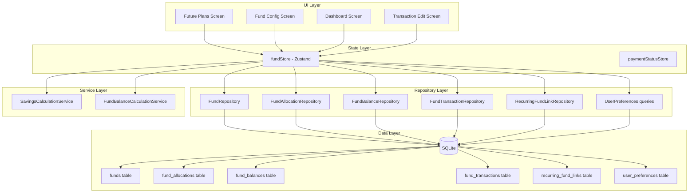

# Design Document: Future Plans Funds

## Overview

This feature adds a "Planos Futuros" (Future Plans) tab to the GG-Economy Mobile app, providing users with a comprehensive savings management system. The feature introduces fund allocation slots where users can distribute their monthly savings across different goals (e.g., travel, retirement, emergency fund), with accumulated balances tracked over time.

The implementation follows the existing offline-first architecture: SQLite storage via Drizzle ORM, repository pattern for data access, Zustand for reactive state, and expo-router for navigation. The feature integrates with existing transaction management, recurring transactions, and the Dashboard summary.

Key design decisions:

- **Five new SQLite tables**: `funds`, `fund_allocations`, `fund_balances`, `fund_transactions`, `recurring_fund_links` — each with clear responsibility boundaries.
- **Cents-based storage**: All monetary amounts stored as real (cents) consistent with existing schema convention.
- **Reference Month Constraint**: Only transactions with reference month ≤ current month count as deductions from fund balances. Future-dated ones are listed but not summed.
- **isExcludedFromTotals integration**: When a transaction is linked to a fund, it leverages the existing `isExcludedFromTotals` flag to remove it from regular monthly calculations.
- **Monthly Income as preference**: Stored in `user_preferences` with key `monthly_income`, independent of actual income transactions.
- **Savings Goal formula**: `Monthly_Income - Total_Paid - Total_Pending - max(0, General_Variable_Goal - Actual_Variable_Spending)`

## Architecture



The feature follows the existing layered architecture:

1. **UI Layer**: New `FuturePlans` tab screen + `FundConfig` settings screen + modifications to Dashboard and Transaction Edit screens
2. **State Layer**: A new `fundStore` (Zustand) manages all fund-related state reactively
3. **Service Layer**: Pure calculation functions for savings goals and fund balance computations
4. **Repository Layer**: Five new repository classes for fund-related tables + extension of user_preferences
5. **Data Layer**: Five new SQLite tables + reuse of `user_preferences` table

## Components and Interfaces

### New Files

| File                                                  | Purpose                                          |
| ----------------------------------------------------- | ------------------------------------------------ |
| `src/db/migrations/XXXX_add_funds_tables.sql`         | SQL migration for all fund-related tables        |
| `src/db/migrations/XXXX_add_funds_tables.ts`          | TypeScript migration wrapper                     |
| `src/repositories/FundRepository.ts`                  | Repository for fund CRUD                         |
| `src/repositories/FundAllocationRepository.ts`        | Repository for monthly fund allocation CRUD      |
| `src/repositories/FundBalanceRepository.ts`           | Repository for fund base balance management      |
| `src/repositories/FundTransactionRepository.ts`       | Repository for fund-transaction links            |
| `src/repositories/RecurringFundLinkRepository.ts`     | Repository for recurring-fund associations       |
| `src/stores/fundStore.ts`                             | Zustand store for fund state management          |
| `src/services/funds/SavingsCalculationService.ts`     | Pure functions for savings goal & actual savings |
| `src/services/funds/FundBalanceCalculationService.ts` | Pure function for total fund balance             |
| `src/hooks/useFuturePlansData.ts`                     | Hook composing fund store data for the screen    |
| `src/validation/fundValidation.ts`                    | Validation logic for fund inputs                 |
| `src/types/fund.ts`                                   | TypeScript types for fund entities               |
| `app/(tabs)/future-plans.tsx`                         | Future Plans tab screen                          |
| `app/(tabs)/settings/fund-config.tsx`                 | Fund configuration settings screen               |
| `src/components/future-plans/FundCard.tsx`            | Fund allocation card component                   |
| `src/components/future-plans/SavingsMetrics.tsx`      | Savings goal/actual display component            |
| `src/components/future-plans/FundTransactionList.tsx` | Linked transactions list component               |
| `src/components/future-plans/FundSelector.tsx`        | Fund picker modal for transaction linking        |

### Modified Files

| File                                                    | Change                                                                                                        |
| ------------------------------------------------------- | ------------------------------------------------------------------------------------------------------------- |
| `src/db/schema.ts`                                      | Add 5 new table definitions (funds, fund_allocations, fund_balances, fund_transactions, recurring_fund_links) |
| `app/(tabs)/_layout.tsx`                                | Add "Planos" tab between Manual and Settings                                                                  |
| `app/(tabs)/index.tsx`                                  | Add fund expense summary display                                                                              |
| `app/transaction/[id].tsx`                              | Add Fund selector to transaction edit screen                                                                  |
| `app/(tabs)/manual.tsx`                                 | Add optional Fund selector to manual entry                                                                    |
| `app/(tabs)/settings/_layout.tsx`                       | Add `fund-config` screen to stack                                                                             |
| `app/(tabs)/settings/index.tsx`                         | Add navigation item for Fund Configuration                                                                    |
| `src/components/ui/TabBarIcon.tsx`                      | Add "plans" icon variant                                                                                      |
| `src/hooks/useDashboardData.ts`                         | Include fund expense totals                                                                                   |
| `src/i18n/locales/pt-BR.json`                           | Add fund-related translation keys                                                                             |
| `src/i18n/locales/en.json`                              | Add fund-related translation keys                                                                             |
| `src/services/recurring/RecurringTransactionService.ts` | Check for fund link when generating transactions                                                              |

### Key Interfaces

```typescript
// src/types/fund.ts
export interface Fund {
  id: string;
  name: string;
  icon: string | null;
  color: string | null;
  isActive: boolean;
  createdAt: string; // ISO 8601
  updatedAt: string; // ISO 8601
}

export interface FundAllocation {
  id: string;
  fundId: string;
  referenceMonth: string; // YYYY-MM
  amount: number; // in cents, > 0
  createdAt: string;
  updatedAt: string;
}

export interface FundBalance {
  id: string;
  fundId: string;
  baseAmount: number; // in cents, >= 0
  updatedAt: string;
}

export interface FundTransaction {
  id: string;
  fundId: string;
  transactionId: string;
  createdAt: string;
}

export interface RecurringFundLink {
  id: string;
  recurringId: string;
  fundId: string;
  createdAt: string;
}

export interface FundWithBalance extends Fund {
  totalBalance: number; // calculated: base + allocations - deductions
  monthlyAllocation: number; // current month allocation
}
```

```typescript
// src/stores/fundStore.ts (Zustand store shape)
interface FundState {
  funds: Fund[];
  allocations: Map<string, FundAllocation>; // fundId -> current month allocation
  balances: Map<string, FundBalance>; // fundId -> base balance
  fundTransactions: Map<string, FundTransaction[]>; // fundId -> linked transactions
  monthlyIncome: number | null; // cents, null = not configured
  selectedMonth: string; // YYYY-MM
  isLoading: boolean;

  // Actions
  loadFunds(): Promise<void>;
  loadMonthData(month: string): Promise<void>;
  createFund(name: string, icon?: string, color?: string): Promise<Fund>;
  updateFund(id: string, updates: Partial<Fund>): Promise<void>;
  deactivateFund(id: string): Promise<void>;
  setMonthlyIncome(amountInCents: number): Promise<void>;
  removeMonthlyIncome(): Promise<void>;
  setAllocation(fundId: string, month: string, amountInCents: number): Promise<void>;
  removeAllocation(fundId: string, month: string): Promise<void>;
  linkTransaction(fundId: string, transactionId: string): Promise<void>;
  unlinkTransaction(transactionId: string): Promise<void>;
  setBaseBalance(fundId: string, amountInCents: number): Promise<void>;
  getFundExpensesForMonth(month: string): Promise<number>;
}
```

```typescript
// src/services/funds/SavingsCalculationService.ts
export interface SavingsCalculationInput {
  monthlyIncome: number; // cents
  totalPaidExpenses: number; // cents (includes variable, excludes fund-linked)
  totalPendingExpenses: number; // cents (includes variable, excludes fund-linked)
  actualVariableSpending: number; // cents (only paid variable expenses)
  generalVariableGoal: number | null; // cents, null = not configured
}

/**
 * Calculates the projected savings goal for the month.
 * Formula: monthlyIncome - totalPaid - totalPending - max(0, generalVariableGoal - actualVariableSpending)
 * If no variable goal is configured, the variable expectation is 0.
 */
export function calculateSavingsGoal(input: SavingsCalculationInput): number;

export interface ActualSavingsInput {
  totalReceivedIncome: number; // cents (only isPaid=true income)
  totalPaidExpenses: number; // cents (all paid expenses excluding fund-linked)
}

/**
 * Calculates the actual realized savings.
 * Formula: totalReceivedIncome - totalPaidExpenses
 */
export function calculateActualSavings(input: ActualSavingsInput): number;
```

```typescript
// src/services/funds/FundBalanceCalculationService.ts
export interface FundBalanceInput {
  baseAmount: number; // cents, from fund_balances table
  totalAllocations: number; // sum of all fund_allocations for this fund
  totalDeductions: number; // sum of linked transactions where referenceMonth <= currentMonth
}

/**
 * Calculates total fund balance.
 * Formula: baseAmount + totalAllocations - totalDeductions
 */
export function calculateFundBalance(input: FundBalanceInput): number;
```

### Validation Functions

```typescript
// src/validation/fundValidation.ts
export function validateFundName(name: string): { valid: boolean; error?: string };
export function validateMonetaryInput(
  input: string | number,
  locale: SupportedLocale,
  options?: { allowZero?: boolean; maxCents?: number }
): { valid: boolean; amountInCents?: number; error?: string };
```

## Data Models

### New Table: `funds`

```sql
CREATE TABLE `funds` (
  `id` TEXT PRIMARY KEY NOT NULL,
  `name` TEXT NOT NULL,
  `icon` TEXT,
  `color` TEXT,
  `is_active` INTEGER NOT NULL DEFAULT 1,
  `created_at` TEXT NOT NULL DEFAULT (datetime('now')),
  `updated_at` TEXT NOT NULL DEFAULT (datetime('now'))
);
```

### New Table: `fund_allocations`

```sql
CREATE TABLE `fund_allocations` (
  `id` TEXT PRIMARY KEY NOT NULL,
  `fund_id` TEXT NOT NULL REFERENCES `funds`(`id`) ON DELETE CASCADE,
  `reference_month` TEXT NOT NULL,
  `amount` REAL NOT NULL CHECK(`amount` > 0),
  `created_at` TEXT NOT NULL DEFAULT (datetime('now')),
  `updated_at` TEXT NOT NULL DEFAULT (datetime('now'))
);
CREATE UNIQUE INDEX `idx_fund_allocations_fund_month` ON `fund_allocations` (`fund_id`, `reference_month`);
```

### New Table: `fund_balances`

```sql
CREATE TABLE `fund_balances` (
  `id` TEXT PRIMARY KEY NOT NULL,
  `fund_id` TEXT NOT NULL UNIQUE REFERENCES `funds`(`id`) ON DELETE CASCADE,
  `base_amount` REAL NOT NULL DEFAULT 0 CHECK(`base_amount` >= 0),
  `updated_at` TEXT NOT NULL DEFAULT (datetime('now'))
);
```

### New Table: `fund_transactions`

```sql
CREATE TABLE `fund_transactions` (
  `id` TEXT PRIMARY KEY NOT NULL,
  `fund_id` TEXT NOT NULL REFERENCES `funds`(`id`) ON DELETE CASCADE,
  `transaction_id` TEXT NOT NULL UNIQUE REFERENCES `transactions`(`id`) ON DELETE CASCADE,
  `created_at` TEXT NOT NULL DEFAULT (datetime('now'))
);
CREATE INDEX `idx_fund_transactions_fund` ON `fund_transactions` (`fund_id`);
```

### New Table: `recurring_fund_links`

```sql
CREATE TABLE `recurring_fund_links` (
  `id` TEXT PRIMARY KEY NOT NULL,
  `recurring_id` TEXT NOT NULL UNIQUE REFERENCES `recurring_transactions`(`id`) ON DELETE CASCADE,
  `fund_id` TEXT NOT NULL REFERENCES `funds`(`id`) ON DELETE CASCADE,
  `created_at` TEXT NOT NULL DEFAULT (datetime('now'))
);
CREATE INDEX `idx_recurring_fund_links_fund` ON `recurring_fund_links` (`fund_id`);
```

### Monthly Income in `user_preferences`

| key              | value      | notes                                                       |
| ---------------- | ---------- | ----------------------------------------------------------- |
| `monthly_income` | `"500000"` | String representation of cents (e.g., R$ 5.000,00 = 500000) |

Row is deleted when value is removed (absence = not configured).

## Correctness Properties

### Property 1: Savings Goal calculation correctness

_For any_ valid combination of monthly income, total paid, total pending, actual variable spending, and general variable goal, the `calculateSavingsGoal` function SHALL return `monthlyIncome - totalPaid - totalPending - max(0, generalVariableGoal - actualVariableSpending)`. When no variable goal is configured, the variable expectation term SHALL be 0.

**Validates: Requirements 3.2, 3.3, 3.4, 3.5**

### Property 2: Actual Savings calculation correctness

_For any_ valid combination of total received income and total paid expenses, the `calculateActualSavings` function SHALL return `totalReceivedIncome - totalPaidExpenses`. The result may be negative.

**Validates: Requirements 4.2, 4.5**

### Property 3: Fund Balance calculation correctness

_For any_ valid base amount (≥ 0), total allocations (≥ 0), and total deductions (≥ 0), the `calculateFundBalance` function SHALL return `baseAmount + totalAllocations - totalDeductions`. The result may be negative (indicating overspending from the fund).

**Validates: Requirements 7.3**

### Property 4: Reference Month Constraint filtering

_For any_ set of linked transactions with various reference months and _for any_ current month value, the deduction calculation SHALL include only transactions where `referenceMonth <= currentMonth` and SHALL exclude transactions where `referenceMonth > currentMonth`.

**Validates: Requirements 9.1, 9.4**

### Property 5: Fund allocation remaining calculation

_For any_ savings goal value and _for any_ set of fund allocations with positive amounts, the remaining distributable amount SHALL equal `savingsGoal - sum(allocations)`. The result may be negative.

**Validates: Requirements 6.3, 6.4**

### Property 6: Fund name validation

_For any_ string of length 0 or greater than 50 characters, the fund name validation SHALL return `{ valid: false }`. For any string of length 1-50, the validation SHALL return `{ valid: true }`.

**Validates: Requirements 5.6**

### Property 7: Monetary input validation

_For any_ numeric value ≤ 0, > 999,999,999.99, NaN, or non-numeric input, the monetary validation function SHALL return `{ valid: false }`. For any value between 0.01 and 999,999,999.99, it SHALL return `{ valid: true, amountInCents }` with correct cent conversion.

**Validates: Requirements 2.5, 6.7**

### Property 8: Fund persistence round-trip

_For any_ valid fund name (1-50 chars), creating a fund via the repository and reading it back SHALL return the same name. For any valid allocation amount and month, persisting and reading back SHALL return the same values.

**Validates: Requirements 5.3, 6.2, 7.2**

## Error Handling

| Scenario                                      | Handling                                                      |
| --------------------------------------------- | ------------------------------------------------------------- |
| Monthly income not configured                 | Show prompt on Future Plans screen directing user to config   |
| Database write failure (save fund/allocation) | Show localized toast error, do not update local state         |
| Database read failure (loading funds)         | Set `isLoading: false`, show error state, allow retry         |
| Invalid fund name input                       | Show inline validation below input, do not persist            |
| Invalid monetary input                        | Show inline validation message, do not persist                |
| Migration failure                             | Handled by existing `initializeDatabase()` error flow         |
| Fund deleted while editing allocation         | Zustand store reactively removes fund from state              |
| Transaction deleted while linked to fund      | CASCADE delete removes fund_transactions record automatically |
| Over-allocation (sum > savings goal)          | Display negative remaining value with warning color; no block |

## Testing Strategy

### Property-Based Tests (fast-check, minimum 100 iterations each)

| Test File                                                 | Property                      | Coverage         |
| --------------------------------------------------------- | ----------------------------- | ---------------- |
| `src/__tests__/savingsCalculation.property.test.ts`       | Property 1: Savings Goal      | Service layer    |
| `src/__tests__/actualSavings.property.test.ts`            | Property 2: Actual Savings    | Service layer    |
| `src/__tests__/fundBalance.property.test.ts`              | Property 3: Fund Balance      | Service layer    |
| `src/__tests__/referenceMonthConstraint.property.test.ts` | Property 4: Month Constraint  | Service layer    |
| `src/__tests__/fundAllocationRemaining.property.test.ts`  | Property 5: Remaining calc    | Service layer    |
| `src/__tests__/fundNameValidation.property.test.ts`       | Property 6: Name validation   | Validation layer |
| `src/__tests__/fundMonetaryValidation.property.test.ts`   | Property 7: Amount validation | Validation layer |
| `src/__tests__/fundPersistence.property.test.ts`          | Property 8: Round-trip        | Repository layer |

**PBT Library**: `fast-check` (already used in the project)
**Configuration**: `{ numRuns: 100 }` for each property test

### Unit Tests (example-based)

| Test File                                             | Coverage                                    |
| ----------------------------------------------------- | ------------------------------------------- |
| `src/__tests__/fundStore.test.ts`                     | Zustand store actions and state transitions |
| `src/__tests__/FundRepository.test.ts`                | Fund CRUD operations                        |
| `src/__tests__/FundAllocationRepository.test.ts`      | Allocation CRUD with unique constraints     |
| `src/__tests__/FundTransactionRepository.test.ts`     | Linking/unlinking with isExcludedFromTotals |
| `src/__tests__/components/FuturePlansScreen.test.tsx` | Screen rendering, metrics display           |
| `src/__tests__/components/FundCard.test.tsx`          | Fund card interactions                      |
| `src/__tests__/components/FundSelector.test.tsx`      | Fund picker modal behavior                  |

### Key Testing Decisions

- **Calculation tests**: Pure function testing with `fast-check` — no mocks needed
- **Repository tests**: Use in-memory SQLite (via `better-sqlite3` in Jest) to verify SQL behavior including constraints and cascades
- **Component tests**: React Native Testing Library with mocked stores
- **Integration points**: Transaction linking tested with actual store + repository to verify `isExcludedFromTotals` flag behavior
