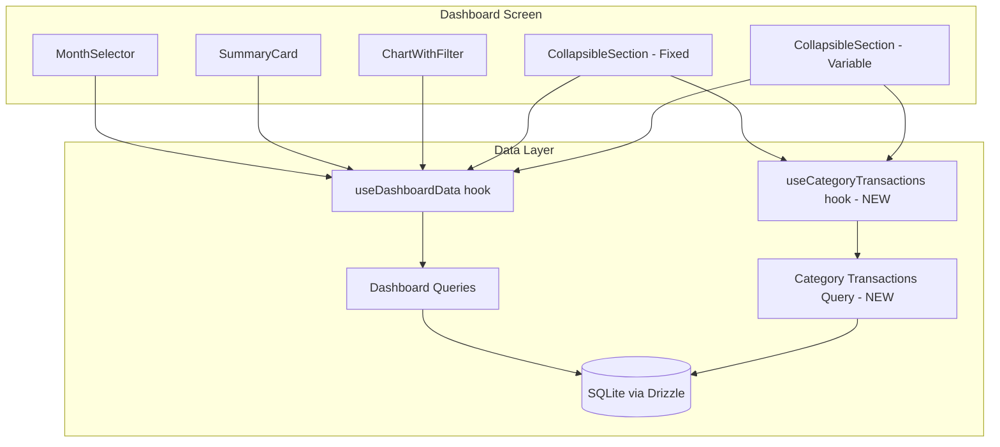

# Design Document: Home UI Categories Chart

## Overview

This design describes the redesign of the Dashboard (Home) screen to introduce collapsible expense group sections (Fixed/Variable), lazy-loaded transaction lists per category, an enhanced chart with fixed-vs-variable comparison and filter options, unrestricted future month navigation, and visual layout corrections.

The implementation builds on the existing architecture: Expo Router for navigation, Drizzle ORM with expo-sqlite for data, Zustand for state management, react-native-svg for charts, and the established theme system (spacing, shadows, borderRadius, colors).

### Key Design Decisions

1. **Collapsible sections use local component state** — no global store needed since collapse state is ephemeral and screen-scoped.
2. **Lazy loading via on-demand database queries** — transaction lists are fetched only when a category row is expanded, using the existing `getDb()` pattern with Drizzle queries.
3. **Chart filter state lives in the dashboard hook** — co-located with other dashboard state (selectedMonth, trendPeriod) for consistency.
4. **Month selector removes upper bound** — the existing `disableNext` prop is simply set to `false` (or removed), and a future-month indicator is added.
5. **Percentage rounding uses largest-remainder method** — ensures displayed percentages always sum to exactly 100%.

## Architecture



### Data Flow

1. `useDashboardData` is enhanced to return expense breakdown grouped by `expenseGroup` (fixed/variable).
2. The new `useCategoryTransactions(categoryId, month)` hook performs lazy queries when a category row is expanded.
3. The chart filter state (`chartFilter: 'all' | 'fixed' | 'variable'`) is added to `useDashboardData`.
4. The `MonthSelector` no longer restricts forward navigation.

## Components and Interfaces

### New Components

#### `CollapsibleSection`
A reusable collapsible container for expense group sections.

```typescript
interface CollapsibleSectionProps {
  title: string;                    // "Fixo" or "Variável"
  total: number;                    // Total in cents for the group
  categories: CategoryBreakdownItem[];
  isExpanded: boolean;
  onToggle: () => void;
  onCategoryPress: (categoryId: string) => void;
  expandedCategoryId: string | null;
  selectedMonth: string;
  testID?: string;
}
```

#### `CategoryRow`
An individual category line item that can expand to show transactions.

```typescript
interface CategoryRowProps {
  category: CategoryBreakdownItem;
  isExpanded: boolean;
  onPress: () => void;
  selectedMonth: string;
  testID?: string;
}
```

#### `TransactionList`
Inline list of transactions for an expanded category (lazy-loaded).

```typescript
interface TransactionListProps {
  categoryId: string;
  month: string;
  testID?: string;
}
```

#### `ChartFilter`
Filter selector for the expense chart.

```typescript
type ChartFilterOption = 'all' | 'fixed' | 'variable';

interface ChartFilterProps {
  selected: ChartFilterOption;
  onSelect: (option: ChartFilterOption) => void;
  testID?: string;
}
```

#### `ExpenseChart`
Enhanced chart component supporting fixed-vs-variable comparison and per-group breakdown.

```typescript
interface ExpenseChartProps {
  fixedTotal: number;
  variableTotal: number;
  fixedCategories: CategoryBreakdownItem[];
  variableCategories: CategoryBreakdownItem[];
  filter: ChartFilterOption;
  testID?: string;
}
```

### Modified Components

#### `MonthSelector` (modified)
- Remove `disableNext` logic (always enabled for forward navigation)
- Add `isFutureMonth` prop for visual indicator

#### `useDashboardData` (enhanced)
- Add `fixedBreakdown: CategoryBreakdownItem[]` — categories with `expenseGroup = 'fixed'`
- Add `variableBreakdown: CategoryBreakdownItem[]` — categories with `expenseGroup = 'variable'`
- Add `fixedTotal: number` and `variableTotal: number`
- Add `chartFilter` state and `setChartFilter` setter
- Remove upper-bound restriction on `nextMonth`

### New Hook

#### `useCategoryTransactions`

```typescript
interface UseCategoryTransactionsReturn {
  transactions: TransactionItem[];
  isLoading: boolean;
  error: string | null;
  retry: () => void;
}

interface TransactionItem {
  id: string;
  description: string;
  amount: number;
  date: string;
}

function useCategoryTransactions(
  categoryId: string | null,
  month: string,
  enabled: boolean
): UseCategoryTransactionsReturn;
```

This hook only executes the database query when `enabled` is `true` (i.e., when the category row is expanded). When `enabled` becomes `false`, the data is cleared from memory.

### New Database Query

#### `getCategoryTransactionsQuery`

```typescript
function getCategoryTransactionsQuery(categoryId: string, referenceMonth: string) {
  const db = getDb();
  return db
    .select({
      id: transactions.id,
      description: transactions.description,
      amount: transactions.amount,
      date: transactions.date,
    })
    .from(transactions)
    .where(
      and(
        eq(transactions.categoryId, categoryId),
        eq(transactions.referenceMonth, referenceMonth),
        eq(transactions.isExcludedFromTotals, false)
      )
    )
    .orderBy(desc(transactions.date));
}
```

#### Enhanced `getCategoryBreakdownQuery`

The existing query is enhanced to also return `expenseGroup` from the categories table:

```typescript
// Add to select:
expenseGroup: categories.expenseGroup,
```

## Data Models

### Enhanced CategoryBreakdownItem

```typescript
interface CategoryBreakdownItem {
  categoryId: string | null;
  categoryName: string;
  categoryType: CategoryType | null;
  categoryColor: string;
  categoryIcon: string;
  expenseGroup: ExpenseGroup | null;  // NEW
  total: number;
  count: number;
  percentage: number;
}
```

### Chart Data Structures

```typescript
interface ChartSegment {
  id: string;
  label: string;
  value: number;       // Amount in cents
  color: string;
  percentage: number;  // Integer 0-100, sum always equals 100
}

interface FixedVsVariableData {
  fixed: ChartSegment;
  variable: ChartSegment;
}
```

### Percentage Rounding (Largest Remainder Method)

```typescript
/**
 * Rounds percentages to integers while ensuring they sum to exactly 100.
 * Uses the largest-remainder method (Hamilton's method).
 */
function roundPercentages(values: number[], total: number): number[] {
  if (total === 0) return values.map(() => 0);
  
  const rawPercentages = values.map(v => (v / total) * 100);
  const floored = rawPercentages.map(Math.floor);
  const remainders = rawPercentages.map((raw, i) => raw - floored[i]);
  
  let remaining = 100 - floored.reduce((sum, v) => sum + v, 0);
  
  // Distribute remaining points to entries with largest remainders
  const indices = remainders
    .map((r, i) => ({ remainder: r, index: i }))
    .sort((a, b) => b.remainder - a.remainder);
  
  for (let i = 0; i < remaining; i++) {
    floored[indices[i].index]++;
  }
  
  return floored;
}
```

## Correctness Properties

*A property is a characteristic or behavior that should hold true across all valid executions of a system — essentially, a formal statement about what the system should do. Properties serve as the bridge between human-readable specifications and machine-verifiable correctness guarantees.*

### Property 1: Category grouping partitions by expenseGroup

*For any* array of expense categories with mixed `expenseGroup` values ('fixed', 'variable', or null), the grouping function SHALL place all categories with `expenseGroup = 'fixed'` into the fixed group, all categories with `expenseGroup = 'variable'` into the variable group, and exclude all categories with `expenseGroup = null` from both groups.

**Validates: Requirements 1.1**

### Property 2: Section total equals sum of category amounts

*For any* non-empty array of category breakdown items belonging to an expense group, the computed section total SHALL equal the arithmetic sum of all individual category `total` values in that group.

**Validates: Requirements 1.7, 1.8**

### Property 3: Transaction list ordering by date descending

*For any* non-empty list of transactions returned for a category in a given month, the list SHALL be ordered such that for every consecutive pair of transactions (t[i], t[i+1]), the date of t[i] is greater than or equal to the date of t[i+1].

**Validates: Requirements 2.5**

### Property 4: Percentage rounding invariant — sum equals 100

*For any* set of two or more positive monetary values whose sum is greater than zero, the `roundPercentages` function SHALL produce integer percentages that sum to exactly 100.

**Validates: Requirements 3.3**

### Property 5: Filtered chart shows only matching group with correct relative percentages

*For any* set of expense categories and a selected filter ('fixed' or 'variable'), the chart SHALL display only categories belonging to the selected expense group, and their displayed percentages SHALL sum to exactly 100 (relative to the group total, not the overall total).

**Validates: Requirements 4.2, 4.3**

### Property 6: Month advancement produces correct next month

*For any* valid YYYY-MM string, advancing to the next month SHALL produce the chronologically next month, correctly handling December→January year transitions (e.g., "2024-12" → "2025-01").

**Validates: Requirements 5.2**

## Error Handling

| Scenario | Behavior |
|----------|----------|
| Category transactions query fails | Show inline error message with retry button inside the expanded category row |
| Empty transaction list for category | Show inline empty state message ("Nenhum lançamento neste mês") |
| Dashboard data loading fails | Existing error state with retry (already implemented) |
| Zero expenses for a group | Section header shows R$ 0,00; chart shows empty state when all groups are zero |
| Future month with no data | All sections render with zero totals; chart shows empty state |

### Error Recovery

- **Retry mechanism**: The `useCategoryTransactions` hook exposes a `retry()` function that re-executes the query.
- **Graceful degradation**: If breakdown data fails to load expense groups, fall back to showing all categories in a single ungrouped list (backward-compatible behavior).

## Testing Strategy

### Property-Based Tests (fast-check)

The project already uses `fast-check` for property-based testing. Each property test will run a minimum of 100 iterations.

| Property | Test File | What It Validates |
|----------|-----------|-------------------|
| 1: Category grouping | `categoryGrouping.property.test.ts` | Correct partitioning by expenseGroup |
| 2: Section totals | `sectionTotals.property.test.ts` | Sum computation correctness |
| 3: Transaction ordering | `transactionOrdering.property.test.ts` | Date descending sort invariant |
| 4: Percentage rounding | `percentageRounding.property.test.ts` | Sum-to-100 invariant |
| 5: Filter percentages | `filterPercentages.property.test.ts` | Group filtering + relative percentages |
| 6: Month advancement | `monthAdvancement.property.test.ts` | Correct next-month derivation |

**Tag format**: `Feature: home-ui-categories-chart, Property {N}: {title}`

**Configuration**: Each test uses `{ numRuns: 100 }` minimum.

### Unit Tests (example-based)

- Initial state: both sections expanded, "Todos" filter selected
- Collapse/expand toggle behavior
- Chevron indicator direction
- Empty section with zero total
- Chart empty state when total is zero
- Filter visual active state
- Future month indicator display
- Layout component order and spacing values
- Shadow elevation hierarchy (lg for SummaryCard, sm/md for others)

### Integration Tests

- Lazy loading: expand category → loading indicator → data appears
- Error state: mock query failure → error message + retry button
- Month navigation: navigate to future month → dashboard renders with zeros
- Filter change: select "Somente Fixo" → chart updates with only fixed categories

### Edge Cases (covered by property generators)

- Categories with `expenseGroup = null` excluded from both sections
- Single category in a group (100% percentage)
- December→January year boundary in month advancement
- All amounts are zero
- Very large number of categories (performance)
