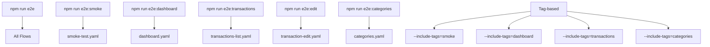
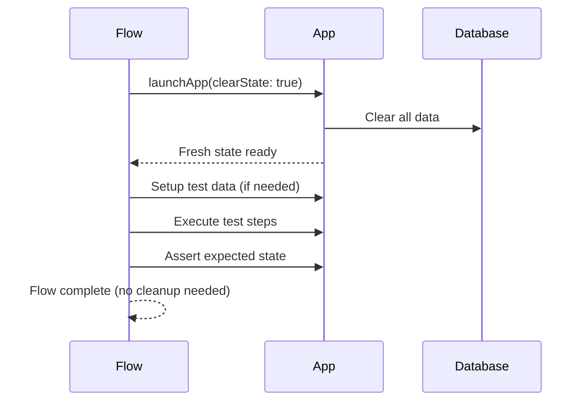

# Design Document: Maestro E2E Testing

## Overview

This design covers the comprehensive Maestro E2E testing strategy for the GG Economy Mobile app. The goal is to expand test coverage beyond the existing flows (smoke-test, import, manual-entry, backup, navigation, language) to include new flows for Dashboard interactions, Transactions list operations, Transaction editing, and Categories management. The design also addresses improvements to existing flows to fully satisfy the requirements.

### Current State

The project already has:
- **8 existing flows**: smoke-test.yaml, import-flow.yaml, import-flow-mock.yaml, manual-entry.yaml, backup-flow.yaml, backup-flow-mock.yaml, navigation.yaml, language.yaml
- **Maestro config**: `.maestro/config.yaml` with env vars, tags, and JUnit reporting
- **npm scripts**: `e2e`, `e2e:smoke`, `e2e:import`, `e2e:manual`, `e2e:backup`, `e2e:navigation`, `e2e:language`
- **testIDs**: Comprehensive testID coverage across Dashboard, Transactions, Manual Entry, Settings, and Transaction Detail screens

### New Flows Needed

| Flow | File | Tag | Validates |
|------|------|-----|-----------|
| Dashboard Flow | `dashboard.yaml` | dashboard | Requirement 3 |
| Transactions List Flow | `transactions-list.yaml` | transactions | Requirement 4 |
| Transaction Edit Flow | `transaction-edit.yaml` | transactions | Requirement 9 |
| Categories Management Flow | `categories.yaml` | categories | Requirement 10 |

### Existing Flow Improvements

| Flow | Improvement | Validates |
|------|-------------|-----------|
| smoke-test.yaml | Add screenshot assertions, timeout validation | Requirement 2 |
| navigation.yaml | Add Notifications sub-setting navigation | Requirement 6 |

## Architecture

### Flow Organization

```
.maestro/
├── config.yaml                    # Global config (appId, env vars, tags, reporting)
├── flows/
│   ├── smoke-test.yaml            # [existing] App launch + tab navigation
│   ├── import-flow.yaml           # [existing] Full import with document picker
│   ├── import-flow-mock.yaml      # [existing] CI-friendly import
│   ├── manual-entry.yaml          # [existing] Manual transaction entry
│   ├── backup-flow.yaml           # [existing] Full backup with OAuth
│   ├── backup-flow-mock.yaml      # [existing] CI-friendly backup UI
│   ├── navigation.yaml            # [existing] Comprehensive navigation
│   ├── language.yaml              # [existing] Language switching + persistence
│   ├── dashboard.yaml             # [NEW] Dashboard interactions
│   ├── transactions-list.yaml     # [NEW] Transactions list + filters + pagination
│   ├── transaction-edit.yaml      # [NEW] Transaction edit modal
│   └── categories.yaml            # [NEW] Categories CRUD management
└── reports/                       # JUnit XML reports (generated)
```

### Flow Execution Strategy



### Test Independence Model

Each flow follows the independence pattern:



## Components and Interfaces

### Flow Component Structure

Each new flow follows a consistent structure:

```yaml
# Header: appId, tags, description
appId: com.ggeconomy.mobile

---
# PART A: App Launch (clearState: true for independence)
- launchApp:
    clearState: true

# PART B-N: Test steps organized by feature area
# Each part is self-contained and creates its own test data

# Final: Summary log
- runScript:
    script: |
      console.log('Flow completed successfully!');
```

### TestID Interface Map

#### Dashboard Screen (`app/(tabs)/index.tsx`)

| testID | Element | Used In |
|--------|---------|---------|
| `dashboard-month-selector` | MonthSelector component | dashboard.yaml |
| `dashboard-summary` | SummaryCard (Income/Expenses/Balance) | dashboard.yaml |
| `dashboard-chart-filter` | ChartFilter (All/Fixed/Variable) | dashboard.yaml |
| `dashboard-expense-chart` | ExpenseChart visualization | dashboard.yaml |
| `dashboard-fixed-section` | CollapsibleSection for fixed expenses | dashboard.yaml |
| `dashboard-variable-section` | CollapsibleSection for variable expenses | dashboard.yaml |

#### Transactions Screen (`app/(tabs)/transactions.tsx`)

| testID | Element | Used In |
|--------|---------|---------|
| `transactions-screen` | SafeAreaView container | transactions-list.yaml |
| `monthly-summary` | MonthlySummary component | transactions-list.yaml |
| `month-selector` | MonthSelector in transactions | transactions-list.yaml |
| `transactions-list` | FlashList component | transactions-list.yaml |
| `add-transaction-button` | "+" FAB button | transactions-list.yaml |
| `loading-more-indicator` | Infinite scroll loading | transactions-list.yaml |
| `empty-transactions` | EmptyState component | transactions-list.yaml |
| `transaction-card-{id}` | Individual transaction card | transactions-list.yaml |

#### Transaction Detail Screen (`app/transaction/[id].tsx`)

| testID | Element | Used In |
|--------|---------|---------|
| `transaction-detail-screen` | SafeAreaView container | transaction-edit.yaml |
| `amount-display` | Amount text display | transaction-edit.yaml |
| `details-card` | Transaction details card | transaction-edit.yaml |
| `detail-category` | Category row (tappable) | transaction-edit.yaml |
| `detail-description` | Description row | transaction-edit.yaml |
| `edit-button` | Edit action button | transaction-edit.yaml |
| `delete-button` | Delete action button | transaction-edit.yaml |
| `category-edit-modal` | Category selection modal | transaction-edit.yaml |
| `category-edit-selector` | CategorySelector in modal | transaction-edit.yaml |
| `category-edit-cancel` | Cancel button in modal | transaction-edit.yaml |
| `edit-prompt-dialog` | InputPromptDialog for edits | transaction-edit.yaml |

#### Categories Screen (`app/(tabs)/settings/categories.tsx`)

| testID | Element | Used In |
|--------|---------|---------|
| `categories-settings-screen` | ScrollView container | categories.yaml |
| `add-category-button` | Add category button | categories.yaml |
| `category-form-modal` | Category form modal | categories.yaml |
| `close-category-modal` | Close modal button | categories.yaml |
| `save-category-button` | Save button in form | categories.yaml |
| `category-name-input` | Name TextInput | categories.yaml |
| `type-expense-button` | Expense type selector | categories.yaml |
| `type-income-button` | Income type selector | categories.yaml |
| `icon-picker-button` | Icon picker trigger | categories.yaml |
| `color-picker-button` | Color picker trigger | categories.yaml |
| `category-item-{id}` | Individual category row | categories.yaml |
| `expense-group-filter` | Expense group filter tabs | categories.yaml |

### npm Script Interface

New scripts to add to `package.json`:

```json
{
  "e2e:dashboard": "maestro test .maestro/flows/dashboard.yaml",
  "e2e:transactions": "maestro test .maestro/flows/transactions-list.yaml",
  "e2e:edit": "maestro test .maestro/flows/transaction-edit.yaml",
  "e2e:categories": "maestro test .maestro/flows/categories.yaml"
}
```

## Data Models

### Flow Configuration Model

Each flow uses the shared config from `.maestro/config.yaml`:

```yaml
# Inherited by all flows
appId: com.ggeconomy.mobile
env:
  APP_NAME: "GG-Economy"
  DEFAULT_TIMEOUT: "10000"
  TEST_AMOUNT: "100.00"
  TEST_DESCRIPTION: "Test Transaction"
```

### Test Data Creation Pattern

Since flows use `clearState: true`, each flow that needs pre-existing data must create it inline. The pattern for creating test transactions within a flow:

```yaml
# Navigate to Manual Entry and create a test transaction
- tapOn: "Manual"
- extendedWaitUntil:
    visible:
      id: "manual-screen"
    timeout: 5000

# Fill form
- tapOn:
    id: "type-expense"
- tapOn:
    id: "amount-input"
- inputText: "50.00"
- tapOn:
    id: "description-input"
- inputText: "Test Expense"
- tapOn:
    id: "submit-button"

# Wait for success
- extendedWaitUntil:
    visible: "success"
    timeout: 5000
```

### Tag Taxonomy

| Tag | Scope | Flows |
|-----|-------|-------|
| `smoke` | Quick validation | smoke-test.yaml |
| `dashboard` | Dashboard screen | dashboard.yaml |
| `transactions` | Transaction operations | transactions-list.yaml, transaction-edit.yaml |
| `manual` | Manual entry | manual-entry.yaml |
| `import` | File import | import-flow.yaml, import-flow-mock.yaml |
| `backup` | Backup/restore | backup-flow.yaml, backup-flow-mock.yaml |
| `navigation` | Navigation paths | navigation.yaml |
| `i18n` | Internationalization | language.yaml |
| `categories` | Category management | categories.yaml |

### Timeout Strategy

| Context | Timeout | Rationale |
|---------|---------|-----------|
| App launch | 15000ms | Cold start with DB initialization |
| Tab navigation | 5000ms | Simple navigation transition |
| Form submission | 10000ms | DB write + UI update |
| Modal open/close | 3000ms | Animation + render |
| Scroll/pagination | 5000ms | Data fetch + render |
| Language switch | 5000ms | Full re-render of UI strings |

## Error Handling

### Flow Failure Modes

| Failure Type | Detection | Recovery Strategy |
|--------------|-----------|-------------------|
| Element not found | Maestro timeout | Use `optional: true` for non-critical elements; fail with screenshot for critical ones |
| App crash | Maestro detects process death | Flow fails; screenshot captured automatically |
| Timeout exceeded | `extendedWaitUntil` timeout | Fail with descriptive error; screenshot at failure point |
| Wrong screen state | `assertVisible` fails | Flow fails; screenshot shows actual state |
| Keyboard blocking | Element obscured | Use `hideKeyboard` before assertions |
| Alert/Dialog blocking | Unexpected modal | Use `back` or dismiss before continuing |

### Defensive Patterns

```yaml
# Pattern 1: Optional elements (may not exist in all states)
- tapOn:
    id: "element-that-may-not-exist"
    optional: true

# Pattern 2: Wait with fallback
- extendedWaitUntil:
    anyOf:
      - visible: "Expected State A"
      - visible: "Expected State B"
    timeout: 5000

# Pattern 3: Keyboard dismissal before navigation
- hideKeyboard
- tapOn: "Next Button"

# Pattern 4: Screenshot on critical assertions
- assertVisible: "Critical Element"
- takeScreenshot: "critical_element_verified"
```

### Retry Configuration

From `config.yaml`:
```yaml
executionOrder:
  continueOnFailure: false
  retryFailedTests: 1
```

Each flow gets one automatic retry on failure. This handles transient issues like slow animations or brief network delays.

## Testing Strategy

### Testing Approach

This feature is about writing E2E test flows (YAML configuration files) that exercise the app's UI. Property-based testing is **not applicable** here because:

1. Maestro flows are declarative YAML configurations, not functions with inputs/outputs
2. There are no universal properties to verify across random inputs
3. The "code under test" is the app's UI behavior, validated through specific interaction sequences
4. Each flow tests a concrete user journey with deterministic steps

### Verification Strategy

Instead of PBT, the testing strategy uses:

1. **Manual execution verification**: Run each flow against the emulator and confirm it passes
2. **Screenshot comparison**: Visual verification at key steps
3. **JUnit reports**: Machine-readable pass/fail results in `.maestro/reports/`
4. **Tag-based selective execution**: Run subsets of flows for faster feedback

### Test Coverage Matrix

| Requirement | Flow(s) | Coverage Type |
|-------------|---------|---------------|
| Req 1: Environment | Manual verification + smoke-test.yaml | Smoke |
| Req 2: Smoke Test | smoke-test.yaml | Smoke |
| Req 3: Dashboard | dashboard.yaml | Functional |
| Req 4: Transactions List | transactions-list.yaml | Functional |
| Req 5: Manual Entry | manual-entry.yaml (existing) | Functional |
| Req 6: Settings Navigation | navigation.yaml (existing + update) | Navigation |
| Req 7: Language Switching | language.yaml (existing) | Functional |
| Req 8: Backup Settings | backup-flow-mock.yaml (existing) | Functional |
| Req 9: Transaction Edit | transaction-edit.yaml | Functional |
| Req 10: Categories | categories.yaml | Functional |
| Req 11: Reporting | All flows (JUnit config) | Infrastructure |
| Req 12: Data Independence | All flows (clearState: true) | Design pattern |

### Flow Design Principles

1. **Independence**: Every flow uses `clearState: true` — no shared state between flows
2. **Self-contained data**: Flows that need data create it as part of their setup steps
3. **Deterministic**: No reliance on external state, network, or timing
4. **Observable**: Screenshots at key steps for visual debugging
5. **Tagged**: Every flow has appropriate tags for selective execution
6. **Timeout-aware**: Explicit timeouts tuned to each operation type

### Execution Modes

| Mode | Command | Use Case |
|------|---------|----------|
| All flows | `npm run e2e` | Full regression |
| Single flow | `npm run e2e:dashboard` | Focused testing |
| By tag | `maestro test .maestro/flows --include-tags=smoke` | Category testing |
| Studio | `npm run e2e:studio` | Interactive debugging |

### CI/CD Considerations

- All new flows should work without external dependencies (no OAuth, no network)
- Flows that require external services have mock variants (backup-flow-mock.yaml)
- JUnit reports enable integration with CI dashboards
- Screenshot artifacts can be collected for visual regression tracking
