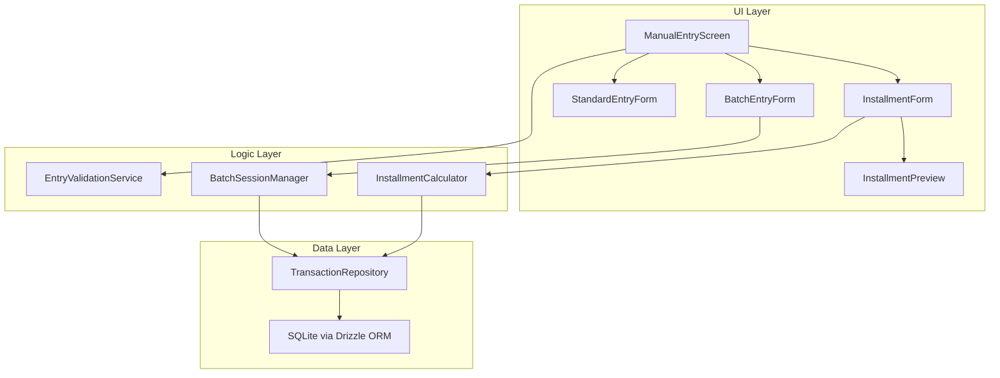
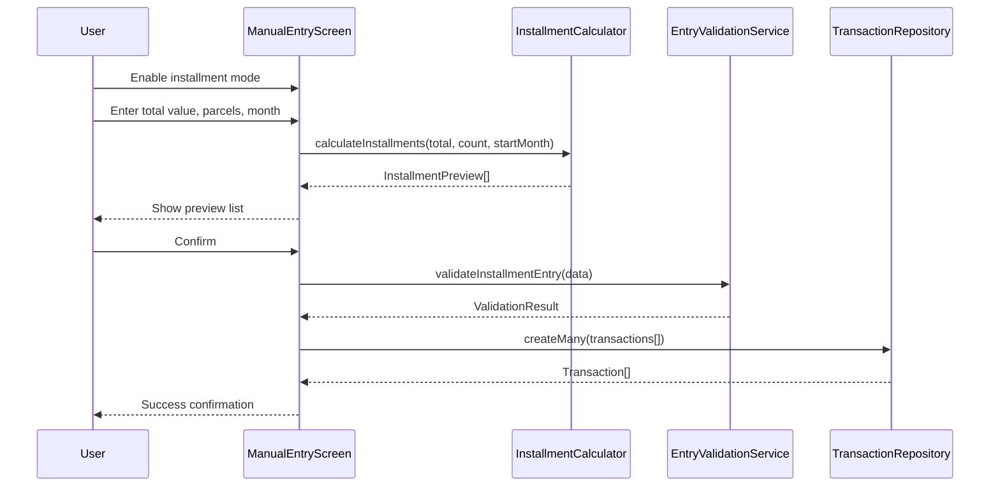

# Design Document: Manual Entry Installments

## Overview

This design reformulates the manual entry screen of GG Economy Mobile to remove the import functionality from navigation, add installment support (parcelamento) for splitting transactions across future months, and introduce a batch entry mode that allows multiple entries under the same category without re-selection.

The system leverages the existing Drizzle ORM + expo-sqlite stack, Zustand stores, and expo-router tab navigation. New pure logic services handle installment calculation and batch session management, while the existing `TransactionRepository` handles persistence through its `createMany` and `deleteMany` methods.

### Key Design Decisions

1. **Installment group tracking via `installmentGroupId`**: A new column on the `transactions` table links parcels together, enabling group operations (delete all, recalculate) without a separate join table.
2. **Pure calculation functions**: Installment splitting and month advancement are implemented as pure functions, making them highly testable with property-based testing.
3. **Batch session in-memory only**: Batch mode state lives in a Zustand store (not persisted to DB until each entry is saved), keeping the architecture simple and consistent with existing patterns.
4. **Navigation simplification**: The "Review" tab is removed alongside import routes, reducing tabs from 5 to 4 (Dashboard, Transactions, Manual Entry, Settings).

## Architecture



### Flow: Installment Creation



## Components and Interfaces

### InstallmentCalculator (Pure Service)

```typescript
interface InstallmentDetail {
  index: number; // 1-based parcel number
  totalParcels: number; // total N
  amount: number; // value in cents for this parcel
  referenceMonth: string; // YYYY-MM
  descriptionSuffix: string; // " (X/N)"
}

interface InstallmentCalculatorInput {
  totalAmount: number; // total value in cents
  parcelCount: number; // 2-48
  startMonth: string; // YYYY-MM
  description: string;
  categoryId: string;
  originId?: string;
}

// Pure functions
function calculateInstallments(input: InstallmentCalculatorInput): InstallmentDetail[];
function advanceMonth(month: string, offset: number): string;
function distributeAmount(total: number, parts: number): number[];
```

### BatchSessionManager (Zustand Store)

```typescript
interface BatchSession {
  isActive: boolean;
  categoryId: string | null;
  categoryType: 'income' | 'expense' | null;
  entryCount: number;
  maxEntries: number; // 50
  totalValue: number; // sum of all entries in session (cents)
}

interface BatchSessionActions {
  startSession(categoryId: string, categoryType: 'income' | 'expense'): void;
  incrementCount(amount: number): void;
  endSession(): BatchSessionSummary;
  reset(): void;
}

interface BatchSessionSummary {
  totalEntries: number;
  totalValue: number;
}
```

### EntryValidationService

```typescript
interface InstallmentValidationInput {
  totalAmount: number;
  parcelCount: number;
  description: string;
  startMonth: string;
  categoryId: string | null;
}

interface StandardValidationInput {
  amount: number;
  description: string;
  date: Date;
  categoryId: string | null;
  referenceMonth: string;
}

function validateInstallmentEntry(input: InstallmentValidationInput): ValidationResult;
function validateStandardEntry(input: StandardValidationInput): ValidationResult;
function validateBatchEntry(input: Omit<StandardValidationInput, 'categoryId'>): ValidationResult;
```

### Updated Navigation (Tabs Layout)

The tab layout reduces from 5 tabs to 4:

- Dashboard (index)
- Transactions
- Manual Entry (with installment/batch modes)
- Settings

The `review` tab and `app/import/` routes are removed. Any deep links to import/review routes redirect to manual entry.

## Data Models

### Schema Changes

A new column `installmentGroupId` is added to the `transactions` table to link installment parcels:

```typescript
// Addition to existing transactions table schema
installmentGroupId: (text('installment_group_id'), // UUID linking parcels of same installment
  // New index for efficient group queries
  index('idx_transactions_installment_group').on(table.installmentGroupId));
```

### Installment Group Identification

- Each installment operation generates a UUID (`installmentGroupId`) shared by all parcels
- Single (non-installment) transactions have `installmentGroupId = null`
- Batch entries are independent transactions with `installmentGroupId = null`

### Transaction Creation DTOs

```typescript
// Extended DTO for installment creation
interface CreateInstallmentDTO {
  totalAmount: number; // cents
  parcelCount: number; // 2-48
  startMonth: string; // YYYY-MM
  description: string;
  categoryId: string;
  categoryType: 'income' | 'expense';
  originId?: string;
  date: Date;
}

// Batch entry DTO (simplified - category comes from session)
interface CreateBatchEntryDTO {
  amount: number; // cents
  description: string;
  date: Date;
}
```

### Month Advancement Logic

```
startMonth = "2025-11", parcelCount = 3
→ parcels at: "2025-11", "2025-12", "2026-01"
```

Year rolls over when month exceeds 12. This is a pure function with no side effects.

### Amount Distribution Logic

```
totalAmount = 1000 (R$ 10,00), parcelCount = 3
→ base = floor(1000 / 3) = 333
→ remainder = 1000 - (333 * 3) = 1
→ parcels: [334, 333, 333] (first parcel absorbs remainder)
```

## Correctness Properties

_A property is a characteristic or behavior that should hold true across all valid executions of a system — essentially, a formal statement about what the system should do. Properties serve as the bridge between human-readable specifications and machine-verifiable correctness guarantees._

### Property 1: Amount distribution invariant

_For any_ valid total amount (1 to 99999999999 cents) and valid parcel count (2 to 48), the `distributeAmount` function SHALL produce an array where: (a) the sum of all elements equals the original total exactly, (b) the first element equals `floor(total / count) + (total % count)`, and (c) all remaining elements equal `floor(total / count)`.

**Validates: Requirements 2.3, 2.4, 2.5**

### Property 2: Month advancement correctness

_For any_ valid start month (YYYY-MM format) and valid parcel count (2 to 48), the `advanceMonth` function SHALL produce a sequence of months where each consecutive month is exactly one calendar month after the previous, correctly rolling over from December to January of the next year.

**Validates: Requirements 2.2, 3.2, 7.1**

### Property 3: Description suffix formatting

_For any_ non-empty description string and valid parcel count N (2 to 48), the installment creation logic SHALL produce N descriptions where the i-th description equals `"{original} (i/N)"` for i from 1 to N.

**Validates: Requirements 3.3**

### Property 4: Installment group homogeneity

_For any_ installment creation input with a given categoryId and originId, all generated transaction records SHALL share the same `categoryId`, `originId`, and `installmentGroupId`.

**Validates: Requirements 3.4**

### Property 5: Re-indexing after single parcel deletion

_For any_ installment group of size N and any valid removal index k (1 ≤ k ≤ N), after removing the k-th parcel, the remaining (N-1) parcels SHALL have their description suffixes re-indexed as sequential " (1/(N-1))", " (2/(N-1))", ..., " ((N-1)/(N-1))" in chronological order.

**Validates: Requirements 4.3**

### Property 6: Batch entry category and type derivation

_For any_ batch session with a selected category of type T (income or expense), every transaction created during that session SHALL have `categoryId` equal to the session's category and the amount sign consistent with type T (positive for income, negative for expense).

**Validates: Requirements 5.2, 6.1**

### Property 7: Reference month derivation from date

_For any_ valid Date object, the derived `referenceMonth` SHALL equal the date's year and month formatted as "YYYY-MM" (zero-padded month).

**Validates: Requirements 6.2**

### Property 8: Amount validation rejects invalid values

_For any_ amount that is zero, negative, or greater than 99999999999 (R$ 999.999.999,99 in cents), the validation function SHALL return `valid: false` with an appropriate error message.

**Validates: Requirements 8.1**

### Property 9: Description validation rejects invalid inputs

_For any_ string that is empty, composed entirely of whitespace characters, or longer than 100 characters, the validation function SHALL return `valid: false` with an appropriate error message.

**Validates: Requirements 8.2**

### Property 10: Minimum parcel value validation

_For any_ total amount and parcel count where `floor(total / count) < 1` (resulting in sub-cent parcels), the validation function SHALL return `valid: false` and prevent installment creation.

**Validates: Requirements 8.4**

## Error Handling

### Installment Creation Errors

- **Atomic transaction**: All parcels are created within a single SQLite transaction. If any insert fails, the entire transaction is rolled back via Drizzle's `db.transaction()`.
- **Validation errors**: Caught before DB interaction. The form retains all user input and highlights the invalid field.
- **Database errors**: Caught in the repository layer, surfaced as a toast error message. No partial data persists.

### Batch Mode Errors

- **Individual entry failure**: Only the failed entry is affected. The session counter does not increment. The form retains data for retry. Previously saved entries in the session remain intact.
- **Session limit reached**: When counter hits 50, the save button is disabled and an informative message is shown. No error state — graceful limit enforcement.

### Navigation Redirect Errors

- **Invalid route access**: The `_layout.tsx` catches navigation to removed routes (`/import/*`, `/review`) and redirects to `/manual`. No error shown to user — seamless redirect.

### Group Edit/Delete Errors

- **Atomic operations**: Group deletes and recalculations use SQLite transactions. On failure, all changes are rolled back and the user sees an error toast with original data preserved.
- **Concurrent modification**: Since this is a local SQLite database on a single device, concurrent modification is not a concern.

## Testing Strategy

### Property-Based Tests (fast-check)

The project already includes `fast-check` as a dev dependency. Each correctness property maps to a single property-based test with minimum 100 iterations.

**Target modules for PBT:**

- `src/services/installment/InstallmentCalculator.ts` — Properties 1, 2, 3, 4
- `src/services/installment/InstallmentGroupManager.ts` — Property 5
- `src/services/batch/BatchSessionManager.ts` — Property 6
- `src/utils/deriveReferenceMonth.ts` — Property 7
- `src/validation/installmentValidation.ts` — Properties 8, 9, 10

**Configuration:**

- Minimum 100 iterations per property test
- Each test tagged with: `Feature: manual-entry-installments, Property {N}: {title}`
- Tests located in `src/__tests__/properties/` directory

### Unit Tests (Jest)

Example-based tests for:

- Navigation tab rendering (4 tabs, correct labels)
- Route redirect behavior (import/review → manual)
- UI state management (form reset after batch save, dialog appearance)
- Installment preview formatting (locale-specific month names)
- Edge cases: 50th batch entry succeeds, 51st is blocked; parcel count boundaries (2, 48)

### Integration Tests

- Installment creation atomicity (mock DB failure mid-insert, verify rollback)
- Group deletion atomicity
- Batch session persistence (each save creates a real DB record)

### E2E Tests (Maestro)

Update existing `manual-entry.yaml` flow and add:

- `installment-flow.yaml` — Create installment, verify preview, confirm, check transactions
- `batch-entry-flow.yaml` — Activate batch mode, add multiple entries, verify counter and summary
