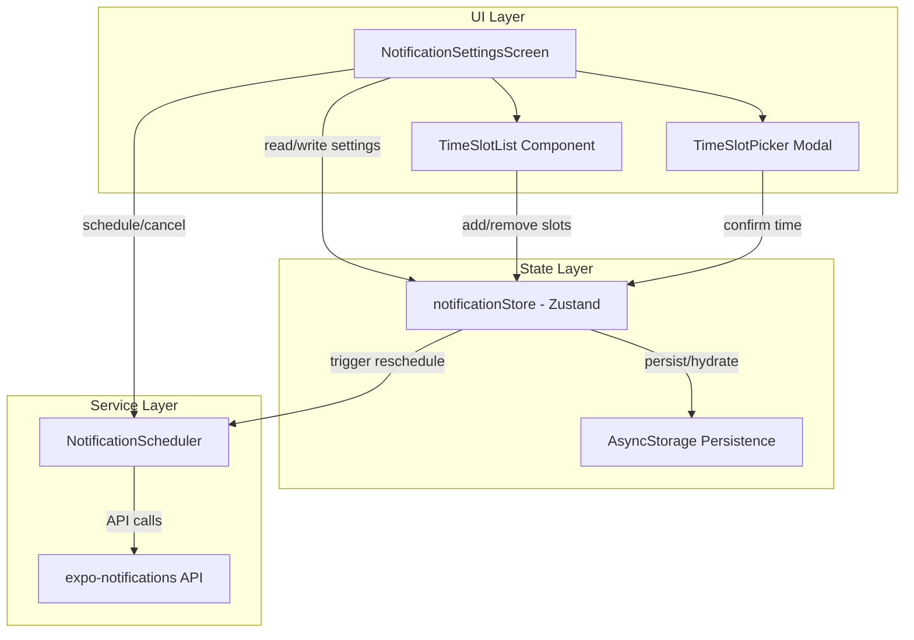

# Design Document: Multiple Daily Notifications

## Overview

This feature extends the existing notification system to support multiple intra-day notifications. Currently, the app schedules a single notification per cycle (daily, every 2 days, etc.) at one preferred time. This enhancement introduces a "Multiple times per day" frequency mode where users can configure up to 5 time slots, each triggering an independent notification daily.

The design preserves full backward compatibility with existing notification settings and scheduling logic. When the frequency is not "multipleDaily", the system behaves identically to the current implementation.

### Key Design Decisions

1. **Additive extension**: The new `multipleDaily` frequency is added to the existing `NotificationFrequency` union type rather than replacing the existing model. This ensures zero-risk backward compatibility.
2. **Independent scheduling per slot**: Each time slot gets its own `TIME_INTERVAL` trigger and notification ID, allowing independent rescheduling on delivery without affecting other slots.
3. **String-keyed mapping**: Notification IDs are stored in a `Record<string, string>` keyed by `"HH:MM"` format, providing O(1) lookup and natural deduplication.
4. **Graceful degradation**: Scheduling and restoration operations are isolated per slot — a failure for one slot does not block others.

## Architecture



### Data Flow

1. **User adds a time slot** → UI validates (no duplicates, max 5) → Store adds slot in sorted order → Scheduler cancels all and reschedules all slots
2. **User removes a time slot** → Store removes slot → Scheduler cancels all and reschedules remaining slots
3. **Notification delivered** → Scheduler identifies originating slot from payload data → Reschedules that slot for next day → Updates mapping
4. **App restart** → Store hydrates from AsyncStorage → Scheduler verifies each notification ID exists → Reschedules any missing ones

## Components and Interfaces

### Type Definitions

```typescript
// Extended frequency type
export type NotificationFrequency =
  | 'daily'
  | 'every2days'
  | 'every3days'
  | 'weekly'
  | 'disabled'
  | 'multipleDaily';

// New TimeSlot type
export interface TimeSlot {
  hour: number; // 0-23
  minute: number; // 0, 15, 30, 45
}

// Key format helper
export function timeSlotKey(slot: TimeSlot): string {
  return `${slot.hour.toString().padStart(2, '0')}:${slot.minute.toString().padStart(2, '0')}`;
}
```

### Store Extensions (notificationStore.ts)

```typescript
// Extended NotificationSettings
export interface NotificationSettings {
  // ... existing fields unchanged ...
  isEnabled: boolean;
  frequency: NotificationFrequency;
  preferredHour: number;
  preferredMinute: number;
  scheduledNotificationId: string | null;
  lastDeliveryTime: string | null;

  // New fields
  timeSlots: TimeSlot[];
  timeSlotNotificationIds: Record<string, string>; // key: "HH:MM", value: notification ID
}

// New store actions
interface NotificationStoreActions {
  // ... existing actions unchanged ...

  /** Add a time slot (sorted insertion, validates uniqueness and max 5) */
  addTimeSlot: (slot: TimeSlot) => boolean;

  /** Remove a time slot by key (validates min 1) */
  removeTimeSlot: (key: string) => boolean;

  /** Update the notification ID mapping for a specific slot */
  setTimeSlotNotificationId: (key: string, id: string | null) => void;

  /** Bulk update all time slot notification IDs */
  setTimeSlotNotificationIds: (ids: Record<string, string>) => void;
}
```

### Scheduler Extensions (NotificationScheduler.ts)

```typescript
export interface INotificationScheduler {
  // ... existing methods unchanged ...

  /**
   * Schedule notifications for all time slots in multipleDaily mode
   * @returns Mapping of slot keys to notification IDs
   */
  scheduleAllSlots: (
    timeSlots: TimeSlot[],
    settings: NotificationSettings
  ) => Promise<Record<string, string>>;

  /**
   * Restore all time slot notifications after app restart
   * Verifies each stored ID and reschedules missing ones
   */
  restoreMultipleSlots: (
    timeSlots: TimeSlot[],
    storedIds: Record<string, string>,
    settings: NotificationSettings
  ) => Promise<Record<string, string>>;

  /**
   * Calculate the next notification time across all time slots
   */
  calculateNextTimeMultiSlot: (timeSlots: TimeSlot[], fromTime?: Date) => Date | null;

  /**
   * Handle notification received for a specific time slot
   * Reschedules only the delivered slot for the next day
   */
  handleSlotNotificationReceived: (slotHour: number, slotMinute: number) => Promise<void>;
}
```

### UI Components

**TimeSlotListItem** — Renders a single time slot with formatted time and optional delete button.

```typescript
interface TimeSlotListItemProps {
  slot: TimeSlot;
  canDelete: boolean;
  onDelete: (key: string) => void;
}
```

**TimeSlotSection** — Container for the time slot list, add button, and max-reached message. Conditionally rendered when frequency is `multipleDaily`.

```typescript
interface TimeSlotSectionProps {
  timeSlots: TimeSlot[];
  onAddSlot: (slot: TimeSlot) => void;
  onRemoveSlot: (key: string) => void;
  disabled: boolean;
}
```

## Data Models

### Store State Shape (after extension)

```typescript
{
  settings: {
    isEnabled: boolean;
    frequency: NotificationFrequency; // now includes 'multipleDaily'
    preferredHour: number;
    preferredMinute: number;
    scheduledNotificationId: string | null;
    lastDeliveryTime: string | null;
    timeSlots: TimeSlot[];                    // NEW - sorted array
    timeSlotNotificationIds: Record<string, string>; // NEW - "HH:MM" → notif ID
  },
  permissionStatus: PermissionStatus;
  isHydrated: boolean;
}
```

### Default Values for New Fields

```typescript
{
  timeSlots: [],  // Empty until multipleDaily is first selected
  timeSlotNotificationIds: {}
}
```

### Persistence (partialize)

The `partialize` function is extended to include the new fields:

```typescript
partialize: (state) => ({
  settings: state.settings, // Already persists the full settings object
  permissionStatus: state.permissionStatus,
});
```

Since `timeSlots` and `timeSlotNotificationIds` are part of `settings`, they are automatically persisted.

### Hydration Logic

On rehydration, the `onRehydrateStorage` callback is extended:

```typescript
onRehydrateStorage: () => (state) => {
  if (state) {
    state.isHydrated = true;

    // Backward compatibility: initialize timeSlots if missing
    if (!state.settings.timeSlots) {
      state.settings.timeSlots = [
        {
          hour: state.settings.preferredHour,
          minute: state.settings.preferredMinute,
        },
      ];
    }

    // Initialize mapping if missing
    if (!state.settings.timeSlotNotificationIds) {
      state.settings.timeSlotNotificationIds = {};
    }

    // Validate frequency - fallback to defaults if invalid
    const validFrequencies = [
      'daily',
      'every2days',
      'every3days',
      'weekly',
      'disabled',
      'multipleDaily',
    ];
    if (!validFrequencies.includes(state.settings.frequency)) {
      state.settings = {
        ...DEFAULT_NOTIFICATION_SETTINGS,
        timeSlots: [],
        timeSlotNotificationIds: {},
      };
    }
  }
};
```

### Notification Data Payload

Each scheduled notification includes slot identification:

```typescript
{
  content: {
    title: "...",
    body: "...",
    data: {
      type: 'reminder',
      navigateTo: '/(tabs)/manual',
      slotHour: number,    // NEW
      slotMinute: number,  // NEW
    }
  },
  trigger: {
    type: SchedulableTriggerInputTypes.TIME_INTERVAL,
    seconds: calculatedSeconds
  }
}
```

## Correctness Properties

_A property is a characteristic or behavior that should hold true across all valid executions of a system — essentially, a formal statement about what the system should do. Properties serve as the bridge between human-readable specifications and machine-verifiable correctness guarantees._

### Property 1: Chronological Order Invariant

_For any_ time slot list and _for any_ valid time slot added to it, the resulting list SHALL always be sorted in ascending chronological order (comparing hour first, then minute).

**Validates: Requirements 1.2, 5.6**

### Property 2: Size Bounds Invariant

_For any_ sequence of add and remove operations on a time slot list, the list size SHALL always remain within the bounds [1, 5] inclusive. Add operations SHALL be rejected when size is 5, and remove operations SHALL be rejected when size is 1.

**Validates: Requirements 1.3, 1.6, 1.7**

### Property 3: Duplicate Rejection

_For any_ time slot list and _for any_ time slot whose hour and minute match an existing entry in the list, the add operation SHALL return false and the list SHALL remain unchanged.

**Validates: Requirements 1.4**

### Property 4: Removal Correctness

_For any_ time slot list with more than 1 entry and _for any_ valid slot key in that list, removing it SHALL decrease the list size by exactly 1 and the removed slot SHALL no longer appear in the list.

**Validates: Requirements 1.5**

### Property 5: Time Slot Preservation Round-Trip

_For any_ non-empty time slot list, switching frequency from "multipleDaily" to any other frequency and then back to "multipleDaily" SHALL result in the same time slot list without modification.

**Validates: Requirements 2.3, 2.5**

### Property 6: One-to-One Scheduling Mapping

_For any_ time slot list with N entries, after scheduling all slots, the resulting notification ID mapping SHALL contain exactly N entries, one for each unique slot key, and each value SHALL be a non-empty string.

**Validates: Requirements 3.1, 4.2**

### Property 7: Next-Day Rescheduling After Delivery

_For any_ time slot with hour H and minute M, after a notification delivery is handled for that slot, the next scheduled notification for that slot SHALL target the same hour H and minute M on the next calendar day.

**Validates: Requirements 3.2**

### Property 8: TIME_INTERVAL Seconds Calculation

_For any_ target time strictly in the future relative to a current time, the calculated trigger seconds SHALL equal `Math.floor((targetTime - currentTime) / 1000)` and SHALL always be at least 1.

**Validates: Requirements 3.3**

### Property 9: Error Isolation

_For any_ time slot list where scheduling or restoration fails for K slots (0 ≤ K < N), the remaining N-K slots SHALL still be successfully scheduled/restored with valid notification IDs.

**Validates: Requirements 3.5, 4.5**

### Property 10: Next Notification Time Calculation

_For any_ non-empty time slot list and _for any_ current time, the calculated next notification time SHALL be the earliest time slot whose target time is strictly after the current time. If all slots are at or before the current time today, the result SHALL be the earliest slot's time on the next calendar day.

**Validates: Requirements 6.1, 6.2, 6.3**

### Property 11: Backward-Compatible Hydration

_For any_ valid preferredHour (0-23) and preferredMinute (0-59), when the store hydrates without a timeSlots field, the resulting timeSlots array SHALL contain exactly one entry with hour equal to preferredHour and minute equal to preferredMinute.

**Validates: Requirements 7.1**

### Property 12: Frequency Type Backward Compatibility

_For any_ previously valid frequency value ('daily', 'every2days', 'every3days', 'weekly', 'disabled'), the store SHALL accept it without error, and the scheduler SHALL use the single preferredHour/preferredMinute with the existing FREQUENCY_DAYS interval mapping.

**Validates: Requirements 7.2, 7.3**

## Error Handling

| Scenario                                  | Handling Strategy                                                     |
| ----------------------------------------- | --------------------------------------------------------------------- |
| Scheduling fails for a single time slot   | Log warning, store no ID for that slot, continue with remaining slots |
| Restoration finds missing notification ID | Reschedule that slot, update mapping with new ID                      |
| Rescheduling fails during restoration     | Log warning, skip that slot, continue restoring others                |
| User adds duplicate time slot             | Return false from `addTimeSlot`, UI shows validation message          |
| User tries to add when at max (5)         | `addTimeSlot` returns false, UI disables add button                   |
| User tries to remove last slot            | `removeTimeSlot` returns false, UI hides delete button                |
| Hydration with missing timeSlots field    | Initialize from preferredHour/preferredMinute                         |
| Hydration with invalid frequency value    | Reset to DEFAULT_NOTIFICATION_SETTINGS                                |
| expo-notifications unavailable (Expo Go)  | Return placeholder IDs, skip actual scheduling                        |

## Testing Strategy

### Unit Tests (Example-Based)

- UI state transitions: frequency modal shows "Multiple times per day" as first option
- UI conditional rendering: time picker hidden / slot list shown when multipleDaily selected
- UI boundary states: add button disabled at 5 slots, delete hidden at 1 slot
- Hydration edge cases: empty timeSlots initialization, invalid frequency fallback
- Format function: various hour/minute combinations produce correct "HH:MM" strings

### Property-Based Tests

This feature is well-suited for property-based testing because:

- The time slot management logic (add, remove, sort, validate) operates on a clear input space (hours 0-23, minutes 0/15/30/45, lists of 1-5 slots)
- The scheduling calculation (seconds until target time) is a pure function with a large input space
- The next-notification-time algorithm has multiple branches (today vs tomorrow) that benefit from randomized input exploration

**Library**: [fast-check](https://github.com/dubzzz/fast-check) (already compatible with the project's Jest/TypeScript setup)

**Configuration**:

- Minimum 100 iterations per property test
- Each test tagged with: `Feature: multiple-daily-notifications, Property {N}: {title}`

**Properties to implement**:

1. Chronological order invariant
2. Size bounds invariant [1, 5]
3. Duplicate rejection
4. Removal correctness
5. Time slot preservation round-trip
6. One-to-one scheduling mapping (with mocked expo-notifications)
7. Next-day rescheduling after delivery
8. TIME_INTERVAL seconds calculation
9. Error isolation (with injected failures)
10. Next notification time calculation
11. Backward-compatible hydration
12. Frequency type backward compatibility

### Integration Tests

- Full scheduling flow: add slots → verify expo-notifications receives correct calls
- Restoration flow: simulate app restart with stale IDs → verify rescheduling
- Notification delivery: simulate received notification → verify correct slot rescheduled
