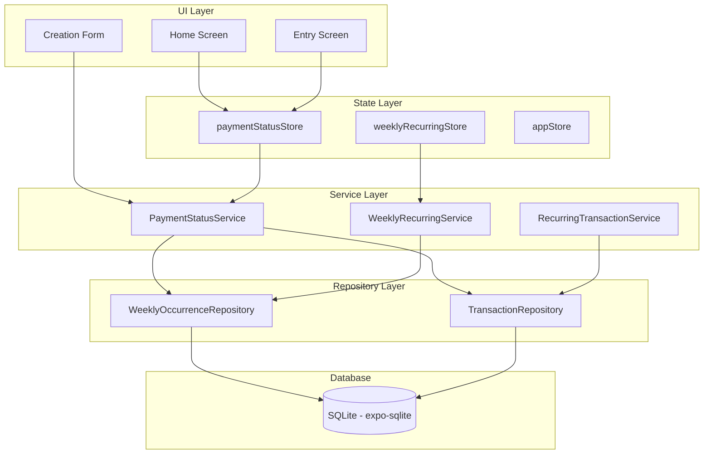

# Design Document: Payment Status Tracking

## Overview

O recurso de rastreamento de status de pagamento adiciona um campo booleano `isPaid` às ocorrências de gastos recorrentes (mensais e semanais), permitindo que o usuário controle quais contas já foram quitadas. O sistema oferece múltiplos pontos de interação: marcação individual na Home e na Entry_Screen, marcação em massa (Bulk Mark), e opções de status durante a criação de grupos. A Home exibe uma seção de contas pendentes e um resumo de previsto vs. pago no SummaryCard.

### Design Decisions

1. **Campo `isPaid` nas tabelas existentes**: Adicionamos uma coluna `is_paid` (INTEGER boolean, default 0) tanto na tabela `weekly_occurrences` quanto na tabela `transactions` (para transações geradas por `recurring_transactions`). Isso evita criar tabelas auxiliares e mantém as queries simples.

2. **Serviço centralizado `PaymentStatusService`**: Toda lógica de toggle, bulk mark e cálculo de totais fica em um serviço dedicado, separando a lógica de negócio da camada de UI e repositório.

3. **Store Zustand dedicado `paymentStatusStore`**: Gerencia o estado reativo dos totais (predicted, paid, pending) e da lista de pending items, permitindo atualização instantânea da UI após alterações.

4. **Transações SQLite para operações em massa**: Bulk mark e criação com opções de status usam transações do banco para garantir atomicidade (rollback em caso de falha).

## Architecture



### Data Flow

1. **Toggle individual**: UI → `paymentStatusStore.togglePaymentStatus(id, type)` → `PaymentStatusService.toggle()` → Repository.update() → Store recalcula totais
2. **Bulk Mark**: UI → `paymentStatusStore.bulkMarkAsPaid(groupId, type)` → `PaymentStatusService.bulkMark()` → Repository.updateMany() (em transação) → Store recalcula totais
3. **Criação com status**: UI → `WeeklyRecurringService.createGroup(dto)` ou `RecurringTransactionService.createRecurring(dto)` → gera ocorrências com isPaid conforme opção selecionada

## Components and Interfaces

### New Components

#### `PendingSection` (React Native Component)
```typescript
interface PendingSectionProps {
  items: PendingItem[];
  onToggleStatus: (id: string, type: 'weekly' | 'monthly') => void;
  onItemPress: (groupId: string, type: 'weekly' | 'monthly') => void;
  testID?: string;
}
```
Localização: `src/components/dashboard/PendingSection.tsx`
Exibe a lista de contas pendentes na Home, entre o SummaryCard e os gráficos.

#### `PaymentStatusSummary` (React Native Component)
```typescript
interface PaymentStatusSummaryProps {
  predictedTotal: number;
  paidTotal: number;
  pendingTotal: number;
  testID?: string;
}
```
Localização: `src/components/dashboard/PaymentStatusSummary.tsx`
Seção dentro do SummaryCard que exibe previsto vs. pago vs. pendente.

#### `PaymentStatusOption` (React Native Component)
```typescript
type PaymentStatusCreationOption = 'all_pending' | 'first_paid' | 'all_paid';

interface PaymentStatusOptionProps {
  selected: PaymentStatusCreationOption;
  onSelect: (option: PaymentStatusCreationOption) => void;
  testID?: string;
}
```
Localização: `src/components/weekly-recurring/PaymentStatusOption.tsx`
Seção de seleção de status no formulário de criação.

#### `OccurrenceStatusToggle` (React Native Component)
```typescript
interface OccurrenceStatusToggleProps {
  isPaid: boolean;
  onToggle: () => void;
  size?: 'small' | 'medium';
  testID?: string;
}
```
Localização: `src/components/ui/OccurrenceStatusToggle.tsx`
Controle reutilizável para alternar o status de pagamento (checkbox/toggle visual).

### New Services

#### `PaymentStatusService`
```typescript
interface IPaymentStatusService {
  toggleWeeklyOccurrence(occurrenceId: string): Promise<WeeklyOccurrence>;
  toggleMonthlyTransaction(transactionId: string): Promise<TransactionRecord>;
  bulkMarkWeeklyGroup(groupId: string): Promise<BulkMarkResult>;
  bulkMarkMonthlyGroup(recurringId: string): Promise<BulkMarkResult>;
  getPendingItemsForMonth(month: string): Promise<PendingItem[]>;
  getPaymentTotalsForMonth(month: string): Promise<PaymentTotals>;
  getGroupPaymentSummary(groupId: string, type: 'weekly' | 'monthly'): Promise<GroupPaymentSummary>;
}

interface BulkMarkResult {
  markedCount: number;
  affectedMonths: string[];
}

interface PaymentTotals {
  predictedTotal: number;
  paidTotal: number;
  pendingTotal: number;
}

interface GroupPaymentSummary {
  totalCount: number;
  paidCount: number;
  pendingCount: number;
}
```
Localização: `src/services/payment-status/PaymentStatusService.ts`

### Modified Interfaces

#### `WeeklyOccurrence` (type update)
```typescript
export interface WeeklyOccurrence {
  // ... existing fields
  isPaid: boolean; // NEW FIELD
}
```

#### `TransactionRecord` (schema update)
A tabela `transactions` ganha a coluna `is_paid` para transações vinculadas a `recurring_id`.

#### `CreateWeeklyGroupDTO` (type update)
```typescript
export interface CreateWeeklyGroupDTO {
  // ... existing fields
  paymentStatusOption?: PaymentStatusCreationOption; // NEW FIELD
}
```

#### `CreateRecurringDTO` (type update)
```typescript
export interface CreateRecurringDTO {
  // ... existing fields
  paymentStatusOption?: PaymentStatusCreationOption; // NEW FIELD
}
```

### New Store

#### `paymentStatusStore`
```typescript
interface PaymentStatusState {
  pendingItems: Record<string, PendingItem[]>; // keyed by month
  paymentTotals: Record<string, PaymentTotals>; // keyed by month
  isLoading: boolean;
  error: string | null;
}

interface PaymentStatusActions {
  loadPendingItemsForMonth(month: string): Promise<void>;
  loadPaymentTotalsForMonth(month: string): Promise<void>;
  togglePaymentStatus(id: string, type: 'weekly' | 'monthly'): Promise<void>;
  bulkMarkAsPaid(groupId: string, type: 'weekly' | 'monthly'): Promise<BulkMarkResult>;
}
```
Localização: `src/stores/paymentStatusStore.ts`

## Data Models

### Database Schema Changes

#### Migration: `0006_add_payment_status.sql`

```sql
-- Add is_paid column to weekly_occurrences
ALTER TABLE weekly_occurrences ADD COLUMN is_paid INTEGER NOT NULL DEFAULT 0;

-- Add is_paid column to transactions (for recurring-generated transactions)
ALTER TABLE transactions ADD COLUMN is_paid INTEGER NOT NULL DEFAULT 0;

-- Index for efficient pending items query (month + is_paid)
CREATE INDEX idx_weekly_occurrences_month_paid 
  ON weekly_occurrences(reference_month, is_paid);

-- Index for efficient pending items query on transactions
CREATE INDEX idx_transactions_month_paid_recurring 
  ON transactions(reference_month, is_paid, recurring_id);
```

#### Drizzle Schema Updates

```typescript
// In weeklyOccurrences table definition:
isPaid: integer('is_paid', { mode: 'boolean' }).notNull().default(false),

// In transactions table definition:
isPaid: integer('is_paid', { mode: 'boolean' }).notNull().default(false),
```

### Domain Types

```typescript
/** Represents a pending item displayed in the Home Pending Section */
export interface PendingItem {
  id: string;
  type: 'weekly' | 'monthly';
  groupId: string;
  groupName: string;
  amount: number;
  date: string; // YYYY-MM-DD
  referenceMonth: string; // YYYY-MM
}

/** Payment totals for a given month */
export interface PaymentTotals {
  predictedTotal: number;
  paidTotal: number;
  pendingTotal: number;
}

/** Payment status creation options */
export type PaymentStatusCreationOption = 'all_pending' | 'first_paid' | 'all_paid';
```

## Correctness Properties

*A property is a characteristic or behavior that should hold true across all valid executions of a system — essentially, a formal statement about what the system should do. Properties serve as the bridge between human-readable specifications and machine-verifiable correctness guarantees.*

### Property 1: Toggle payment status inverts the boolean

*For any* recurring occurrence (weekly or monthly) with any date (past, present, or future) and any initial payment status (true or false), calling togglePaymentStatus should produce an occurrence whose isPaid value is the logical negation of the original.

**Validates: Requirements 1.1, 1.5**

### Property 2: Newly generated occurrences default to unpaid

*For any* weekly group or monthly recurring transaction, when the occurrence generator creates new occurrences (regardless of the month or group configuration), all newly generated occurrences shall have isPaid equal to false.

**Validates: Requirements 1.6, 1.7, 7.4**

### Property 3: Payment totals computation correctness

*For any* set of recurring occurrences (from both active and inactive groups) belonging to a given reference month, the Predicted_Total shall equal the sum of all occurrence amounts, the Paid_Total shall equal the sum of amounts where isPaid is true, and the Pending_Total shall equal Predicted_Total minus Paid_Total.

**Validates: Requirements 1.4, 5.1, 5.5**

### Property 4: Mark first as paid identifies the correct occurrence

*For any* group creation with the "mark first as paid" option, given a set of generated occurrences, exactly the occurrence with the minimum date within the earliest reference month shall have isPaid equal to true, and all other occurrences shall have isPaid equal to false.

**Validates: Requirements 2.3, 2.7**

### Property 5: Mark all as paid sets all occurrences to paid

*For any* group creation with the "mark all as paid" option, all generated occurrences shall have isPaid equal to true, regardless of their reference month or date.

**Validates: Requirements 2.4**

### Property 6: Bulk mark sets all unpaid to paid and reports correct count

*For any* recurring group with N occurrences where K have isPaid equal to false, executing bulk mark shall result in all N occurrences having isPaid equal to true, and the operation shall report exactly K as the count of newly marked items.

**Validates: Requirements 3.2, 3.3**

### Property 7: Pending section contains exactly unpaid items sorted by date

*For any* reference month with a set of recurring occurrences, the pending items list shall contain exactly those occurrences where isPaid is false, and the list shall be sorted by date in ascending chronological order.

**Validates: Requirements 4.1**

### Property 8: Group mutations preserve payment status

*For any* group edit operation (name, amount, day of week, category change) or soft delete, the isPaid value of all existing occurrences shall remain unchanged after the operation completes.

**Validates: Requirements 7.1, 7.2, 7.3**

### Property 9: Paid and pending count computation

*For any* recurring group with N total occurrences where P have isPaid equal to true, the group payment summary shall report paidCount equal to P and pendingCount equal to N minus P.

**Validates: Requirements 6.3**

## Error Handling

### Toggle Failure
- Se a persistência do toggle falhar (erro de I/O no SQLite), o store reverte o estado otimista e exibe um toast de erro via `toastStore`.
- O estado da UI não deve ficar inconsistente — se o toggle falhar, o controle visual retorna ao estado anterior.

### Bulk Mark Failure
- A operação de bulk mark usa uma transação SQLite (`db.transaction()`).
- Se qualquer UPDATE dentro da transação falhar, toda a transação é revertida automaticamente pelo SQLite.
- O store exibe mensagem de erro indicando que a marcação não foi concluída.
- Nenhuma ocorrência terá seu status alterado parcialmente.

### Creation with Status Option Failure
- A criação do grupo + definição de status usa uma transação SQLite.
- Se a criação falhar após gerar algumas ocorrências, o rollback garante que nenhum dado parcial persista.
- O formulário permanece preenchido para que o usuário possa tentar novamente.

### Totals Recalculation Failure
- Se o cálculo de totais falhar (query error), o store mantém os valores anteriores e registra o erro via `logger.error()`.
- A UI exibe os últimos valores conhecidos até que um refresh bem-sucedido ocorra.

### Concurrent Access
- Como o app é single-user local (SQLite), não há preocupação com concorrência real.
- Operações assíncronas são serializadas pelo store (isLoading flag previne operações simultâneas).

## Testing Strategy

### Property-Based Tests (fast-check)

O projeto já utiliza `fast-check` (v4.7.0) como dependência de desenvolvimento. Cada propriedade do design será implementada como um teste property-based com mínimo de 100 iterações.

**Testes property-based cobrirão:**
- `PaymentStatusService.toggle()` — Property 1
- `OccurrenceGenerator` com isPaid default — Property 2
- `PaymentStatusService.getPaymentTotalsForMonth()` — Property 3
- Lógica de "primeira ocorrência" na criação — Property 4
- Lógica de "todas pagas" na criação — Property 5
- `PaymentStatusService.bulkMark()` — Property 6
- `PaymentStatusService.getPendingItemsForMonth()` — Property 7
- Preservação de status em edições — Property 8
- `PaymentStatusService.getGroupPaymentSummary()` — Property 9

**Configuração:**
- Mínimo 100 iterações por teste
- Cada teste tagueado com: `Feature: payment-status-tracking, Property {N}: {description}`
- Generators customizados para `WeeklyOccurrence` e `TransactionRecord` com campos aleatórios

### Unit Tests (Jest)

**Testes example-based cobrirão:**
- Renderização do `OccurrenceStatusToggle` com isPaid=true e isPaid=false (Req 1.2, 1.3)
- Renderização do `PaymentStatusOption` com três opções (Req 2.1)
- Visibilidade do `PendingSection` quando lista vazia vs. com itens (Req 4.3, 4.4)
- Ocultação da seção previsto/pago quando Predicted_Total = 0 (Req 5.3)
- Cores diferenciadas para Paid_Total (verde) e Pending_Total (laranja) (Req 5.6)
- Navegação ao tocar em PendingItem (Req 4.6)
- Exibição do botão Bulk Mark na Entry_Screen (Req 3.1)

### Integration Tests

- Rollback transacional em caso de falha no bulk mark (Req 3.5)
- Rollback transacional em caso de falha na criação com status (Req 2.6)
- Persistência sobrevive restart do app (Req 7.5)
- Recálculo de totais após alteração de status (Req 5.2)

### E2E Tests (Maestro)

- Fluxo completo: criar grupo → marcar como pago → verificar pending section atualizada
- Fluxo bulk mark: acessar Entry_Screen → marcar todas → verificar confirmação
- Fluxo Home: verificar pending section → marcar item → verificar remoção da lista
