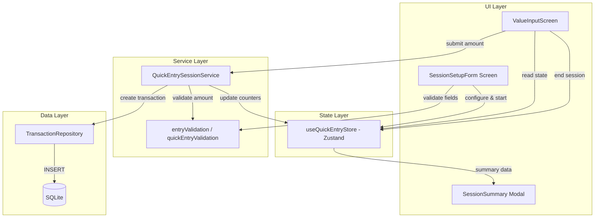

# Design Document: Quick Entry Session

## Overview

This design describes the "Sessão de Lançamento Rápido" (Quick Entry Session) feature for GG-Economy Mobile. The feature provides a streamlined data entry mode where the user configures shared fields (title, description, reference month, purchase date, category) once, then enters only monetary values in rapid succession.

The design builds directly on the existing Batch Session pattern (`useBatchSessionStore`) but introduces additional locked fields (description, reference month, purchase date) beyond just title and category. Each value submission immediately persists a transaction via the existing `TransactionRepository.create()` method, ensuring no data loss on unexpected app termination.

### Design Decisions

1. **Dedicated Zustand store over reusing BatchSessionStore** — The Quick Entry Session has different locked fields (description, referenceMonth, purchaseDate) and different semantics (batchId = null, needsReview = false). A separate store avoids coupling and keeps the batch session logic stable.

2. **Immediate persistence per entry** — Each submitted value is persisted immediately rather than buffered, matching Requirement 3.4 (use existing `createTransaction` without schema modifications) and preventing data loss.

3. **Reuse of existing validation functions** — Title validation (`validateTitle`), description validation (`validateDescription`), and amount validation logic from `entryValidation.ts` are reused directly without duplication.

4. **In-memory state only** — Session metadata (locked fields, counters) lives exclusively in the Zustand store. No new database tables or AsyncStorage keys are needed, matching the lightweight requirement.

5. **Service layer for orchestration** — A `QuickEntrySessionService` handles the transaction creation logic (assembling the DTO and calling the repository), keeping the store focused on state and the UI focused on presentation.

## Architecture



## Components and Interfaces

### 1. Quick Entry Session Store (`src/stores/quickEntryStore.ts`)

Zustand store managing the session lifecycle.

```typescript
interface QuickEntrySessionState {
  /** Whether a quick entry session is currently active */
  isActive: boolean;
  /** Locked title for all entries in the session */
  title: string | null;
  /** Locked description for all entries */
  description: string | null;
  /** Locked reference month (YYYY-MM) */
  referenceMonth: string | null;
  /** Locked purchase date */
  purchaseDate: Date | null;
  /** Locked category ID */
  categoryId: string | null;
  /** Number of entries created in this session */
  entryCount: number;
  /** Maximum entries allowed per session */
  maxEntries: number;
  /** Accumulated total value in cents */
  totalValue: number;
}

interface QuickEntrySessionActions {
  /** Start a new session with configured fields */
  startSession(config: QuickEntrySessionConfig): void;
  /** Record a successful entry (increment count, add to total) */
  recordEntry(amount: number): void;
  /** End the session and return summary */
  endSession(): QuickEntrySessionSummary;
  /** Reset all session state */
  reset(): void;
}
```

### 2. Quick Entry Session Service (`src/services/quick-entry/QuickEntrySessionService.ts`)

Orchestrates transaction creation during an active session.

```typescript
interface QuickEntrySessionConfig {
  title: string;
  description: string;
  referenceMonth: string;
  purchaseDate: Date;
  categoryId: string;
}

interface QuickEntrySessionSummary {
  totalEntries: number;
  totalValue: number;
}

interface SubmitEntryResult {
  success: boolean;
  error?: string;
}

class QuickEntrySessionService {
  constructor(
    private transactionRepository: ITransactionRepository = transactionRepository
  ) {}

  /** Submit a single value during an active session */
  async submitEntry(amount: number): Promise<SubmitEntryResult>;
}
```

### 3. Validation Module (`src/validation/quickEntryValidation.ts`)

Session-specific validation composing existing validators.

```typescript
interface QuickEntrySetupValidationInput {
  title: string;
  description: string;
  referenceMonth: string;
  purchaseDate: Date;
  categoryId: string | null;
}

/** Validates all session setup fields */
function validateQuickEntrySetup(input: QuickEntrySetupValidationInput): ValidationResult;

/** Validates the amount during active session */
function validateQuickEntryAmount(amount: number): ValidationResult;
```

### 4. UI Components

| Component | Location | Responsibility |
|-----------|----------|---------------|
| `QuickEntrySetupScreen` | `app/quick-entry/setup.tsx` | Form for configuring session fields |
| `QuickEntryInputScreen` | `app/quick-entry/input.tsx` | Numeric input during active session |
| `QuickEntrySummaryModal` | `src/components/quick-entry/QuickEntrySummaryModal.tsx` | Summary display on session end |

### 5. Custom Hook (`src/hooks/useQuickEntrySession.ts`)

Connects the store and service for UI consumption.

```typescript
interface UseQuickEntrySessionReturn {
  /** Current session state */
  isActive: boolean;
  entryCount: number;
  maxEntries: number;
  totalValue: number;
  remainingEntries: number;
  isAtLimit: boolean;
  /** Locked fields (read-only context display) */
  title: string | null;
  description: string | null;
  referenceMonth: string | null;
  purchaseDate: Date | null;
  categoryId: string | null;
  /** Actions */
  startSession: (config: QuickEntrySessionConfig) => void;
  submitEntry: (amount: number) => Promise<SubmitEntryResult>;
  endSession: () => QuickEntrySessionSummary;
}
```

## Data Models

### Transaction DTO (assembled by QuickEntrySessionService)

For each value submitted during an active session, the service assembles a `CreateTransactionDTO`:

```typescript
{
  title: session.title,           // from locked session config
  date: session.purchaseDate,     // from locked session config
  amount: submittedAmount,        // user input (cents, negative for expenses)
  description: session.description, // from locked session config
  categoryId: session.categoryId, // from locked session config
  referenceMonth: session.referenceMonth, // from locked session config
  batchId: undefined,             // null — not a batch entry
  needsReview: false,             // per Requirement 3.2
  isPaid: false,                  // default
}
```

### Session State (in-memory only)

No new database tables. The session state is a Zustand store slice with:
- 6 locked config fields (title, description, referenceMonth, purchaseDate, categoryId, maxEntries)
- 3 running counters (isActive, entryCount, totalValue)

### Amount Handling

Amounts are stored as positive integers in cents, matching the existing convention where the sign is determined by the category type (expenses are negative in reports but stored as positive amounts in the `amount` field per `CreateTransactionDTO`). The validation range is 1–99,999,999,999 cents (R$ 0.01 to R$ 999,999,999.99).


## Correctness Properties

*A property is a characteristic or behavior that should hold true across all valid executions of a system — essentially, a formal statement about what the system should do. Properties serve as the bridge between human-readable specifications and machine-verifiable correctness guarantees.*

### Property 1: Setup validation correctness

*For any* `QuickEntrySetupValidationInput`, the validation function SHALL return `valid: true` if and only if: the title has `trim().length` between 1 and 100, the description has `length` at most 500, the reference month matches `YYYY-MM` with a valid month (01–12), the purchase date is a valid `Date` (not NaN), and the category ID is a non-null non-empty string.

**Validates: Requirements 1.2, 1.3, 1.4, 1.5, 7.2**

### Property 2: Session start locks configuration

*For any* valid `QuickEntrySessionConfig`, calling `startSession(config)` SHALL result in the store state having `isActive = true` and all locked fields (title, description, referenceMonth, purchaseDate, categoryId) matching the provided config values exactly.

**Validates: Requirements 1.6**

### Property 3: Amount validation boundary

*For any* integer `amount`, the quick entry amount validation SHALL return `valid: true` if and only if `1 <= amount <= 99999999999`. Non-integer, NaN, Infinity, zero, and negative values SHALL always be rejected.

**Validates: Requirements 2.3**

### Property 4: Entry counters are always accurate

*For any* sequence of N valid amounts submitted during a session (where N <= 50), the store's `entryCount` SHALL equal N and `totalValue` SHALL equal the sum of all submitted amounts. When the session ends, the returned summary SHALL have `totalEntries = N` and `totalValue = sum(amounts)`.

**Validates: Requirements 2.5, 5.2**

### Property 5: Transaction DTO assembly preserves session fields

*For any* valid session config and *for any* valid amount submitted during that session, the `CreateTransactionDTO` passed to `TransactionRepository.create()` SHALL have: `title` equal to the session title, `description` equal to the session description, `date` equal to the session purchase date, `referenceMonth` equal to the session reference month, `categoryId` equal to the session category, `amount` equal to the submitted amount, `needsReview` equal to `false`, and `batchId` equal to `undefined`.

**Validates: Requirements 3.1, 3.2, 3.3, 7.3**

### Property 6: Session limit enforcement

*For any* session, after 50 entries have been successfully recorded, all subsequent calls to `submitEntry` SHALL be rejected (return `{ success: false }`) and the `entryCount` SHALL remain at 50.

**Validates: Requirements 4.1**

### Property 7: Session reset on end

*For any* active session with any number of entries, calling `endSession()` SHALL reset all state fields to their initial values: `isActive = false`, `title = null`, `description = null`, `referenceMonth = null`, `purchaseDate = null`, `categoryId = null`, `entryCount = 0`, `totalValue = 0`.

**Validates: Requirements 5.3, 6.2**

### Property 8: Prevent concurrent sessions

*For any* two valid session configs A and B, if session A is active (started but not ended), calling `startSession(B)` SHALL be a no-op — the store state SHALL remain unchanged with session A's configuration intact.

**Validates: Requirements 6.3**

## Error Handling

### Database Errors (Transaction Persistence)

| Error Scenario | Handling | User Feedback |
|----------------|----------|---------------|
| `createTransaction` throws | Service returns `{ success: false, error: message }` | Toast with error message; amount input retains value for retry |
| Validation failure on DTO | Service returns `{ success: false, error: validationErrors }` | Error displayed inline; input retained |

### Session State Errors

| Error Scenario | Handling | User Feedback |
|----------------|----------|---------------|
| Start session while active | `startSession` is a no-op | N/A (UI should not expose this path) |
| Submit entry with no active session | Service returns `{ success: false }` | N/A (UI only shows input when active) |
| Submit entry at limit (50) | Service returns `{ success: false }` | Input disabled with prompt to end session |

### Validation Errors (Setup Form)

| Field | Validation Error | Display |
|-------|-----------------|---------|
| Title | Empty or > 100 chars | Inline error below title field |
| Description | > 500 chars | Inline error below description field |
| Reference Month | Invalid YYYY-MM | Inline error below month picker |
| Purchase Date | Invalid date | Inline error below date picker |
| Category | None selected | Inline error below category selector |

### Recovery Strategy

- **App backgrounded**: Zustand store retains state in memory (no persistence needed per Req 5.4)
- **App killed**: Session state is lost; already-persisted transactions remain in SQLite
- **Network offline**: Not applicable (all operations are local SQLite)

## Testing Strategy

### Property-Based Tests (fast-check)

The project already uses `fast-check` for property-based testing. Each correctness property above maps to a property test with minimum 100 iterations.

| Property | Test File | Key Generators |
|----------|-----------|---------------|
| 1: Setup validation | `src/__tests__/quickEntrySetupValidation.property.test.ts` | Random strings (title, description), YYYY-MM strings, Date objects, UUIDs |
| 2: Session start locks config | `src/__tests__/quickEntrySessionStart.property.test.ts` | Random valid `QuickEntrySessionConfig` |
| 3: Amount validation | `src/__tests__/quickEntryAmountValidation.property.test.ts` | Random integers across full range |
| 4: Entry counters | `src/__tests__/quickEntryCounters.property.test.ts` | Random arrays of valid amounts (length 1–50) |
| 5: DTO assembly | `src/__tests__/quickEntryDtoAssembly.property.test.ts` | Random configs + random amounts, mock repository |
| 6: Session limit | `src/__tests__/quickEntryLimit.property.test.ts` | 50 random amounts then additional attempts |
| 7: Session reset | `src/__tests__/quickEntryReset.property.test.ts` | Random configs + random entry sequences |
| 8: Concurrent sessions | `src/__tests__/quickEntryConcurrent.property.test.ts` | Two random configs |

**Configuration:**
- Library: `fast-check` (already installed)
- Minimum iterations: 100 per property (`{ numRuns: 100 }`)
- Tag format: `Feature: quick-entry-session, Property N: <title>`

### Unit Tests (Jest)

| Area | Focus |
|------|-------|
| `QuickEntrySessionService` | Error handling (DB throws), edge cases (zero amount, null fields) |
| `quickEntryValidation.ts` | Boundary values (title at exactly 100 chars, description at 500, amount at 1 and 99999999999) |
| `useQuickEntryStore` | State transitions, reset behavior |
| `useQuickEntrySession` hook | Integration of store + service |

### Component Tests (React Native Testing Library)

| Component | Key Scenarios |
|-----------|--------------|
| `QuickEntrySetupScreen` | Form renders all fields, validation errors display, submit navigates to input |
| `QuickEntryInputScreen` | Shows locked fields read-only, numeric input works, counter displays correctly, disables at limit |
| `QuickEntrySummaryModal` | Displays correct totals, dismiss resets state |

### Integration Tests

| Scenario | Description |
|----------|-------------|
| Full session flow | Start session → submit 3 entries → end session → verify 3 transactions in DB |
| Error recovery | Start session → DB error on entry → retry succeeds |
| Limit reached | Start session → submit 50 entries → verify 51st is blocked |
