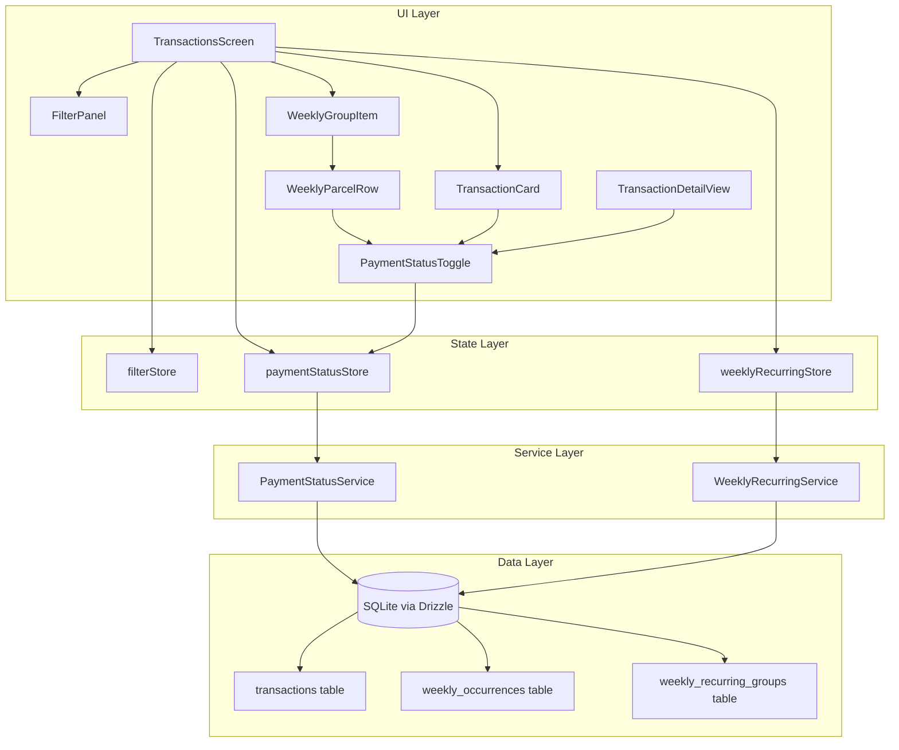

# Design Document: Statement Payment Integration

## Overview

This feature integrates weekly recurring expenses and payment status tracking directly into the main transactions statement (extrato) screen. Currently, weekly occurrences are displayed in a separate header section above the FlashList. This redesign merges them as grouped, expandable items within the main list, adds a payment status toggle to all transaction types, enables editing individual parcel values, and introduces a "Pending only" filter.

### Key Design Decisions

1. **Unified Statement Item model**: A discriminated union type (`UnifiedStatementItem`) that represents regular transactions, installment parcels, and weekly group items in a single list. This enables FlashList to render all item types with a single `renderItem` function using type discrimination.

2. **Expand/collapse state in Zustand**: Weekly group expansion state is managed in a lightweight Zustand store slice rather than component-local state, so expansion persists across re-renders triggered by filter changes or pagination.

3. **Optimistic toggle with rollback**: Payment status toggles use optimistic UI updates (immediate visual feedback) with server-side persistence and rollback on failure, leveraging the existing `paymentStatusStore` pattern.

4. **Filter composition**: The "Pending only" filter is added to the existing `FilterState` interface as a boolean field, composing with existing AND-logic filters at the query/data-merge level.

## Architecture



### Data Flow

1. **Statement loading**: `TransactionsScreen` loads paginated transactions via `usePaginatedTransactions` and weekly occurrences via `weeklyRecurringStore.loadOccurrencesForMonth`. A new `useUnifiedStatementItems` hook merges both data sources into a sorted `UnifiedStatementItem[]`.

2. **Payment toggle**: User taps `PaymentStatusToggle` → optimistic state update in `paymentStatusStore` → `PaymentStatusService.toggleWeeklyOccurrence` or `toggleMonthlyTransaction` → on success, refresh affected data; on failure, rollback.

3. **Filter application**: "Pending only" toggle in `FilterPanel` sets `pendingOnly: true` in `filterStore`. The `useUnifiedStatementItems` hook filters items client-side for weekly occurrences and passes the flag to `buildFilterConditions` for transactions.

4. **Parcel editing**: User taps a `WeeklyParcelRow` → navigates to a weekly parcel detail view → edits amount → `weeklyRecurringStore.updateOccurrence` → store refreshes occurrences for the month → `WeeklyGroupItem` recalculates total.

## Components and Interfaces

### New Components

#### `WeeklyGroupItem`

Collapsible row representing a weekly recurring expense group in the statement list.

```typescript
interface WeeklyGroupItemProps {
  group: WeeklyRecurringGroup;
  occurrences: WeeklyOccurrence[];
  isExpanded: boolean;
  onToggleExpand: (groupId: string) => void;
  onParcelPress: (occurrence: WeeklyOccurrence) => void;
  onTogglePaymentStatus: (occurrenceId: string) => void;
  pendingOnly: boolean;
}
```

#### `WeeklyParcelRow`

Individual parcel row within an expanded `WeeklyGroupItem`.

```typescript
interface WeeklyParcelRowProps {
  occurrence: WeeklyOccurrence;
  onPress: (occurrence: WeeklyOccurrence) => void;
  onTogglePaymentStatus: (occurrenceId: string) => void;
}
```

#### `PaymentStatusToggle`

Reusable toggle component for paid/pending status on any statement item.

```typescript
interface PaymentStatusToggleProps {
  isPaid: boolean;
  onToggle: () => void;
  disabled?: boolean;
  size?: 'small' | 'medium';
  testID?: string;
}
```

### Modified Components

#### `FilterPanel`

- Add "Pending only" toggle switch below existing filters
- Update `countActiveFilters` to include `pendingOnly` in the badge count

#### `TransactionsScreen`

- Replace the inline weekly occurrences header section with `WeeklyGroupItem` components merged into the FlashList data
- Add `PaymentStatusToggle` to each `TransactionCard`
- Use new `useUnifiedStatementItems` hook for merged data

#### `TransactionDetailView` (`transaction/[id].tsx`)

- Add a `DetailRow` for payment status with tap-to-toggle behavior
- Show "Paid" / "Pending" with appropriate icon

### New Hooks

#### `useUnifiedStatementItems`

Merges paginated transactions and weekly occurrences into a single sorted array.

```typescript
interface UseUnifiedStatementItemsParams {
  transactions: PaginatedTransactionWithCategory[];
  weeklyOccurrences: WeeklyOccurrence[];
  weeklyGroups: WeeklyRecurringGroup[];
  pendingOnly: boolean;
  expandedGroupIds: Set<string>;
}

function useUnifiedStatementItems(params: UseUnifiedStatementItemsParams): UnifiedStatementItem[];
```

### Store Changes

#### `filterStore` — Add `pendingOnly` field

```typescript
export interface FilterState {
  categoryIds: string[];
  minAmount: number | null;
  maxAmount: number | null;
  startDate: string | null;
  endDate: string | null;
  pendingOnly: boolean; // NEW
}
```

New actions: `setPendingOnly(value: boolean)`.
Update `getActiveFilterCount` to include `pendingOnly`.
Update `resetFilters` to reset `pendingOnly` to `false`.

#### `weeklyRecurringStore` — Add expansion state

```typescript
// Add to state
expandedGroupIds: Set<string>;

// Add actions
toggleGroupExpansion(groupId: string): void;
collapseAllGroups(): void;
```

## Data Models

### `UnifiedStatementItem` (Discriminated Union)

```typescript
type UnifiedStatementItem =
  | { type: 'transaction'; data: PaginatedTransactionWithCategory }
  | { type: 'weeklyGroupHeader'; data: WeeklyGroupHeaderData }
  | { type: 'weeklyParcel'; data: WeeklyOccurrence; groupId: string };

interface WeeklyGroupHeaderData {
  group: WeeklyRecurringGroup;
  monthlyTotal: number;
  paidCount: number;
  pendingCount: number;
  totalCount: number;
  isExpanded: boolean;
}
```

### Sorting Strategy

All items are sorted by date descending (matching existing transaction sort order):

- `transaction` items use their `date` field
- `weeklyGroupHeader` items use the earliest occurrence date in the group for that month
- `weeklyParcel` items appear immediately after their parent header when expanded, sorted by date ascending within the group

### Database Schema (No Changes Required)

The existing schema already supports this feature:

- `transactions.isPaid` — already exists for regular transactions and installment parcels
- `weeklyOccurrences.isPaid` — already exists for weekly parcels
- `weeklyOccurrences.isValueEdited` — already exists for tracking edited amounts
- `weeklyOccurrences.amount` — already editable per occurrence

### Filter Query Extension

For the "Pending only" filter on regular transactions, extend `buildFilterConditions`:

```typescript
// In buildFilterConditions.ts
if (filters.pendingOnly) {
  conditions.push(eq(transactions.isPaid, false));
}
```

For weekly occurrences, filtering is done client-side in `useUnifiedStatementItems` since they are already loaded in memory from the store.

## Correctness Properties

_A property is a characteristic or behavior that should hold true across all valid executions of a system — essentially, a formal statement about what the system should do. Properties serve as the bridge between human-readable specifications and machine-verifiable correctness guarantees._

### Property 1: Unified list is sorted by date descending

_For any_ set of regular transactions and weekly group items with arbitrary dates within a month, the merged `UnifiedStatementItem[]` produced by `useUnifiedStatementItems` SHALL be sorted by date descending (most recent first), with weekly parcels appearing immediately after their group header in date-ascending order within the group.

**Validates: Requirements 1.1**

### Property 2: Weekly group monthly total equals sum of occurrence amounts

_For any_ weekly recurring group and any set of occurrences belonging to that group in a given month, the `monthlyTotal` displayed in the `WeeklyGroupHeaderData` SHALL equal the arithmetic sum of all occurrence `amount` values for that month.

**Validates: Requirements 1.2, 2.3**

### Property 3: Payment status toggle is involutory (double-toggle restores state)

_For any_ item (regular transaction, installment parcel, or weekly occurrence) with an initial `isPaid` value, toggling the payment status once SHALL flip the boolean, and toggling it a second time SHALL restore the original value. Formally: `toggle(toggle(isPaid)) === isPaid`.

**Validates: Requirements 3.2, 3.3, 3.4, 5.2**

### Property 4: Invalid amounts are always rejected

_For any_ input value that is zero, negative, or non-numeric, the amount validation function SHALL reject it and return an error, leaving the occurrence amount unchanged.

**Validates: Requirements 2.4**

### Property 5: Pending filter returns only unpaid items

_For any_ set of `UnifiedStatementItem` with mixed `isPaid` states, when `pendingOnly` is true, the filtered output SHALL contain only items where `isPaid === false`. For weekly groups, a group SHALL appear in the filtered output if and only if it has at least one occurrence where `isPaid === false`.

**Validates: Requirements 4.2, 4.3**

### Property 6: Pending group summary matches unpaid subset

_For any_ weekly group displayed under the "Pending only" filter, the `pendingCount` SHALL equal the number of occurrences where `isPaid === false`, and the pending total amount SHALL equal the sum of `amount` values for those unpaid occurrences.

**Validates: Requirements 4.4**

### Property 7: Active filter count includes all active filters

_For any_ `FilterState` object, the `getActiveFilterCount` function SHALL return the count of fields that are non-default (non-empty categoryIds, non-null amounts, non-null dates, and `pendingOnly === true`).

**Validates: Requirements 4.6**

### Property 8: Occurrence update persists amount and sets isValueEdited flag

_For any_ valid positive amount and any existing weekly occurrence, calling `updateOccurrence` with that amount SHALL persist the new amount value and set `isValueEdited` to `true` on the resulting record.

**Validates: Requirements 2.2**

## Error Handling

### Payment Status Toggle Failures

- **Optimistic rollback**: If `PaymentStatusService.toggleWeeklyOccurrence` or `toggleMonthlyTransaction` fails (network/DB error), the store reverts the optimistic UI update and shows an error toast via `toastStore.showError()`.
- **Concurrent toggle prevention**: The `paymentStatusStore` checks `isLoading` before allowing a new toggle operation, preventing race conditions.

### Amount Validation Errors

- **Client-side validation**: Before calling `updateOccurrence`, validate that the amount is a positive number. Display inline validation error on the input field.
- **Persistence failure**: If the database update fails, show an error alert and do not update the local state.

### Data Loading Errors

- **Weekly occurrences load failure**: If `loadOccurrencesForMonth` fails, the statement list renders without weekly items and shows a subtle error indicator. Regular transactions remain visible.
- **Filter query failure**: If `buildFilterConditions` produces a query error, fall back to unfiltered results and log the error.

### Edge Cases

- **Empty month**: If a month has no transactions and no weekly occurrences, show the existing `EmptyState` component.
- **All items paid with pending filter**: If all items are paid and "Pending only" is active, show an empty state with a message indicating no pending items.
- **Group with zero occurrences**: If a weekly group has no occurrences for the current month (e.g., group created mid-month), it does not appear in the statement list.

## Testing Strategy

### Property-Based Tests (fast-check)

The project uses Jest as the test runner. Property-based tests will use the `fast-check` library with a minimum of 100 iterations per property.

Each property test will be tagged with a comment referencing the design property:

```
// Feature: statement-payment-integration, Property {N}: {property_text}
```

**Properties to implement:**

1. Unified list sorting (pure function, testable with generated data)
2. Monthly total sum invariant (pure arithmetic, testable with generated amounts)
3. Toggle involution (testable with mocked DB service)
4. Invalid amount rejection (pure validation function)
5. Pending filter correctness (pure filtering logic)
6. Pending group summary (pure computation)
7. Active filter count (pure function)
8. Occurrence update persistence (testable with mocked repository)

### Unit Tests (Jest)

- `WeeklyGroupItem` renders group title, icon, and total
- `WeeklyGroupItem` expands/collapses on tap
- `PaymentStatusToggle` renders correct icon for paid/pending states
- `FilterPanel` renders "Pending only" toggle
- `TransactionDetailView` shows payment status row
- Navigation from parcel tap to detail view

### Integration Tests

- Full flow: load month → display unified list → toggle payment → verify state sync
- Filter flow: enable "Pending only" → verify list updates → clear filter → verify restoration
- Edit flow: tap parcel → edit amount → verify group total recalculates

### Test File Organization

```
src/__tests__/
  useUnifiedStatementItems.property.test.ts   (Properties 1, 5, 6)
  paymentStatusToggle.property.test.ts        (Property 3)
  amountValidation.property.test.ts           (Property 4)
  weeklyGroupTotal.property.test.ts           (Property 2)
  filterCount.property.test.ts                (Property 7)
  occurrenceUpdate.property.test.ts           (Property 8)
src/components/__tests__/
  WeeklyGroupItem.test.tsx
  PaymentStatusToggle.test.tsx
  FilterPanel.test.tsx
```
