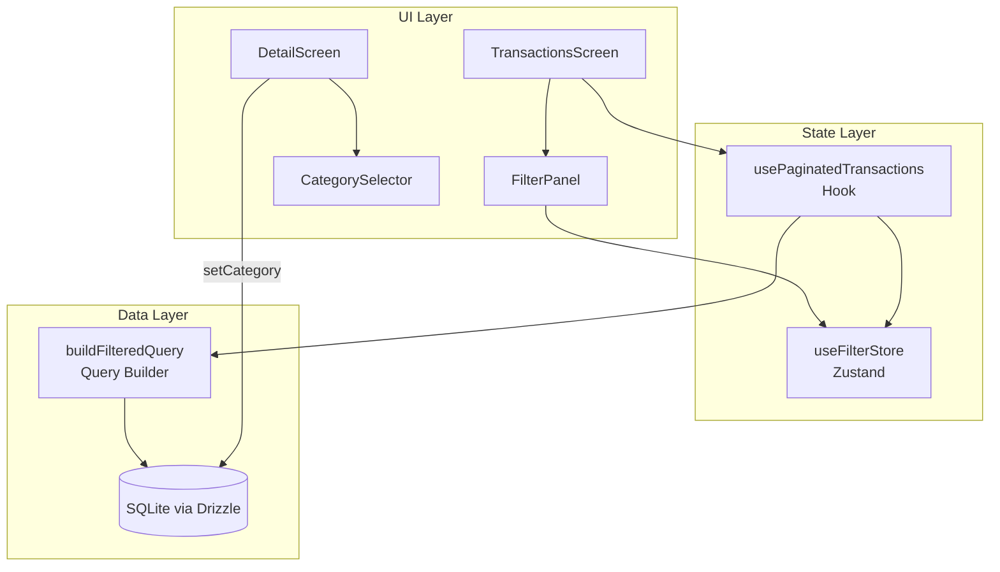

# Design Document: Transaction Statement Redesign

## Overview

This design covers the redesign of the transaction statement screen and detail screen, adding filter capabilities (category, value range, date range), editable categories from the detail screen, and migrating to cursor-based infinite scroll pagination. The architecture extends existing patterns (Drizzle ORM queries, Zustand stores, FlashList) while introducing a new filter state layer and enhanced pagination hook.

### Key Design Decisions

1. **Filter state in Zustand store** — Filters are session-scoped UI state that persists across month navigation. A dedicated `useFilterStore` keeps filter logic decoupled from data fetching.
2. **SQL-level filtering** — All filters are applied as WHERE conditions in the Drizzle query, not in-memory. This ensures pagination counts are accurate and performance scales with large datasets.
3. **Extend `usePaginatedTransactions`** — Rather than creating a new hook, the existing hook is extended with a `filters` parameter that accepts category IDs, value range, and date range.
4. **CategorySelector reuse** — The existing `CategorySelector` component is reused in the detail screen for category editing, wrapped in a bottom sheet modal.
5. **Page size reduced to 20** — Matches the requirement for smaller batches with more frequent loads during scroll.

## Architecture



### Data Flow

1. User interacts with `FilterPanel` → updates `useFilterStore`
2. `usePaginatedTransactions` subscribes to filter store → rebuilds query conditions
3. Query builder constructs Drizzle WHERE clause combining: referenceMonth + categoryIds + valueRange + dateRange + cursor
4. FlashList's `onEndReached` triggers `loadMore()` → appends next page using cursor
5. Summary is computed from a separate aggregate query with the same filter conditions (no cursor)

## Components and Interfaces

### FilterPanel Component

```typescript
interface FilterState {
  categoryIds: string[]; // Selected category IDs (OR logic)
  minAmount: number | null; // Minimum absolute amount in cents
  maxAmount: number | null; // Maximum absolute amount in cents
  startDate: string | null; // ISO date string (YYYY-MM-DD)
  endDate: string | null; // ISO date string (YYYY-MM-DD)
}

interface FilterPanelProps {
  isExpanded: boolean;
  onToggle: () => void;
  filters: FilterState;
  onFiltersChange: (filters: FilterState) => void;
  categories: Category[];
  locale: 'pt-BR' | 'en';
}
```

The `FilterPanel` is a collapsible section rendered above the transaction list. It contains:

- **Category chips**: Horizontal scroll of category chips with multi-select
- **Value range inputs**: Two `TextInput` fields for min/max with locale-aware numeric keyboard
- **Date range pickers**: Two date picker buttons using `@react-native-community/datetimepicker`
- **Active filter badge**: Shows count of active filters on the toggle button
- **Clear all button**: Resets all filters to default state

### useFilterStore (Zustand)

```typescript
interface FilterStoreState {
  filters: FilterState;
  isExpanded: boolean;
  // Actions
  setCategoryIds: (ids: string[]) => void;
  toggleCategory: (id: string) => void;
  setMinAmount: (amount: number | null) => void;
  setMaxAmount: (amount: number | null) => void;
  setStartDate: (date: string | null) => void;
  setEndDate: (date: string | null) => void;
  setExpanded: (expanded: boolean) => void;
  resetFilters: () => void;
  getActiveFilterCount: () => number;
}
```

The store persists filter selections across month navigation within the same session. When the reference month changes, only the date range resets (since dates are month-specific); category and value filters persist per requirement 4.7.

### Extended usePaginatedTransactions

```typescript
interface PaginationFilters {
  referenceMonth: string;
  categoryIds?: string[];
  minAmount?: number | null;
  maxAmount?: number | null;
  startDate?: string | null;
  endDate?: string | null;
}

interface UsePaginatedTransactionsReturn {
  transactions: PaginatedTransactionWithCategory[];
  isLoading: boolean;
  isLoadingMore: boolean;
  error: string | null;
  hasMore: boolean;
  totalCount: number;
  summary: FilteredSummary;
  loadMore: () => void;
  refresh: () => void;
}

interface FilteredSummary {
  totalIncome: number;
  totalExpenses: number;
  balance: number;
  transactionCount: number;
}
```

The hook accepts `PaginationFilters` and:

1. Builds WHERE conditions from all active filters
2. Runs a live count query for `totalCount`
3. Runs a live aggregate query for `summary` (with same filters, no cursor)
4. Runs the paginated data query with cursor + filters
5. Resets cursor when any filter changes (via `useEffect` on filters)

### Query Builder Function

```typescript
function buildFilterConditions(filters: PaginationFilters): SQL | undefined {
  const conditions: SQL[] = [];

  // Always filter by reference month
  conditions.push(eq(transactions.referenceMonth, filters.referenceMonth));

  // Category filter (OR across selected IDs)
  if (filters.categoryIds && filters.categoryIds.length > 0) {
    conditions.push(inArray(transactions.categoryId, filters.categoryIds));
  }

  // Value range filter (on absolute amount)
  if (filters.minAmount != null) {
    conditions.push(sql`ABS(${transactions.amount}) >= ${filters.minAmount}`);
  }
  if (filters.maxAmount != null) {
    conditions.push(sql`ABS(${transactions.amount}) <= ${filters.maxAmount}`);
  }

  // Date range filter
  if (filters.startDate) {
    conditions.push(sql`${transactions.date} >= ${filters.startDate}`);
  }
  if (filters.endDate) {
    conditions.push(sql`${transactions.date} <= ${filters.endDate}`);
  }

  return and(...conditions);
}
```

### Category Edit on Detail Screen

The detail screen adds a tappable category row that opens a bottom sheet containing the existing `CategorySelector`. For installment group transactions, an intermediate Alert prompts the user to choose scope (this parcel only vs. all parcels).

```typescript
interface CategoryEditState {
  isOpen: boolean;
  isUpdating: boolean;
}
```

Flow:

1. User taps category row → `setCategoryEditOpen(true)`
2. Bottom sheet renders `CategorySelector` with `selectedCategoryId` pre-set
3. User selects category → if installment group, show scope Alert
4. Call `setTransactionCategory(id, newCategoryId)` (or `updateGroupField` for all parcels)
5. On success: close sheet, UI updates reactively via `useLiveQuery`
6. On failure: show Alert error, retain previous value

## Data Models

### Filter State (Runtime)

```typescript
interface FilterState {
  categoryIds: string[];
  minAmount: number | null; // In cents (absolute value)
  maxAmount: number | null; // In cents (absolute value)
  startDate: string | null; // YYYY-MM-DD
  endDate: string | null; // YYYY-MM-DD
}
```

### Pagination Cursor

```typescript
interface PaginationCursor {
  lastDate: string; // ISO date of last loaded item
  lastId: string; // ID of last loaded item
}
```

The cursor uses the existing composite index `idx_transactions_date_id` on `(date, id)` for efficient keyset pagination:

```sql
WHERE (date < :lastDate OR (date = :lastDate AND id < :lastId))
ORDER BY date DESC, id DESC
LIMIT 20
```

### Database Indexes (Existing)

The schema already has all necessary indexes:

- `idx_transactions_reference_month` — month filtering
- `idx_transactions_category_id` — category filtering
- `idx_transactions_date_id` — cursor pagination
- `idx_transactions_date` — date range filtering
- `idx_transactions_month_date` — combined month + date queries

No new indexes are required.

### Validation Rules

| Rule            | Condition             | Behavior                          |
| --------------- | --------------------- | --------------------------------- |
| Value range     | minAmount > maxAmount | Show error, retain previous state |
| Date range      | startDate > endDate   | Show error, retain previous state |
| Amount input    | Non-numeric input     | Reject input (numeric keyboard)   |
| Category filter | Empty selection       | No filter applied (show all)      |

## Correctness Properties

_A property is a characteristic or behavior that should hold true across all valid executions of a system — essentially, a formal statement about what the system should do. Properties serve as the bridge between human-readable specifications and machine-verifiable correctness guarantees._

### Property 1: Amount Color Assignment

_For any_ transaction amount (positive or negative), the color assigned to the amount display SHALL be the success/green semantic color when amount > 0, and the danger/red semantic color when amount < 0.

**Validates: Requirements 1.3, 2.1**

### Property 2: Category Filter Correctness

_For any_ list of transactions and any non-empty subset of category IDs used as a filter, the filtered result SHALL contain exactly those transactions whose `categoryId` is a member of the selected category ID set (OR logic).

**Validates: Requirements 4.3, 4.5**

### Property 3: Summary Recalculation from Filtered Data

_For any_ set of transactions and any combination of active filters (category, value range, date range), the computed summary totals (totalIncome, totalExpenses, balance) SHALL equal the aggregation computed from only the transactions that pass all active filter conditions.

**Validates: Requirements 4.6, 5.6, 8.6**

### Property 4: Value Range Filter Correctness

_For any_ list of transactions and any valid value range [minAmount, maxAmount] where minAmount ≤ maxAmount, the filtered result SHALL contain exactly those transactions where `abs(amount) >= minAmount AND abs(amount) <= maxAmount`.

**Validates: Requirements 5.2, 5.3, 5.4**

### Property 5: Date Range Filter Correctness

_For any_ list of transactions and any valid date range [startDate, endDate] where startDate ≤ endDate, the filtered result SHALL contain exactly those transactions where `date >= startDate AND date <= endDate`.

**Validates: Requirements 8.2, 8.3, 8.4**

### Property 6: Combined Filter Query Builder

_For any_ combination of filter parameters (categoryIds, minAmount, maxAmount, startDate, endDate, referenceMonth), the query builder function SHALL produce a SQL condition that is the logical AND of all individual non-null filter conditions, such that applying the built condition to a dataset produces the same result as applying each filter sequentially.

**Validates: Requirements 7.1, 7.3**

### Property 7: Cursor Pagination Ordering Consistency

_For any_ sequence of paginated results across multiple pages, the concatenation of all pages SHALL be strictly ordered by (date DESC, id DESC) with no duplicate transactions and no gaps (every transaction matching the filters appears exactly once across all pages).

**Validates: Requirements 6.5, 6.4**

### Property 8: Currency Locale Round-Trip

_For any_ numeric value representing an amount, formatting it as a currency string using the current locale's decimal separator and then parsing it back SHALL produce the original numeric value (within floating-point precision of 1 cent).

**Validates: Requirements 5.7, 9.3**

## Error Handling

| Scenario                           | Handling                                                                   |
| ---------------------------------- | -------------------------------------------------------------------------- |
| Category update fails              | Show Alert with i18n error message, retain previous category value         |
| Pagination load fails              | Log error, set `isLoadingMore = false`, allow retry on next scroll         |
| Invalid value range (min > max)    | Show inline validation error below inputs, do not apply filter             |
| Invalid date range (start > end)   | Show inline validation error below pickers, do not apply filter            |
| Database query error               | Show EmptyState with error icon and message                                |
| Network timeout on category update | Same as category update failure                                            |
| Empty filter results               | Show EmptyState with "no results" message and suggestion to adjust filters |

### Validation Strategy

Validation is performed at the UI layer before updating the filter store:

- **Value range**: Compare parsed min/max before calling `setMinAmount`/`setMaxAmount`
- **Date range**: Compare dates before calling `setStartDate`/`setEndDate`
- **Amount parsing**: Use locale-aware parser that handles both `.` and `,` as decimal separators

## Testing Strategy

### Unit Tests (Example-Based)

- FilterPanel renders correctly in expanded/collapsed states
- Category chips toggle selection correctly
- Value inputs accept locale-appropriate decimal separators
- Date pickers open with correct initial values
- Filter badge shows correct active count
- CategorySelector opens from detail screen with pre-selected category
- Installment group prompt appears for group transactions
- Month change resets date range but preserves category filter
- Loading indicator appears during pagination fetch
- FlashList configured with correct `onEndReachedThreshold`

### Property-Based Tests

**Library**: [fast-check](https://github.com/dubzzz/fast-check) (already compatible with Jest setup)

**Configuration**: Minimum 100 iterations per property test.

Each property test references its design document property:

- **Feature: transaction-statement-redesign, Property 2: Category filter correctness** — Generate random transaction arrays and random category ID subsets, verify filter output matches expected set membership.
- **Feature: transaction-statement-redesign, Property 3: Summary recalculation** — Generate random transactions with random filters, verify computed summary equals manual aggregation of filtered subset.
- **Feature: transaction-statement-redesign, Property 4: Value range filter correctness** — Generate random transactions and random [min, max] ranges, verify filter output contains exactly transactions within range.
- **Feature: transaction-statement-redesign, Property 5: Date range filter correctness** — Generate random transactions with random dates and random [start, end] ranges, verify filter output.
- **Feature: transaction-statement-redesign, Property 6: Combined filter query builder** — Generate random filter combinations, verify the query builder output produces equivalent results to sequential filtering.
- **Feature: transaction-statement-redesign, Property 7: Cursor pagination ordering** — Generate random ordered transaction sets, paginate with random page sizes, verify concatenated results maintain strict ordering with no duplicates.
- **Feature: transaction-statement-redesign, Property 8: Currency locale round-trip** — Generate random numeric values, format with locale, parse back, verify equality within 1 cent tolerance.

### Integration Tests

- Full filter + pagination flow with real SQLite database
- Category update persists and reflects in transaction list
- Month navigation resets pagination cursor correctly
- Concurrent loadMore calls result in single fetch execution

### Edge Cases (Covered by Property Generators)

- Empty transaction list with active filters
- All transactions filtered out (zero results)
- Single transaction matching filter
- Amounts at exact boundary of min/max range
- Dates at exact boundary of start/end range
- Very large transaction counts (100+ items across multiple pages)
- Transactions with null categoryId when category filter is active
