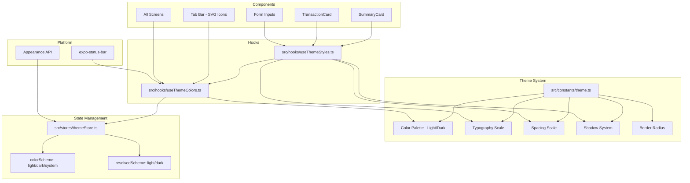

# Design: UI Style Improvements

## Overview

Este documento descreve a arquitetura técnica para modernizar o sistema visual do GG-Economy Mobile. O objetivo é substituir a abordagem atual de estilos inline com cores hardcoded por um sistema de design centralizado com suporte a dark mode, tipografia hierárquica, espaçamentos consistentes e componentes refinados.

A solução se baseia em um **Theme Provider** implementado como módulo TypeScript puro (sem Context API), exportando design tokens tipados e imutáveis. Os componentes consumirão tokens via importação direta, e a reatividade ao dark mode será obtida através de um hook customizado que escuta mudanças na `Appearance` API do React Native.

### Decisões de Design Principais

1. **Módulo puro vs Context API**: Optamos por exportar tokens como constantes TypeScript readonly com um hook `useThemeColors()` para cores mode-aware. Isso evita re-renders desnecessários em toda a árvore e mantém a API simples.
2. **Zustand para estado do tema**: O estado do color scheme (light/dark/system) será gerenciado via Zustand, consistente com o padrão existente do projeto.
3. **react-native-svg para ícones**: Ícones vetoriais customizados via SVG, aproveitando a dependência já existente no projeto, sem adicionar bibliotecas de ícones externas.
4. **Migração incremental**: Componentes serão migrados gradualmente, com fallbacks para tokens inexistentes durante a transição.

## Architecture



### Fluxo de Dados

1. O `themeStore` (Zustand) mantém a preferência do usuário (`system` | `light` | `dark`)
2. Um listener na `Appearance` API atualiza o `resolvedScheme` quando o sistema muda
3. O hook `useThemeColors()` retorna a paleta correta baseada no `resolvedScheme`
4. Componentes usam o hook para obter cores dinâmicas e importam tokens estáticos (typography, spacing) diretamente

## Components and Interfaces

### Theme Store

```typescript
// src/stores/themeStore.ts
import { create } from 'zustand';
import { Appearance, ColorSchemeName } from 'react-native';

type ThemePreference = 'system' | 'light' | 'dark';
type ResolvedScheme = 'light' | 'dark';

interface ThemeState {
  preference: ThemePreference;
  resolvedScheme: ResolvedScheme;
  setPreference: (pref: ThemePreference) => void;
}

export const useThemeStore = create<ThemeState>((set, get) => ({
  preference: 'system',
  resolvedScheme: Appearance.getColorScheme() === 'dark' ? 'dark' : 'light',
  setPreference: (pref) => {
    const resolved =
      pref === 'system' ? (Appearance.getColorScheme() === 'dark' ? 'dark' : 'light') : pref;
    set({ preference: pref, resolvedScheme: resolved });
  },
}));

// Listener for system appearance changes
Appearance.addChangeListener(({ colorScheme }) => {
  const state = useThemeStore.getState();
  if (state.preference === 'system') {
    useThemeStore.setState({
      resolvedScheme: colorScheme === 'dark' ? 'dark' : 'light',
    });
  }
});
```

### useThemeColors Hook

```typescript
// src/hooks/useThemeColors.ts
import { useThemeStore } from '../stores/themeStore';
import { colors } from '../constants/theme';

export function useThemeColors() {
  const resolvedScheme = useThemeStore((s) => s.resolvedScheme);
  return colors[resolvedScheme];
}
```

### Color Palette Interface

```typescript
// src/constants/theme.ts (expanded)

interface ColorVariant {
  readonly light: string;
  readonly base: string;
  readonly dark: string;
}

interface PrimaryScale {
  readonly 50: string;
  readonly 100: string;
  readonly 200: string;
  readonly 300: string;
  readonly 400: string;
  readonly 500: string;
  readonly 600: string;
  readonly 700: string;
  readonly 800: string;
  readonly 900: string;
}

interface SemanticColors {
  readonly primary: ColorVariant & { scale: PrimaryScale };
  readonly secondary: ColorVariant;
  readonly success: ColorVariant;
  readonly danger: ColorVariant;
  readonly warning: ColorVariant;
  readonly info: ColorVariant;
  readonly neutral: NeutralScale;
}

interface NeutralScale {
  readonly 0: string; // white / near-black
  readonly 50: string;
  readonly 100: string;
  readonly 200: string;
  readonly 300: string;
  readonly 400: string;
  readonly 500: string;
  readonly 600: string;
  readonly 700: string;
  readonly 800: string;
  readonly 900: string; // near-black / white
}

interface ModeColors {
  readonly background: {
    readonly primary: string;
    readonly secondary: string;
    readonly tertiary: string;
  };
  readonly text: {
    readonly primary: string;
    readonly secondary: string;
    readonly tertiary: string;
    readonly inverse: string;
  };
  readonly border: {
    readonly default: string;
    readonly subtle: string;
    readonly strong: string;
  };
  readonly semantic: SemanticColors;
  readonly surface: {
    readonly card: string;
    readonly elevated: string;
    readonly overlay: string;
  };
  readonly interactive: {
    readonly primary: string;
    readonly primaryPressed: string;
    readonly disabled: string;
  };
}

export interface ThemeColors {
  readonly light: ModeColors;
  readonly dark: ModeColors;
}
```

### Typography Scale Interface

```typescript
interface TypographyLevel {
  readonly fontSize: number;
  readonly fontWeight: '400' | '500' | '600' | '700';
  readonly lineHeight: number;
  readonly letterSpacing?: number;
}

export interface TypographyScale {
  readonly display: TypographyLevel; // 34px, 700
  readonly heading: TypographyLevel; // 28px, 700
  readonly title: TypographyLevel; // 22px, 600
  readonly body: TypographyLevel; // 16px, 400
  readonly caption: TypographyLevel; // 13px, 400
  readonly overline: TypographyLevel; // 11px, 500
}
```

### Spacing Scale Interface

```typescript
export interface SpacingScale {
  readonly xs: 4;
  readonly sm: 8;
  readonly md: 12;
  readonly base: 16;
  readonly lg: 20;
  readonly xl: 24;
  readonly '2xl': 32;
  readonly '3xl': 48;
}
```

### Shadow System Interface

```typescript
interface ShadowLevel {
  readonly shadowColor: string;
  readonly shadowOffset: { readonly width: number; readonly height: number };
  readonly shadowOpacity: number;
  readonly shadowRadius: number;
  readonly elevation: number;
}

export interface ShadowSystem {
  readonly light: {
    readonly sm: ShadowLevel;
    readonly md: ShadowLevel;
    readonly lg: ShadowLevel;
  };
  readonly dark: {
    readonly sm: ShadowLevel;
    readonly md: ShadowLevel;
    readonly lg: ShadowLevel;
  };
}
```

### Tab Bar Icon Component

```typescript
// src/components/ui/TabBarIcon.tsx
import React from 'react';
import Svg, { Path } from 'react-native-svg';

interface TabBarIconProps {
  name: 'dashboard' | 'transactions' | 'manual' | 'settings';
  focused: boolean;
  color: string;
  size?: number;
}

export function TabBarIcon({ name, focused, color, size = 24 }: TabBarIconProps) {
  // Returns filled variant when focused, outline when not
  const iconPath = focused ? FILLED_PATHS[name] : OUTLINE_PATHS[name];
  return (
    <Svg width={size} height={size} viewBox="0 0 24 24" fill="none">
      <Path d={iconPath} fill={color} />
    </Svg>
  );
}
```

## Data Models

### Theme Token Structure

```typescript
// Complete theme export structure
export const theme = {
  colors, // ThemeColors (light + dark palettes)
  typography, // TypographyScale
  spacing, // SpacingScale
  shadows, // ShadowSystem
  borderRadius, // BorderRadiusScale
} as const;

export type Theme = typeof theme;
```

### Border Radius Constants

```typescript
export const borderRadius = {
  sm: 8,
  md: 12,
  lg: 16,
  xl: 24,
} as const;
```

### Color Values (Light Mode)

```typescript
const lightColors: ModeColors = {
  background: {
    primary: '#FFFFFF',
    secondary: '#F5F5F7',
    tertiary: '#EBEBF0',
  },
  text: {
    primary: '#1C1C1E',
    secondary: '#6B7280',
    tertiary: '#9CA3AF',
    inverse: '#FFFFFF',
  },
  border: {
    default: '#E5E7EB',
    subtle: '#F3F4F6',
    strong: '#D1D5DB',
  },
  semantic: {
    primary: {
      light: '#EFF6FF',
      base: '#3B82F6',
      dark: '#1D4ED8',
      scale: { 50: '#EFF6FF', 100: '#DBEAFE', /* ... */ 900: '#1E3A5F' },
    },
    success: { light: '#DCFCE7', base: '#16A34A', dark: '#166534' },
    danger: { light: '#FEE2E2', base: '#DC2626', dark: '#991B1B' },
    warning: { light: '#FEF3C7', base: '#D97706', dark: '#92400E' },
    info: { light: '#DBEAFE', base: '#2563EB', dark: '#1E40AF' },
    // ...
  },
  surface: {
    card: '#FFFFFF',
    elevated: '#FFFFFF',
    overlay: 'rgba(0, 0, 0, 0.5)',
  },
  interactive: {
    primary: '#3B82F6',
    primaryPressed: '#2563EB',
    disabled: '#D1D5DB',
  },
};
```

### Color Values (Dark Mode)

```typescript
const darkColors: ModeColors = {
  background: {
    primary: '#000000',
    secondary: '#1C1C1E',
    tertiary: '#2C2C2E',
  },
  text: {
    primary: '#F5F5F7',
    secondary: '#A1A1AA',
    tertiary: '#71717A',
    inverse: '#1C1C1E',
  },
  border: {
    default: 'rgba(255, 255, 255, 0.12)',
    subtle: 'rgba(255, 255, 255, 0.08)',
    strong: 'rgba(255, 255, 255, 0.20)',
  },
  semantic: {
    primary: {
      light: '#1E3A5F',
      base: '#60A5FA',
      dark: '#93C5FD',
      scale: {
        /* adjusted for dark mode */
      },
    },
    success: { light: '#064E3B', base: '#34D399', dark: '#6EE7B7' },
    danger: { light: '#7F1D1D', base: '#F87171', dark: '#FCA5A5' },
    warning: { light: '#78350F', base: '#FBBF24', dark: '#FDE68A' },
    info: { light: '#1E3A8A', base: '#60A5FA', dark: '#93C5FD' },
    // ...
  },
  surface: {
    card: '#1C1C1E',
    elevated: '#2C2C2E',
    overlay: 'rgba(0, 0, 0, 0.7)',
  },
  interactive: {
    primary: '#60A5FA',
    primaryPressed: '#93C5FD',
    disabled: '#3F3F46',
  },
};
```

### Typography Values

```typescript
export const typography: TypographyScale = {
  display: { fontSize: 34, fontWeight: '700', lineHeight: 41 }, // 1.2x
  heading: { fontSize: 28, fontWeight: '700', lineHeight: 36 }, // 1.29x
  title: { fontSize: 22, fontWeight: '600', lineHeight: 30 }, // 1.36x
  body: { fontSize: 16, fontWeight: '400', lineHeight: 24 }, // 1.5x
  caption: { fontSize: 13, fontWeight: '400', lineHeight: 18 }, // 1.38x
  overline: { fontSize: 11, fontWeight: '500', lineHeight: 16, letterSpacing: 0.5 }, // 1.45x
} as const;
```

### Spacing Values

```typescript
export const spacing: SpacingScale = {
  xs: 4,
  sm: 8,
  md: 12,
  base: 16,
  lg: 20,
  xl: 24,
  '2xl': 32,
  '3xl': 48,
} as const;
```

### Shadow Values

```typescript
export const shadows: ShadowSystem = {
  light: {
    sm: {
      shadowColor: '#000',
      shadowOffset: { width: 0, height: 1 },
      shadowOpacity: 0.04,
      shadowRadius: 3,
      elevation: 2,
    },
    md: {
      shadowColor: '#000',
      shadowOffset: { width: 0, height: 2 },
      shadowOpacity: 0.06,
      shadowRadius: 4,
      elevation: 3,
    },
    lg: {
      shadowColor: '#000',
      shadowOffset: { width: 0, height: 4 },
      shadowOpacity: 0.08,
      shadowRadius: 6,
      elevation: 4,
    },
  },
  dark: {
    sm: {
      shadowColor: '#000',
      shadowOffset: { width: 0, height: 1 },
      shadowOpacity: 0.02,
      shadowRadius: 2,
      elevation: 0,
    },
    md: {
      shadowColor: '#000',
      shadowOffset: { width: 0, height: 2 },
      shadowOpacity: 0.03,
      shadowRadius: 3,
      elevation: 0,
    },
    lg: {
      shadowColor: '#000',
      shadowOffset: { width: 0, height: 4 },
      shadowOpacity: 0.04,
      shadowRadius: 4,
      elevation: 0,
    },
  },
} as const;
```

## Correctness Properties

_A property is a characteristic or behavior that should hold true across all valid executions of a system — essentially, a formal statement about what the system should do. Properties serve as the bridge between human-readable specifications and machine-verifiable correctness guarantees._

### Property 1: Color palette completeness

_For any_ semantic color name (primary, secondary, success, danger, warning, info) and _for any_ variant (light, base, dark) and _for any_ mode (light, dark), the Color_Palette SHALL return a valid 6-digit hex color string matching the pattern `/^#[0-9A-Fa-f]{6}$/`.

**Validates: Requirements 1.1**

### Property 2: Dark mode color selection

_For any_ color token path, when the resolved scheme is 'dark', the value returned by `useThemeColors()` SHALL equal the corresponding value in the dark mode palette, and when the resolved scheme is 'light', it SHALL equal the light mode palette value.

**Validates: Requirements 2.1**

### Property 3: Dark mode luminance constraints

_For any_ background color in the dark mode palette, the relative luminance SHALL be ≤ 0.05. _For any_ primary text color in the dark mode palette, the relative luminance SHALL be ≥ 0.8.

**Validates: Requirements 2.2**

### Property 4: Shadow opacity reduction in dark mode

_For any_ shadow level (sm, md, lg), the dark mode shadowOpacity SHALL be at most 50% of the corresponding light mode shadowOpacity.

**Validates: Requirements 2.3**

### Property 5: WCAG contrast compliance

_For any_ text color and its corresponding background color in either light or dark mode, the WCAG 2.1 contrast ratio SHALL be ≥ 4.5:1. _For any_ interactive/graphic element color against its background, the contrast ratio SHALL be ≥ 3:1.

**Validates: Requirements 2.5, 3.3**

### Property 6: Primary color progressive luminosity

_For any_ two primary color scale variants where variant index A < variant index B (e.g., 50 < 100 < 200 ... < 900), the relative luminance of variant A SHALL be strictly greater than the relative luminance of variant B.

**Validates: Requirements 3.1**

### Property 7: Typography scale validity

_For any_ typography level in the scale: (a) fontSize SHALL be between 11 and 34 inclusive, (b) fontWeight SHALL be one of '400', '500', '600', '700', (c) lineHeight/fontSize ratio SHALL be between 1.2 and 1.6 inclusive. Additionally, _for any_ two adjacent levels in the hierarchy (display > heading > title > body > caption > overline), the fontSize difference SHALL be ≥ 2px.

**Validates: Requirements 1.2, 4.2, 4.3**

### Property 8: Spacing scale multiples

_For any_ value in the Spacing_Scale, the value SHALL be a positive multiple of 4.

**Validates: Requirements 1.3**

## Error Handling

### Missing Token Fallback

When a component references a design token that does not exist in the theme (e.g., due to a typo or version mismatch):

1. The theme accessor function returns a fallback value from the default scale
2. In `__DEV__` mode, a `console.warn` is emitted with the token path that was not found
3. The component renders normally with the fallback value — no crash

```typescript
function getToken<T>(obj: Record<string, T>, key: string, fallback: T): T {
  if (key in obj) return obj[key];
  if (__DEV__) {
    console.warn(`[Theme] Token "${key}" not found, using fallback`);
  }
  return fallback;
}
```

### Appearance API Failure

If `Appearance.getColorScheme()` returns `null` (rare edge case on some Android devices):

- Default to `'light'` mode
- Log a warning in development

### Theme Store Persistence

If AsyncStorage fails to load the saved theme preference:

- Default to `'system'` preference
- The app functions normally with system-detected scheme
- Retry persistence on next preference change

## Testing Strategy

### Property-Based Tests (fast-check)

The project already has `fast-check` installed. Property-based tests will validate the correctness properties defined above.

**Configuration:**

- Minimum 100 iterations per property test
- Each test tagged with: `Feature: ui-style-improvements, Property {N}: {description}`
- Tests located in `src/constants/__tests__/theme.test.ts`

**Library:** `fast-check` (already in devDependencies)

**Properties to test:**

1. Color palette completeness — generate random (semanticColor, variant, mode) tuples
2. Dark mode selection — mock Appearance API, verify correct palette returned
3. Dark mode luminance — compute relative luminance for all dark mode colors
4. Shadow opacity reduction — compare light vs dark shadow values
5. WCAG contrast — compute contrast ratios for all text/background pairs
6. Primary luminosity progression — verify monotonic decrease across scale
7. Typography scale validity — verify ranges and adjacent differences
8. Spacing multiples — verify all values are multiples of 4

### Unit Tests (Jest)

Unit tests cover specific examples and edge cases:

- Theme store state transitions (system → light → dark → system)
- `useThemeColors` hook returns correct palette for each mode
- Tab bar icon renders correct SVG path for each tab and state
- SummaryCard uses elevated shadow level vs other cards
- TransactionCard uses semantic success/danger colors
- Input focus/error/disabled states apply correct styles
- Fallback behavior for missing tokens
- TRANSACTION_COLORS backward compatibility

### Integration Tests

- Appearance change listener updates all consuming components
- Theme preference persists across app restarts (AsyncStorage)
- Status bar style updates with theme change

### Visual Regression (Manual)

- Screenshot comparison for light/dark mode on key screens
- Verify tab bar icon rendering on iOS and Android
- Verify shadow/border rendering differences between platforms
