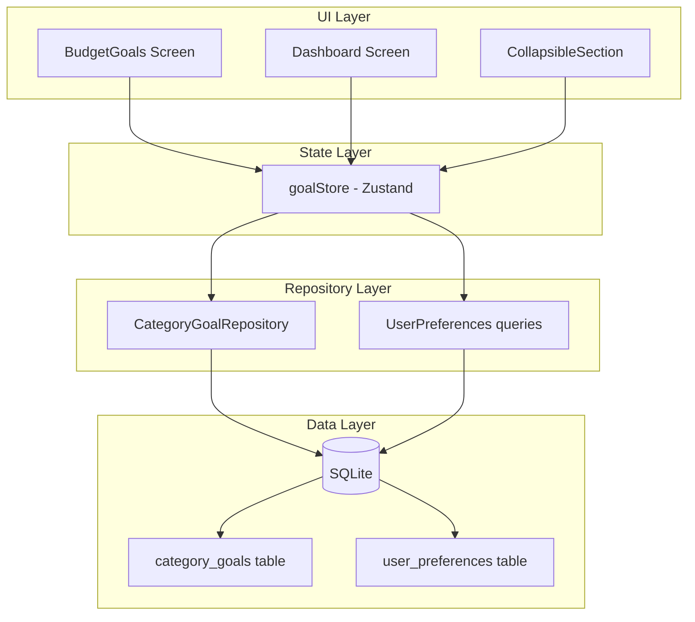

# Design Document: Variable Expense Goals

## Overview

This feature adds budget goal (meta) management for variable expenses in the GG-Economy mobile app. Users can configure a general goal for all variable expenses combined and/or individual per-category goals. These goals are displayed on the Dashboard alongside actual spending values and serve as advisory suggestions — never enforced limits.

The implementation follows the existing offline-first architecture: SQLite storage via Drizzle ORM, repository pattern for data access, Zustand for reactive state, and expo-router for navigation. The feature integrates tightly with the existing `CollapsibleSection` dashboard component and adds a new Settings sub-screen for goal configuration.

Key design decisions:

- **Auto-save on input**: Goals persist automatically when a valid value is entered, matching the frictionless UX pattern.
- **Cents-based storage**: All amounts are stored as integers (cents) in SQLite to avoid floating-point precision issues.
- **Null-means-absent**: The absence of a row in `category_goals` or `user_preferences` indicates no goal is configured (not zero).
- **Non-blocking goals**: No warnings, alerts, or red indicators when spending exceeds a goal — by design.

## Architecture



The feature follows the existing layered architecture:

1. **UI Layer**: New `BudgetGoals` screen + modified `CollapsibleSection` and `CategoryRow` components
2. **State Layer**: A new `goalStore` (Zustand) manages goal state reactively, similar to existing stores like `weeklyRecurringStore`
3. **Repository Layer**: A new `CategoryGoalRepository` class + extension of existing `user_preferences` queries for the general goal
4. **Data Layer**: New `category_goals` SQLite table + reuse of existing `user_preferences` table

## Components and Interfaces

### New Files

| File                                                     | Purpose                                           |
| -------------------------------------------------------- | ------------------------------------------------- |
| `src/db/migrations/0007_add_category_goals.sql`          | SQL migration for `category_goals` table          |
| `src/db/migrations/0007_add_category_goals.ts`           | TypeScript migration wrapper                      |
| `src/repositories/CategoryGoalRepository.ts`             | Repository for category goal CRUD                 |
| `src/repositories/interfaces/ICategoryGoalRepository.ts` | Repository interface                              |
| `src/stores/goalStore.ts`                                | Zustand store for goal state management           |
| `src/hooks/useGoals.ts`                                  | Hook exposing goal data for Dashboard consumption |
| `src/validation/goalValidation.ts`                       | Validation logic for goal amounts                 |
| `src/services/goals/ExpectedFutureSpending.ts`           | Pure calculation function                         |
| `app/(tabs)/settings/budget-goals.tsx`                   | Budget Goals configuration screen                 |

### Modified Files

| File                                              | Change                                             |
| ------------------------------------------------- | -------------------------------------------------- |
| `src/db/schema.ts`                                | Add `categoryGoals` table definition               |
| `src/components/dashboard/CollapsibleSection.tsx` | Display general goal + expected spending in header |
| `src/components/dashboard/CategoryRow.tsx`        | Display per-category goal alongside actual amount  |
| `app/(tabs)/settings/_layout.tsx`                 | Add `budget-goals` screen to stack                 |
| `app/(tabs)/settings/index.tsx`                   | Add navigation item for Budget Goals               |
| `src/i18n/locales/pt-BR.json`                     | Add goal-related translation keys                  |
| `src/i18n/locales/en.json`                        | Add goal-related translation keys                  |
| `src/hooks/useDashboardData.ts`                   | Include goal data in return type                   |

### Key Interfaces

```typescript
// src/types/goal.ts
export interface CategoryGoal {
  id: string;
  categoryId: string;
  amount: number; // in cents, always > 0
  createdAt: string; // ISO 8601
  updatedAt: string; // ISO 8601
}

export interface GoalValidationResult {
  valid: boolean;
  amountInCents?: number;
  error?: string; // i18n key
}
```

```typescript
// src/repositories/interfaces/ICategoryGoalRepository.ts
export interface ICategoryGoalRepository {
  getByCategoryId(categoryId: string): Promise<CategoryGoal | null>;
  getAllForVariableCategories(): Promise<CategoryGoal[]>;
  upsert(categoryId: string, amountInCents: number): Promise<CategoryGoal>;
  delete(categoryId: string): Promise<void>;
}
```

```typescript
// src/stores/goalStore.ts (Zustand store shape)
interface GoalState {
  generalGoal: number | null; // cents, null = not configured
  categoryGoals: Map<string, number>; // categoryId -> cents
  isLoading: boolean;

  // Actions
  loadGoals(): Promise<void>;
  setGeneralGoal(amountInCents: number): Promise<void>;
  removeGeneralGoal(): Promise<void>;
  setCategoryGoal(categoryId: string, amountInCents: number): Promise<void>;
  removeCategoryGoal(categoryId: string): Promise<void>;
}
```

```typescript
// src/services/goals/ExpectedFutureSpending.ts
export interface CategorySpendingWithGoal {
  categoryId: string;
  actualSpending: number; // cents
  goal: number | null; // cents, null = no goal
}

/**
 * Calculates expected future spending.
 * For each category with a goal: max(0, goal - actualSpending)
 * Categories without goals are excluded.
 */
export function calculateExpectedFutureSpending(categories: CategorySpendingWithGoal[]): number;
```

### Validation Function

```typescript
// src/validation/goalValidation.ts
const MIN_GOAL_CENTS = 1; // 0.01 in currency
const MAX_GOAL_CENTS = 99999999999; // 999,999,999.99 in currency

export function validateGoalAmount(
  input: string | number,
  locale: SupportedLocale
): GoalValidationResult;
```

## Data Models

### New Table: `category_goals`

```sql
CREATE TABLE `category_goals` (
  `id` TEXT PRIMARY KEY NOT NULL,
  `category_id` TEXT NOT NULL UNIQUE REFERENCES `categories`(`id`) ON DELETE CASCADE,
  `amount` REAL NOT NULL CHECK(`amount` > 0),
  `created_at` TEXT NOT NULL DEFAULT (datetime('now')),
  `updated_at` TEXT NOT NULL DEFAULT (datetime('now'))
);
CREATE INDEX `idx_category_goals_category` ON `category_goals` (`category_id`);
```

### Drizzle Schema Addition

```typescript
// Addition to src/db/schema.ts
export const categoryGoals = sqliteTable(
  'category_goals',
  {
    id: text('id').primaryKey(),
    categoryId: text('category_id')
      .notNull()
      .unique()
      .references(() => categories.id, { onDelete: 'cascade' }),
    amount: real('amount').notNull(), // stored in cents, must be > 0
    createdAt: text('created_at')
      .notNull()
      .default(sql`(datetime('now'))`),
    updatedAt: text('updated_at')
      .notNull()
      .default(sql`(datetime('now'))`),
  },
  (table) => [index('idx_category_goals_category').on(table.categoryId)]
);
```

### General Goal in `user_preferences`

| key                     | value      | notes                                                       |
| ----------------------- | ---------- | ----------------------------------------------------------- |
| `general_variable_goal` | `"250000"` | String representation of cents (e.g., R$ 2.500,00 = 250000) |

Row is deleted when goal is removed (absence = no goal).

### Migration: `0007_add_category_goals`

```sql
CREATE TABLE `category_goals` (
  `id` TEXT PRIMARY KEY NOT NULL,
  `category_id` TEXT NOT NULL UNIQUE,
  `amount` REAL NOT NULL,
  `created_at` TEXT NOT NULL DEFAULT (datetime('now')),
  `updated_at` TEXT NOT NULL DEFAULT (datetime('now')),
  FOREIGN KEY (`category_id`) REFERENCES `categories`(`id`) ON DELETE CASCADE
);
--> statement-breakpoint
CREATE INDEX `idx_category_goals_category` ON `category_goals` (`category_id`);
```

## Correctness Properties

_A property is a characteristic or behavior that should hold true across all valid executions of a system — essentially, a formal statement about what the system should do. Properties serve as the bridge between human-readable specifications and machine-verifiable correctness guarantees._

### Property 1: Goal persistence round-trip

_For any_ valid goal amount (between 1 and 99999999999 cents) and any valid category ID, persisting a category goal via the repository and reading it back SHALL return the same amount. Similarly, for any valid amount, persisting a general goal via user_preferences and reading it back SHALL return the same value.

**Validates: Requirements 1.2, 2.2, 6.2**

### Property 2: Goal deletion returns absent state

_For any_ previously persisted goal (general or per-category), deleting it and then querying SHALL return null/undefined, indicating no goal is configured.

**Validates: Requirements 1.5, 2.5, 6.3, 6.7**

### Property 3: Goal validation rejects invalid amounts

_For any_ numeric value that is ≤ 0, > 999,999,999.99, NaN, or non-numeric input, the goal validation function SHALL return `{ valid: false }` and never persist the value.

**Validates: Requirements 1.8, 2.7, 7.5**

### Property 4: Expected Future Spending calculation

_For any_ array of categories with optional goals and actual spending amounts, the `calculateExpectedFutureSpending` function SHALL return the sum of `max(0, goal - actualSpending)` for categories that have goals, and exclude categories without goals entirely. The result SHALL always be ≥ 0.

**Validates: Requirements 10.2, 10.3, 10.4, 10.5, 10.6**

### Property 5: i18n keys completeness

_For any_ required budget-goals translation key and _for any_ supported locale (pt-BR, en), the translation SHALL be a non-empty string. Additionally, the suggestion explanatory text SHALL be at most 150 characters in all locales.

**Validates: Requirements 8.1, 5.4, 1.6**

### Property 6: Categories displayed in alphabetical order

_For any_ set of variable categories with arbitrary names, the Budget Goals screen SHALL display them sorted in ascending alphabetical order by name.

**Validates: Requirements 7.9**

### Property 7: Cascade delete removes associated goals

_For any_ category that has an associated goal in `category_goals`, deleting the category SHALL also delete the goal record (no orphaned goals remain).

**Validates: Requirements 6.5**

### Property 8: Currency formatting produces valid locale output

_For any_ valid goal amount (positive number) and _for any_ supported locale, `formatCurrencyLocale` SHALL produce a non-empty string containing the locale-appropriate currency symbol and decimal representation.

**Validates: Requirements 3.2, 4.2, 10.7**

## Error Handling

| Scenario                                    | Handling                                                                                         |
| ------------------------------------------- | ------------------------------------------------------------------------------------------------ |
| Database write failure (save/update goal)   | Show localized toast error message, do not update local state, keep previous value in input      |
| Database read failure (loading goals)       | Set `isLoading: false`, show error state in UI, allow retry                                      |
| Invalid input during typing                 | Show inline validation message below input, do not persist                                       |
| Migration failure                           | Handled by existing `initializeDatabase()` error flow — alerts user and throws `MigrationError`  |
| Category deleted while goals screen is open | Zustand store reactively removes the goal from state; UI re-renders without the deleted category |
| Concurrent writes (unlikely in single-user) | SQLite serializes writes; last write wins with `upsert` pattern                                  |

Validation errors use i18n keys for localized messages:

- `goals.validation.tooLow` — value < 0.01
- `goals.validation.tooHigh` — value > 999,999,999.99
- `goals.validation.invalidFormat` — non-numeric input

## Testing Strategy

### Property-Based Tests (fast-check, minimum 100 iterations each)

| Test File                                               | Property                        | Coverage         |
| ------------------------------------------------------- | ------------------------------- | ---------------- |
| `src/__tests__/goalPersistence.property.test.ts`        | Property 1: Round-trip          | Repository layer |
| `src/__tests__/goalDeletion.property.test.ts`           | Property 2: Deletion            | Repository layer |
| `src/__tests__/goalValidation.property.test.ts`         | Property 3: Validation          | Validation layer |
| `src/__tests__/expectedFutureSpending.property.test.ts` | Property 4: Calculation         | Service layer    |
| `src/__tests__/goalI18n.property.test.ts`               | Property 5: i18n completeness   | i18n layer       |
| `src/__tests__/goalCategoryOrder.property.test.ts`      | Property 6: Alphabetical order  | UI logic         |
| `src/__tests__/goalCascadeDelete.property.test.ts`      | Property 7: Cascade delete      | Database layer   |
| `src/__tests__/goalCurrencyFormat.property.test.ts`     | Property 8: Currency formatting | Formatter        |

**PBT Library**: `fast-check` (already used in the project)
**Configuration**: `{ numRuns: 100 }` for each property test
**Tag format**: `// Feature: variable-expense-goals, Property N: <title>`

### Unit Tests (example-based)

| Test File                                                    | Coverage                                    |
| ------------------------------------------------------------ | ------------------------------------------- |
| `src/__tests__/goalStore.test.ts`                            | Zustand store actions and state transitions |
| `src/__tests__/components/BudgetGoalsScreen.test.tsx`        | Screen rendering, input interactions        |
| `src/__tests__/components/CollapsibleSection.goals.test.tsx` | Goal display in section header              |
| `src/__tests__/components/CategoryRow.goals.test.tsx`        | Goal display in category rows               |
| `app/(tabs)/settings/__tests__/budget-goals.test.tsx`        | Navigation, screen structure                |

### Key Testing Decisions

- **Repository tests**: Use in-memory SQLite (via `better-sqlite3` in Jest) to verify actual SQL behavior including constraints and cascades
- **Calculation tests**: Pure function testing with `fast-check` — no mocks needed
- **Component tests**: React Native Testing Library with mocked stores
- **Validation tests**: Pure function testing — no dependencies
- **i18n tests**: Direct JSON file reads — no runtime needed
