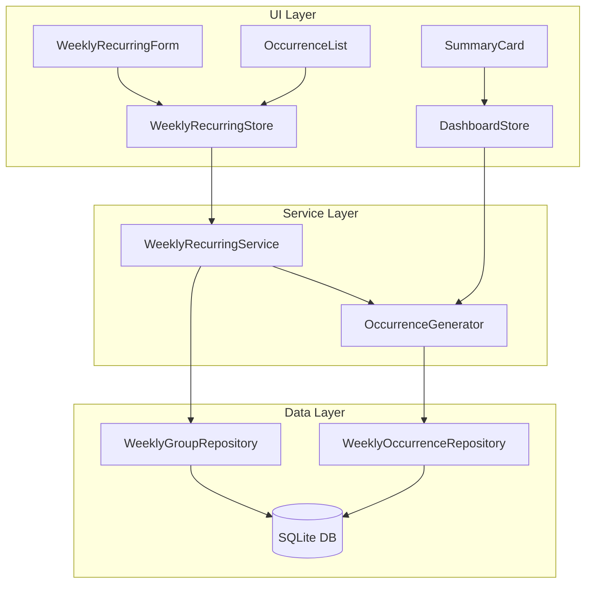

# Design Document: Weekly Recurring Expenses

## Overview

This feature introduces weekly recurring expenses (gastos semanais recorrentes) to GG-Economy Mobile. Unlike the existing monthly recurring transactions (which generate one transaction per month), weekly recurring expenses generate 4-5 occurrences per month based on a fixed day of the week. Each occurrence is an independent entity that can be individually edited, while group-level changes only affect future occurrences — preserving historical data integrity.

### Key Design Decisions

1. **Separate table for weekly groups** — Rather than extending the existing `recurring_transactions` table (which is designed for monthly recurrence), a new `weekly_recurring_groups` table is introduced. This avoids polluting the monthly logic with weekly-specific fields (dayOfWeek, occurrence tracking) and keeps both systems independently maintainable.

2. **Separate occurrences table** — Weekly occurrences are stored in a dedicated `weekly_occurrences` table rather than the main `transactions` table. This provides clear separation of concerns: occurrences have weekly-specific fields (`is_value_edited`, `weekly_group_id`) and different lifecycle rules than regular transactions. The monthly total is computed from this table and injected into the SummaryCard.

3. **Lazy generation on navigation** — Occurrences are generated on-demand when the user navigates to a month, rather than pre-generating months in advance. This keeps the database lean and avoids generating data the user may never view.

4. **Temporal boundary for protection** — The system uses `today at 00:00:00` as the boundary between past and future occurrences. Occurrences on today's date are considered "future" and subject to group-level changes.

## Architecture



### High-Level Flow

1. **Creation**: User fills form → `WeeklyRecurringService.createGroup()` → inserts group → `OccurrenceGenerator.generateForMonth()` → inserts occurrences for current month
2. **Navigation**: User changes month → `OccurrenceGenerator.generateForMonth()` (idempotent) → occurrences available for display
3. **Individual Edit**: User edits occurrence → `WeeklyOccurrenceRepository.update()` → sets `is_value_edited = true` if value changed
4. **Group Edit**: User edits group → `WeeklyRecurringService.updateGroup()` → updates group record → selectively updates/regenerates future unedited occurrences
5. **Deletion**: User confirms deletion → `WeeklyRecurringService.deleteGroup()` → soft-deletes group → removes future occurrences → preserves past occurrences

## Components and Interfaces

### Service Layer

```typescript
// src/services/weekly-recurring/WeeklyRecurringService.ts

interface IWeeklyRecurringService {
  createGroup(dto: CreateWeeklyGroupDTO): Promise<WeeklyRecurringGroup>;
  updateGroup(id: string, dto: UpdateWeeklyGroupDTO): Promise<WeeklyRecurringGroup>;
  deleteGroup(id: string): Promise<void>;
  getActiveGroups(): Promise<WeeklyRecurringGroup[]>;
  getGroupById(id: string): Promise<WeeklyRecurringGroup | null>;
}
```

```typescript
// src/services/weekly-recurring/OccurrenceGenerator.ts

interface IOccurrenceGenerator {
  generateForMonth(targetMonth: string): Promise<void>;
  generateForGroup(groupId: string, targetMonth: string): Promise<void>;
  getMonthlyTotal(targetMonth: string): Promise<number>;
}
```

### Repository Layer

```typescript
// src/repositories/WeeklyGroupRepository.ts

interface IWeeklyGroupRepository {
  create(data: NewWeeklyGroupRecord): Promise<WeeklyRecurringGroup>;
  update(id: string, data: Partial<WeeklyGroupUpdateFields>): Promise<WeeklyRecurringGroup | null>;
  softDelete(id: string): Promise<void>;
  getById(id: string): Promise<WeeklyRecurringGroup | null>;
  getActive(): Promise<WeeklyRecurringGroup[]>;
  getActiveForMonth(targetMonth: string): Promise<WeeklyRecurringGroup[]>;
}
```

```typescript
// src/repositories/WeeklyOccurrenceRepository.ts

interface IWeeklyOccurrenceRepository {
  create(data: NewWeeklyOccurrenceRecord): Promise<WeeklyOccurrence>;
  createMany(data: NewWeeklyOccurrenceRecord[]): Promise<WeeklyOccurrence[]>;
  update(id: string, data: Partial<WeeklyOccurrenceUpdateFields>): Promise<WeeklyOccurrence | null>;
  delete(id: string): Promise<void>;
  deleteMany(ids: string[]): Promise<void>;
  deleteFutureUnedited(groupId: string, fromDate: string): Promise<void>;
  deleteFuture(groupId: string, fromDate: string): Promise<void>;
  getByGroupId(groupId: string): Promise<WeeklyOccurrence[]>;
  getByMonth(targetMonth: string): Promise<WeeklyOccurrence[]>;
  getByGroupAndMonth(groupId: string, targetMonth: string): Promise<WeeklyOccurrence[]>;
  getMonthlyTotal(targetMonth: string): Promise<number>;
  existsForGroupAndDate(groupId: string, date: string): Promise<boolean>;
  getFutureUnedited(groupId: string, fromDate: string): Promise<WeeklyOccurrence[]>;
  getFuture(groupId: string, fromDate: string): Promise<WeeklyOccurrence[]>;
  getPast(groupId: string, beforeDate: string): Promise<WeeklyOccurrence[]>;
}
```

### Validation Layer

```typescript
// src/validation/weeklyRecurringValidation.ts

interface WeeklyGroupValidationInput {
  title: string;
  amount: number;
  dayOfWeek: number;
  categoryId: string | null;
}

interface OccurrenceValueValidationInput {
  amount: number;
}

interface OccurrenceDateValidationInput {
  date: string; // YYYY-MM-DD
}

function validateWeeklyGroup(input: WeeklyGroupValidationInput): ValidationResult;
function validateOccurrenceValue(input: OccurrenceValueValidationInput): ValidationResult;
function validateOccurrenceDate(input: OccurrenceDateValidationInput): ValidationResult;
```

### Store Layer

```typescript
// src/stores/weeklyRecurringStore.ts

interface WeeklyRecurringState {
  groups: WeeklyRecurringGroup[];
  occurrences: Record<string, WeeklyOccurrence[]>; // keyed by referenceMonth
  monthlyTotals: Record<string, number>; // keyed by referenceMonth
  isLoading: boolean;
  error: string | null;

  // Actions
  loadGroups(): Promise<void>;
  loadOccurrencesForMonth(month: string): Promise<void>;
  createGroup(dto: CreateWeeklyGroupDTO): Promise<void>;
  updateGroup(id: string, dto: UpdateWeeklyGroupDTO): Promise<void>;
  deleteGroup(id: string): Promise<void>;
  updateOccurrence(id: string, dto: UpdateOccurrenceDTO): Promise<void>;
  getMonthlyTotal(month: string): number;
}
```

### UI Components

```typescript
// src/components/weekly-recurring/WeeklyRecurringForm.tsx
// Form for creating/editing weekly recurring groups
// Fields: title, amount, dayOfWeek (picker), category (selector), origin (optional)

// src/components/weekly-recurring/WeeklyGroupList.tsx
// List of all weekly recurring groups with edit/delete actions

// src/components/weekly-recurring/OccurrenceList.tsx
// List of occurrences for a specific group, ordered chronologically
// Each item shows date, amount, and edit controls

// src/components/weekly-recurring/OccurrenceEditModal.tsx
// Modal for editing individual occurrence value and date
```

## Data Models

### New Tables

```sql
-- Migration: 0005_add_weekly_recurring.sql

CREATE TABLE weekly_recurring_groups (
  id TEXT PRIMARY KEY,
  title TEXT NOT NULL,
  amount REAL NOT NULL,
  day_of_week INTEGER NOT NULL,  -- 0=Sunday, 6=Saturday
  category_id TEXT NOT NULL REFERENCES categories(id) ON DELETE CASCADE,
  category_type TEXT NOT NULL DEFAULT 'expense',  -- 'income' | 'expense'
  description TEXT NOT NULL DEFAULT '',
  origin_id TEXT REFERENCES origins(id) ON DELETE SET NULL,
  start_date TEXT NOT NULL,  -- YYYY-MM-DD: date from which occurrences begin
  is_active INTEGER NOT NULL DEFAULT 1,
  created_at TEXT NOT NULL DEFAULT (datetime('now')),
  updated_at TEXT NOT NULL DEFAULT (datetime('now'))
);

CREATE INDEX idx_weekly_groups_active ON weekly_recurring_groups(is_active);
CREATE INDEX idx_weekly_groups_day ON weekly_recurring_groups(day_of_week);

CREATE TABLE weekly_occurrences (
  id TEXT PRIMARY KEY,
  weekly_group_id TEXT NOT NULL REFERENCES weekly_recurring_groups(id) ON DELETE CASCADE,
  date TEXT NOT NULL,  -- YYYY-MM-DD: actual occurrence date
  reference_month TEXT NOT NULL,  -- YYYY-MM: derived from date
  amount REAL NOT NULL,
  description TEXT NOT NULL DEFAULT '',
  is_value_edited INTEGER NOT NULL DEFAULT 0,  -- tracks manual edits
  created_at TEXT NOT NULL DEFAULT (datetime('now')),
  updated_at TEXT NOT NULL DEFAULT (datetime('now'))
);

CREATE INDEX idx_weekly_occurrences_group ON weekly_occurrences(weekly_group_id);
CREATE INDEX idx_weekly_occurrences_month ON weekly_occurrences(reference_month);
CREATE INDEX idx_weekly_occurrences_date ON weekly_occurrences(date);
CREATE UNIQUE INDEX idx_weekly_occurrences_group_date ON weekly_occurrences(weekly_group_id, date);
```

### Drizzle Schema Addition

```typescript
// Addition to src/db/schema.ts

export const weeklyRecurringGroups = sqliteTable(
  'weekly_recurring_groups',
  {
    id: text('id').primaryKey(),
    title: text('title').notNull(),
    amount: real('amount').notNull(),
    dayOfWeek: integer('day_of_week').notNull(), // 0-6
    categoryId: text('category_id')
      .notNull()
      .references(() => categories.id, { onDelete: 'cascade' }),
    categoryType: text('category_type', { enum: ['income', 'expense'] })
      .notNull()
      .default('expense'),
    description: text('description').notNull().default(''),
    originId: text('origin_id').references(() => origins.id, { onDelete: 'set null' }),
    startDate: text('start_date').notNull(), // YYYY-MM-DD
    isActive: integer('is_active', { mode: 'boolean' }).notNull().default(true),
    createdAt: text('created_at')
      .notNull()
      .default(sql`(datetime('now'))`),
    updatedAt: text('updated_at')
      .notNull()
      .default(sql`(datetime('now'))`),
  },
  (table) => [
    index('idx_weekly_groups_active').on(table.isActive),
    index('idx_weekly_groups_day').on(table.dayOfWeek),
  ]
);

export const weeklyOccurrences = sqliteTable(
  'weekly_occurrences',
  {
    id: text('id').primaryKey(),
    weeklyGroupId: text('weekly_group_id')
      .notNull()
      .references(() => weeklyRecurringGroups.id, { onDelete: 'cascade' }),
    date: text('date').notNull(), // YYYY-MM-DD
    referenceMonth: text('reference_month').notNull(), // YYYY-MM
    amount: real('amount').notNull(),
    description: text('description').notNull().default(''),
    isValueEdited: integer('is_value_edited', { mode: 'boolean' }).notNull().default(false),
    createdAt: text('created_at')
      .notNull()
      .default(sql`(datetime('now'))`),
    updatedAt: text('updated_at')
      .notNull()
      .default(sql`(datetime('now'))`),
  },
  (table) => [
    index('idx_weekly_occurrences_group').on(table.weeklyGroupId),
    index('idx_weekly_occurrences_month').on(table.referenceMonth),
    index('idx_weekly_occurrences_date').on(table.date),
  ]
);
```

### TypeScript Types

```typescript
// src/types/weeklyRecurring.ts

export interface WeeklyRecurringGroup {
  id: string;
  title: string;
  amount: number;
  dayOfWeek: number; // 0=Sunday, 6=Saturday
  categoryId: string;
  categoryType: 'income' | 'expense';
  description: string;
  originId: string | null;
  startDate: string; // YYYY-MM-DD
  isActive: boolean;
  createdAt: string;
  updatedAt: string;
}

export interface WeeklyOccurrence {
  id: string;
  weeklyGroupId: string;
  date: string; // YYYY-MM-DD
  referenceMonth: string; // YYYY-MM
  amount: number;
  description: string;
  isValueEdited: boolean;
  createdAt: string;
  updatedAt: string;
}

export interface CreateWeeklyGroupDTO {
  title: string;
  amount: number;
  dayOfWeek: number;
  categoryId: string;
  categoryType?: 'income' | 'expense';
  description?: string;
  originId?: string;
}

export interface UpdateWeeklyGroupDTO {
  title?: string;
  amount?: number;
  dayOfWeek?: number;
  categoryId?: string;
  description?: string;
  originId?: string | null;
}

export interface UpdateOccurrenceDTO {
  amount?: number;
  date?: string; // YYYY-MM-DD
}
```

### Core Algorithm: Date Calculation

```typescript
// src/services/weekly-recurring/dateUtils.ts

/**
 * Calculate all dates for a given day of week within a month,
 * starting from startDate if it falls within the month.
 *
 * @param targetMonth - YYYY-MM format
 * @param dayOfWeek - 0 (Sunday) to 6 (Saturday)
 * @param startDate - YYYY-MM-DD, earliest allowed date
 * @returns Array of YYYY-MM-DD strings (4 or 5 dates)
 */
function getWeeklyDatesForMonth(
  targetMonth: string,
  dayOfWeek: number,
  startDate: string
): string[];

/**
 * Derive reference month (YYYY-MM) from a date (YYYY-MM-DD).
 */
function deriveReferenceMonth(date: string): string;

/**
 * Get today's date as YYYY-MM-DD at 00:00:00 for boundary comparison.
 */
function getTodayBoundary(): string;

/**
 * Check if a date is in the past (strictly before today).
 */
function isPastDate(date: string): boolean;
```

## Correctness Properties

_A property is a characteristic or behavior that should hold true across all valid executions of a system — essentially, a formal statement about what the system should do. Properties serve as the bridge between human-readable specifications and machine-verifiable correctness guarantees._

### Property 1: Occurrence Date Calculation Correctness

_For any_ valid month (YYYY-MM) and day of week (0-6), all dates returned by `getWeeklyDatesForMonth` SHALL fall on the specified day of week, be within the target month boundaries, be on or after the group's start date, and the count SHALL be exactly 4 or 5.

**Validates: Requirements 1.3, 1.6, 6.1, 6.4**

### Property 2: Idempotent Generation

_For any_ active weekly recurring group and target month, calling `generateForMonth` multiple times SHALL produce the same set of occurrences as calling it once — the occurrence count and data for that group and month SHALL not change after the first successful generation.

**Validates: Requirements 1.4, 6.3**

### Property 3: Validation Rejects Invalid Inputs

_For any_ input where the title is empty or whitespace-only or exceeds 100 characters, OR the amount is outside [0.01, 999999999.99], OR the dayOfWeek is outside [0, 6], OR the categoryId is null/empty, the validation function SHALL return `{ valid: false }` with at least one error message. Conversely, _for any_ input within all valid ranges, validation SHALL return `{ valid: true }`.

**Validates: Requirements 1.2, 3.3, 3.5, 4.7**

### Property 4: Monthly Total Equals Sum of Occurrences

_For any_ set of weekly occurrences within a reference month, the computed monthly total SHALL equal the arithmetic sum of all occurrence amounts for that month, regardless of which groups they belong to or whether those groups are active or inactive.

**Validates: Requirements 2.1**

### Property 5: Occurrence Edit Isolation

_For any_ weekly recurring group with multiple occurrences, editing the value of one specific occurrence SHALL leave all other occurrences in the same group with their original values unchanged.

**Validates: Requirements 3.2**

### Property 6: Date Change Derives Correct Reference Month

_For any_ valid date in YYYY-MM-DD format, updating an occurrence's date SHALL set its reference month to the YYYY-MM prefix of that date.

**Validates: Requirements 3.4**

### Property 7: Group Edit Preserves Past, Updates Eligible Future

_For any_ weekly recurring group with a mix of past and future occurrences, editing the group's name or base value SHALL leave all past occurrences (date < today) completely unchanged in all fields, AND SHALL only update future occurrences (date >= today) that have `is_value_edited = false` when the base value changes.

**Validates: Requirements 4.1, 4.2, 4.3, 4.6, 7.1, 7.5**

### Property 8: Day-of-Week Change Regenerates Correctly

_For any_ weekly recurring group, changing the day of week SHALL delete all future unedited occurrences, preserve all future edited occurrences (with `is_value_edited = true`), and generate new occurrences on the new day of week for all months that previously had generated occurrences. All new occurrences SHALL fall on the new day of week.

**Validates: Requirements 4.4, 4.5**

### Property 9: Deletion Preserves Past and Removes Future

_For any_ weekly recurring group with both past and future occurrences, confirming deletion SHALL set `is_active = false` on the group, remove all occurrences with date >= today from the database, and preserve all occurrences with date < today with their original data intact.

**Validates: Requirements 5.2, 5.3, 5.4, 7.2**

## Error Handling

### Validation Errors

| Operation             | Error Condition                                   | Behavior                                                                  |
| --------------------- | ------------------------------------------------- | ------------------------------------------------------------------------- |
| Create Group          | Invalid title/amount/dayOfWeek/category           | Return `ValidationResult` with field-specific errors, form retains values |
| Edit Group            | Same as creation                                  | Return `ValidationResult`, form retains previous valid values             |
| Edit Occurrence Value | Zero, out of range, >2 decimals                   | Reject, show error toast, retain previous value                           |
| Edit Occurrence Date  | Empty, invalid format, non-existent, out of range | Reject, show error toast, retain previous date                            |

### Database Errors

| Operation            | Error Condition          | Behavior                                                                           |
| -------------------- | ------------------------ | ---------------------------------------------------------------------------------- |
| Create Group         | Insert failure           | Rollback group + occurrences, show error notification                              |
| Edit Group           | Partial update failure   | Rollback all changes (SQLite transaction), show error notification                 |
| Delete Group         | Partial deletion failure | Rollback all changes (SQLite transaction), show error notification                 |
| Generate Occurrences | Single group failure     | Rollback that group's insertions, continue with other groups, log error internally |

### Transaction Safety

All multi-step operations (group edit, group delete, occurrence generation per group) are wrapped in SQLite transactions to ensure atomicity. If any step fails, the entire operation for that group is rolled back.

```typescript
// Pattern used for transactional operations
async function withTransaction<T>(fn: () => Promise<T>): Promise<T> {
  const db = getDb();
  return db.transaction(async (tx) => {
    return fn();
  });
}
```

## Testing Strategy

### Property-Based Tests (fast-check)

The project already uses `fast-check` (v4.7.0) with Jest. Each correctness property maps to a property-based test with minimum 100 iterations.

**Test file**: `src/__tests__/weekly-recurring/properties.test.ts`

| Property | Test Description                  | Key Generators                                                                                  |
| -------- | --------------------------------- | ----------------------------------------------------------------------------------------------- |
| 1        | Date calculation correctness      | `fc.integer({min:2020, max:2030})`, `fc.integer({min:1, max:12})`, `fc.integer({min:0, max:6})` |
| 2        | Idempotent generation             | Random groups + months, call generate twice                                                     |
| 3        | Validation rejects invalid inputs | `fc.oneof(invalidTitle, invalidAmount, invalidDay, nullCategory)`                               |
| 4        | Monthly total = sum               | `fc.array(fc.float({min:0.01, max:999999.99}))`                                                 |
| 5        | Edit isolation                    | Random group with N occurrences, edit one                                                       |
| 6        | Date → reference month            | `fc.date()` within valid range                                                                  |
| 7        | Group edit preserves past         | Random group with past+future occurrences                                                       |
| 8        | Day-of-week regeneration          | Random group, change dayOfWeek                                                                  |
| 9        | Deletion preserves past           | Random group with past+future occurrences                                                       |

**Configuration**: Each property test runs with `{ numRuns: 100 }` minimum.

**Tag format**: `// Feature: weekly-recurring-expenses, Property N: <property text>`

### Unit Tests (Jest)

Focus on specific examples and edge cases:

- Creation with boundary values (min/max amount, day 0 and 6)
- Month with exactly 4 vs 5 occurrences of a given day
- Occurrence on today's date treated as "future"
- SummaryCard shows/hides weekly line based on total
- Group edit when all future occurrences are manually edited (no-op for value)
- Date validation edge cases (Feb 29 on leap year, Dec 31)

### Integration Tests

- Full creation → generation → navigation → display flow
- Group edit with simulated DB failure → rollback verification
- Concurrent generation calls (idempotence under race conditions)

### Test Organization

```
src/__tests__/weekly-recurring/
├── properties.test.ts          # Property-based tests (9 properties)
├── dateUtils.test.ts           # Unit tests for date calculation
├── validation.test.ts          # Unit tests for validation functions
├── occurrenceGenerator.test.ts # Unit + integration tests for generator
├── weeklyRecurringService.test.ts # Service layer tests
└── weeklyRecurringStore.test.ts   # Store integration tests
```
